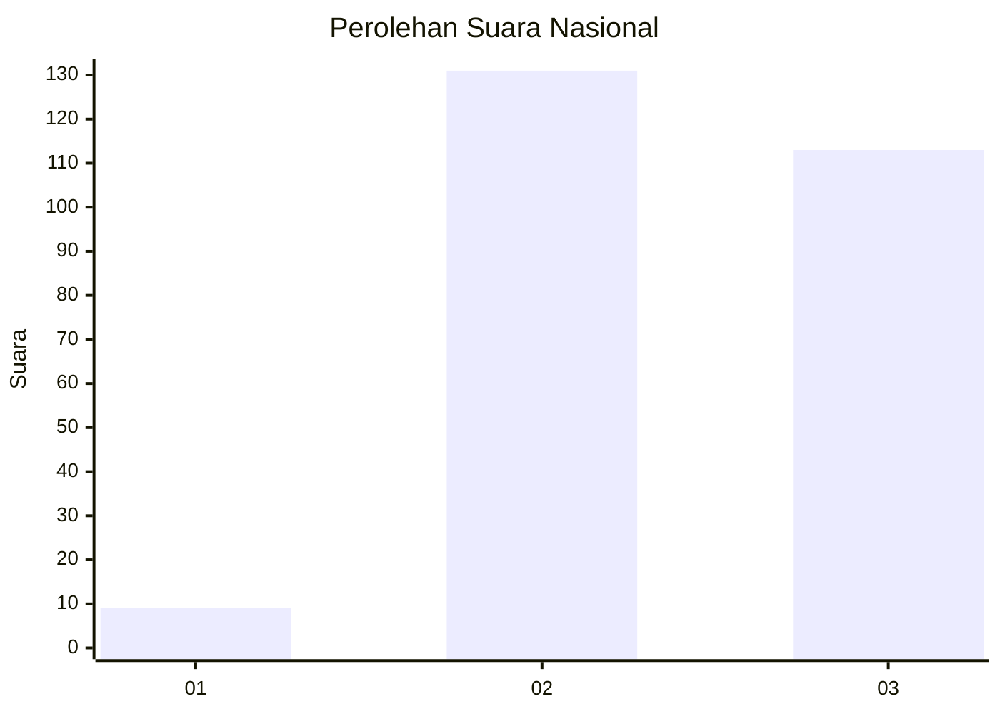
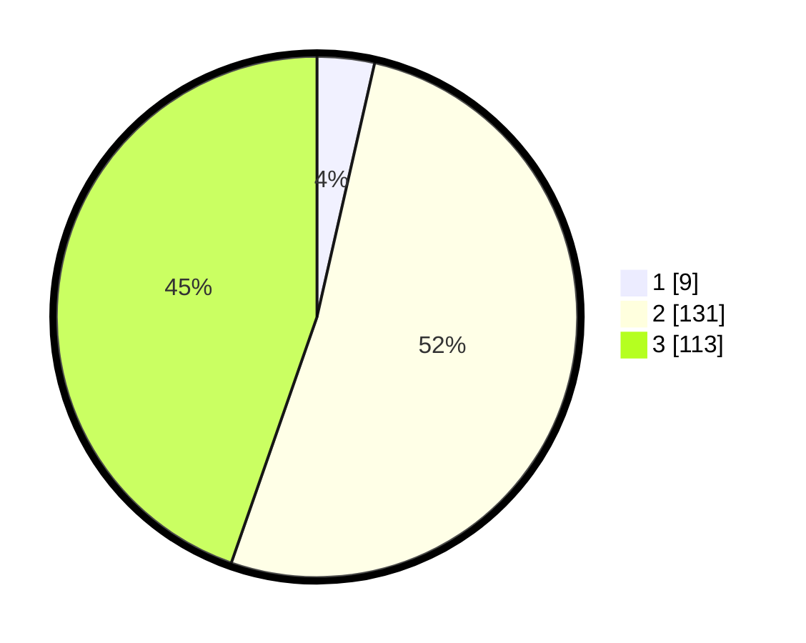

# Hasil

## Grafik

## Tabel

| No. | Nama Paslon    | Suara | Suara (raw) | Persentase |
|:--- |:-------------- | -----:| -----------:| ----------:|
| 1   | ANIES MUHAIMIN | 9     | [9][p-1]    | 3,56       |
| 2   | PRABOWO GIBRAN | 131   | [131][p-2]  | 51,78      |
| 3   | GANJAR MAHFUD  | 113   | [113][p-3]  | 44,66      |

[p-1]: https://github.com/gigit-pemilu/pemilu-2024/blob/main/pilpres/hitung-suara/sub/51-bali/sub/03-badung/sub/06-kuta-utara/sub/1003-kerobokan-kaja/sub/004-tps/sub/paslon-1.txt
[p-2]: https://github.com/gigit-pemilu/pemilu-2024/blob/main/pilpres/hitung-suara/sub/51-bali/sub/03-badung/sub/06-kuta-utara/sub/1003-kerobokan-kaja/sub/004-tps/sub/paslon-2.txt
[p-3]: https://github.com/gigit-pemilu/pemilu-2024/blob/main/pilpres/hitung-suara/sub/51-bali/sub/03-badung/sub/06-kuta-utara/sub/1003-kerobokan-kaja/sub/004-tps/sub/paslon-3.txt

## Foto C Plano

https://sirekap-obj-formc.kpu.go.id/e8cc/pemilu/ppwp/51/03/06/10/03/5103061003004-20240215-082445--a53495fd-0ebd-4432-894a-de95a18a9666.jpg

https://sirekap-obj-formc.kpu.go.id/e8cc/pemilu/ppwp/51/03/06/10/03/5103061003004-20240215-082502--568115f7-09a2-4344-9312-6ed6047efffb.jpg

## Metadata

| Key        | Value               |
| ---------- | ------------------- |
| Time Stamp | 2024-02-24 22:31:28 |

