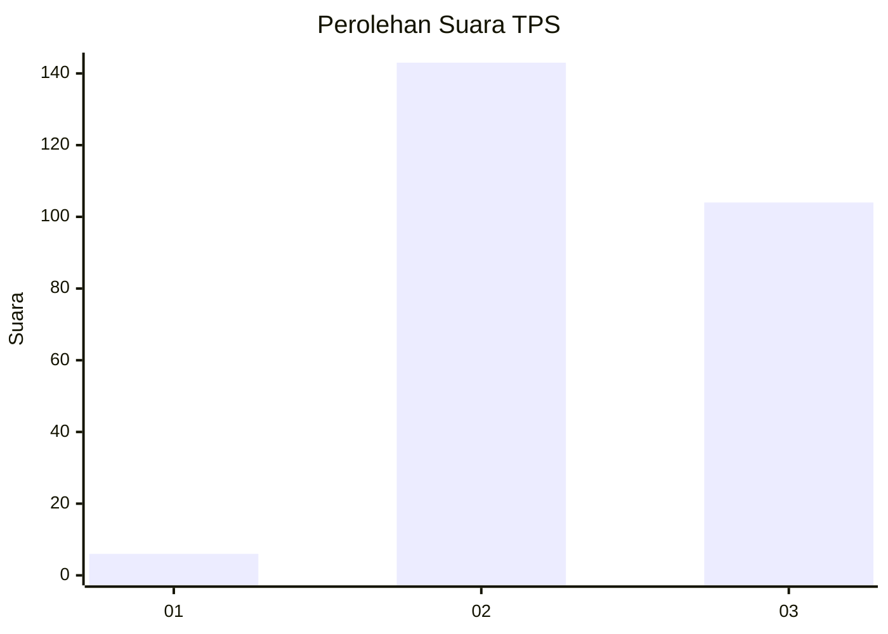
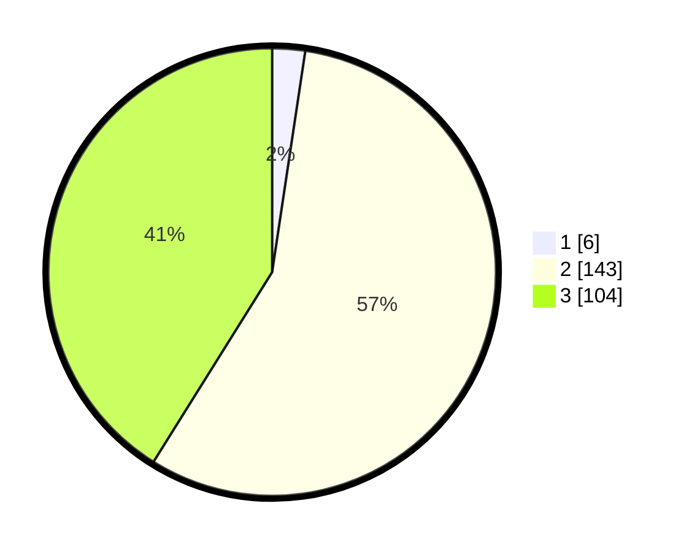

# Hasil

## Grafik

## Tabel

| No. | Nama Paslon    | Suara | Suara (raw) | Persentase |
|:--- |:-------------- | -----:| -----------:| ----------:|
| 1   | ANIES MUHAIMIN | 6     | [6][p-1]    | 2,37       |
| 2   | PRABOWO GIBRAN | 143   | [143][p-2]  | 56,52      |
| 3   | GANJAR MAHFUD  | 104   | [104][p-3]  | 41,11      |

[p-1]: https://github.com/gigit-pemilu/pemilu-2024-51-bali/blob/main/pilpres/hitung-suara/sub/51-bali/sub/03-badung/sub/06-kuta-utara/sub/1003-kerobokan-kaja/sub/005-tps/sub/paslon-1.txt
[p-2]: https://github.com/gigit-pemilu/pemilu-2024-51-bali/blob/main/pilpres/hitung-suara/sub/51-bali/sub/03-badung/sub/06-kuta-utara/sub/1003-kerobokan-kaja/sub/005-tps/sub/paslon-2.txt
[p-3]: https://github.com/gigit-pemilu/pemilu-2024-51-bali/blob/main/pilpres/hitung-suara/sub/51-bali/sub/03-badung/sub/06-kuta-utara/sub/1003-kerobokan-kaja/sub/005-tps/sub/paslon-3.txt

## Foto C Plano

https://sirekap-obj-formc.kpu.go.id/d3c6/pemilu/ppwp/51/03/06/10/03/5103061003005-20240214-155354--10538626-6833-4be4-b2ae-e829b9bc0b50.jpg

https://sirekap-obj-formc.kpu.go.id/d3c6/pemilu/ppwp/51/03/06/10/03/5103061003005-20240214-155409--fa9e25d2-7cd4-4336-b5da-35c12c3c6030.jpg

https://sirekap-obj-formc.kpu.go.id/d3c6/pemilu/ppwp/51/03/06/10/03/5103061003005-20240214-155422--4fd8c6a9-bd36-4ba3-9564-7e9bb3e94c07.jpg

## Metadata

| Key        | Value               |
| ---------- | ------------------- |
| Time Stamp | 2024-02-24 22:31:28 |

## DATA PEMILIH TETAP

Jumlah pemilih dalam DPT: **288**.
 * L: **141**.
 * P: **147**.

## DATA PENGGUNA HAK PILIH

Jumlah pengguna hak pilih dalam DPT: **252**.
 * L: **126**.
 * P: **126**.

Jumlah pengguna hak pilih dalam DPTb: **3**.
 * L: **2**.
 * P: **1**.

Jumlah pengguna hak pilih dalam DPK: **0**.
 * L: **0**.
 * P: **0**.

Jumlah pengguna hak pilih: **255**.
 * L: **128**.
 * P: **127**.

## JUMLAH SUARA SAH DAN TIDAK SAH

JUMLAH SELURUH SUARA SAH: **253**.

JUMLAH SUARA TIDAK SAH: **2**.

JUMLAH SELURUH SUARA SAH DAN SUARA TIDAK SAH: **255**.

