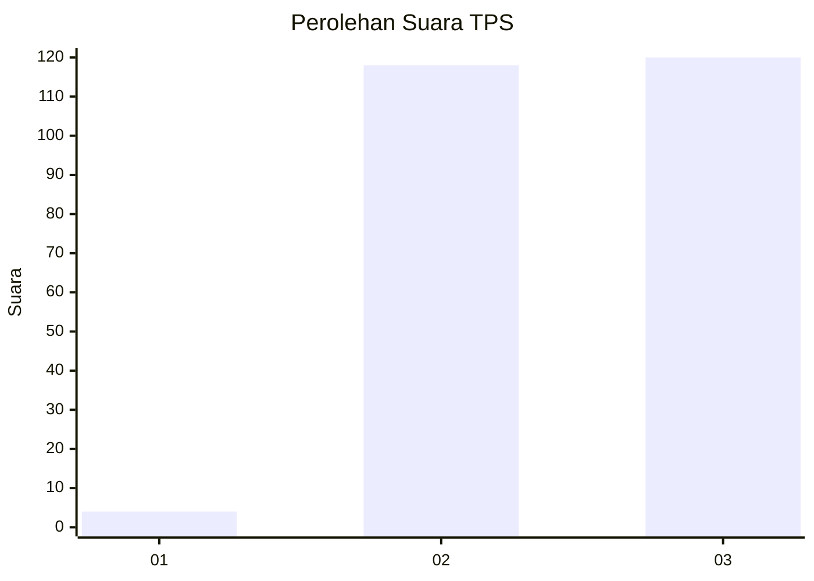
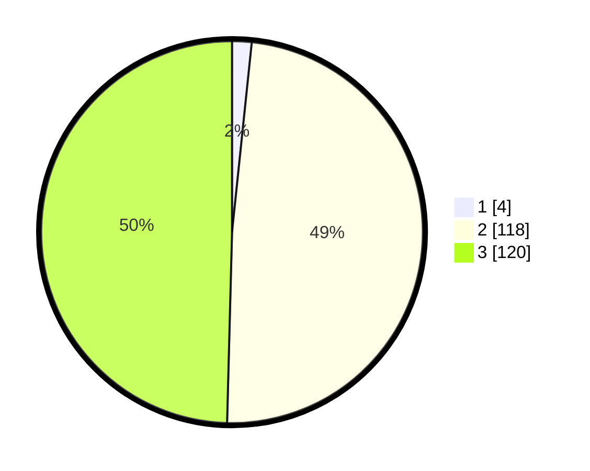

# Hasil

## Grafik

## Tabel

| No. | Nama Paslon    | Suara | Suara (raw) | Persentase |
|:--- |:-------------- | -----:| -----------:| ----------:|
| 1   | ANIES MUHAIMIN | 4     | [4][p-1]    | 1,65       |
| 2   | PRABOWO GIBRAN | 118   | [118][p-2]  | 48,76      |
| 3   | GANJAR MAHFUD  | 120   | [120][p-3]  | 49,59      |

[p-1]: https://github.com/gigit-pemilu/pemilu-2024-51-bali/blob/main/pilpres/hitung-suara/sub/51-bali/sub/03-badung/sub/06-kuta-utara/sub/1003-kerobokan-kaja/sub/006-tps/sub/paslon-1.txt
[p-2]: https://github.com/gigit-pemilu/pemilu-2024-51-bali/blob/main/pilpres/hitung-suara/sub/51-bali/sub/03-badung/sub/06-kuta-utara/sub/1003-kerobokan-kaja/sub/006-tps/sub/paslon-2.txt
[p-3]: https://github.com/gigit-pemilu/pemilu-2024-51-bali/blob/main/pilpres/hitung-suara/sub/51-bali/sub/03-badung/sub/06-kuta-utara/sub/1003-kerobokan-kaja/sub/006-tps/sub/paslon-3.txt

## Foto C Plano

https://sirekap-obj-formc.kpu.go.id/3507/pemilu/ppwp/51/03/06/10/03/5103061003006-20240214-220732--7b3861a2-e34d-4bca-9285-6ffdc1d247ec.jpg

https://sirekap-obj-formc.kpu.go.id/3507/pemilu/ppwp/51/03/06/10/03/5103061003006-20240214-220946--e9adc906-f3ac-4bce-9850-3051b8ac4757.jpg

## Metadata

| Key        | Value               |
| ---------- | ------------------- |
| Time Stamp | 2024-02-24 22:31:28 |

