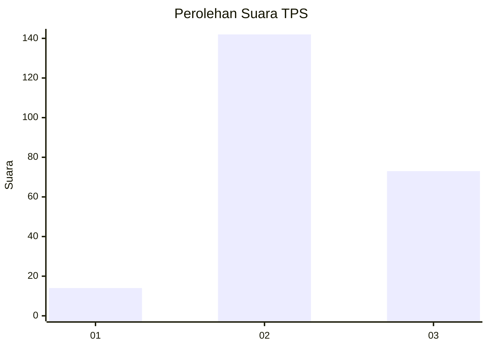
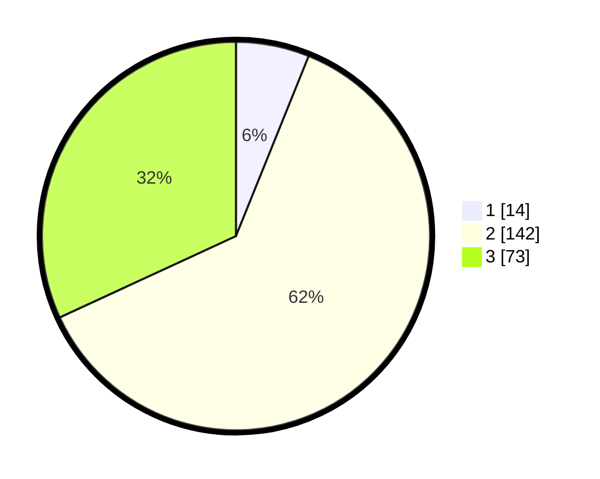

# Hasil

## Grafik

## Tabel

| No. | Nama Paslon    | Suara | Suara (raw) | Persentase |
|:--- |:-------------- | -----:| -----------:| ----------:|
| 1   | ANIES MUHAIMIN | 14    | [14][p-1]   | 6,11       |
| 2   | PRABOWO GIBRAN | 142   | [142][p-2]  | 62,01      |
| 3   | GANJAR MAHFUD  | 73    | [73][p-3]   | 31,88      |

[p-1]: https://github.com/gigit-pemilu/pemilu-2024-51-bali/blob/main/pilpres/hitung-suara/sub/51-bali/sub/03-badung/sub/06-kuta-utara/sub/1003-kerobokan-kaja/sub/012-tps/sub/paslon-1.txt
[p-2]: https://github.com/gigit-pemilu/pemilu-2024-51-bali/blob/main/pilpres/hitung-suara/sub/51-bali/sub/03-badung/sub/06-kuta-utara/sub/1003-kerobokan-kaja/sub/012-tps/sub/paslon-2.txt
[p-3]: https://github.com/gigit-pemilu/pemilu-2024-51-bali/blob/main/pilpres/hitung-suara/sub/51-bali/sub/03-badung/sub/06-kuta-utara/sub/1003-kerobokan-kaja/sub/012-tps/sub/paslon-3.txt

## Foto C Plano

https://sirekap-obj-formc.kpu.go.id/3232/pemilu/ppwp/51/03/06/10/03/5103061003012-20240215-150857--bce4ff9f-12df-48f7-ac02-c5bfc34770d1.jpg

https://sirekap-obj-formc.kpu.go.id/3232/pemilu/ppwp/51/03/06/10/03/5103061003012-20240215-150922--5ad49154-f1f7-45b4-9166-5bb076dbfba0.jpg

https://sirekap-obj-formc.kpu.go.id/3232/pemilu/ppwp/51/03/06/10/03/5103061003012-20240215-150908--69f5eb62-12fe-49fa-8f70-707a1c71a57d.jpg

## Metadata

| Key        | Value               |
| ---------- | ------------------- |
| Time Stamp | 2024-02-21 16:00:00 |

## DATA PEMILIH TETAP

Jumlah pemilih dalam DPT: **279**.
 * L: **132**.
 * P: **147**.

## DATA PENGGUNA HAK PILIH

Jumlah pengguna hak pilih dalam DPT: **222**.
 * L: **109**.
 * P: **113**.

Jumlah pengguna hak pilih dalam DPTb: **4**.
 * L: **2**.
 * P: **2**.

Jumlah pengguna hak pilih dalam DPK: **6**.
 * L: **2**.
 * P: **4**.

Jumlah pengguna hak pilih: **232**.
 * L: **113**.
 * P: **119**.

## JUMLAH SUARA SAH DAN TIDAK SAH

JUMLAH SELURUH SUARA SAH: **229**.

JUMLAH SUARA TIDAK SAH: **3**.

JUMLAH SELURUH SUARA SAH DAN SUARA TIDAK SAH: **232**.

