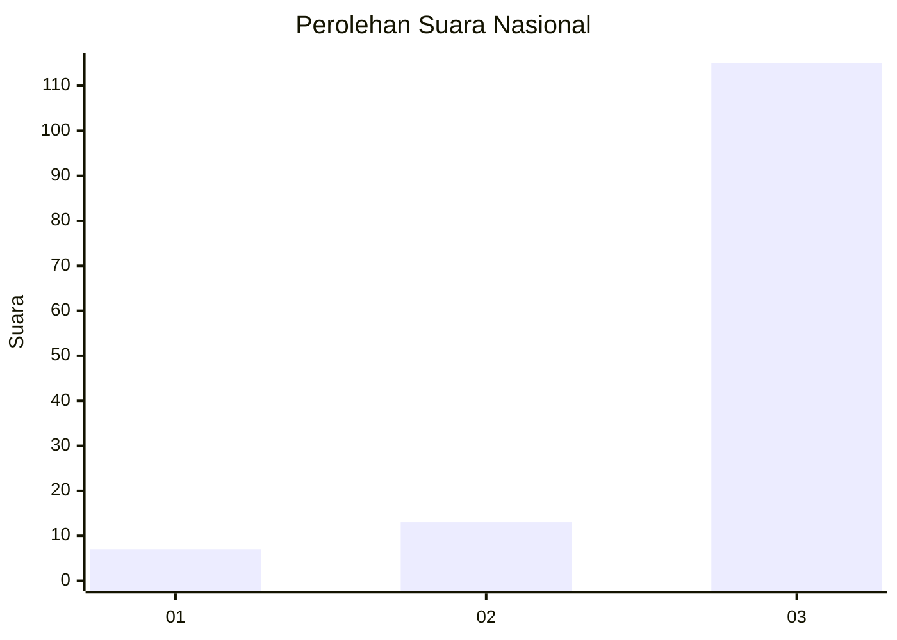
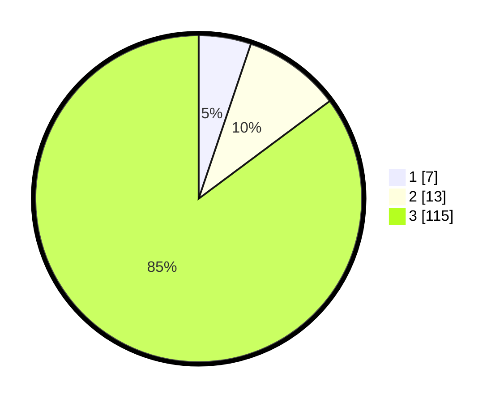

# Hasil

## Grafik

## Tabel

| No. | Nama Paslon    | Suara | Suara (raw) | Persentase |
|:--- |:-------------- | -----:| -----------:| ----------:|
| 1   | ANIES MUHAIMIN | 7     | [7][p-1]    | 5,19       |
| 2   | PRABOWO GIBRAN | 13    | [13][p-2]   | 9,63       |
| 3   | GANJAR MAHFUD  | 115   | [115][p-3]  | 85,19      |

[p-1]: https://github.com/gigit-pemilu/pemilu-2024/blob/main/pilpres/hitung-suara/sub/51-bali/sub/03-badung/sub/06-kuta-utara/sub/1003-kerobokan-kaja/sub/014-tps/sub/paslon-1.txt
[p-2]: https://github.com/gigit-pemilu/pemilu-2024/blob/main/pilpres/hitung-suara/sub/51-bali/sub/03-badung/sub/06-kuta-utara/sub/1003-kerobokan-kaja/sub/014-tps/sub/paslon-2.txt
[p-3]: https://github.com/gigit-pemilu/pemilu-2024/blob/main/pilpres/hitung-suara/sub/51-bali/sub/03-badung/sub/06-kuta-utara/sub/1003-kerobokan-kaja/sub/014-tps/sub/paslon-3.txt

## Foto C Plano

https://sirekap-obj-formc.kpu.go.id/444f/pemilu/ppwp/51/03/06/10/03/5103061003014-20240216-084645--616c2a9d-c9da-4731-a9df-0092ffab4b96.jpg

https://sirekap-obj-formc.kpu.go.id/444f/pemilu/ppwp/51/03/06/10/03/5103061003014-20240216-084656--15881347-b99a-4d77-b4d7-ad25babca1b7.jpg

https://sirekap-obj-formc.kpu.go.id/444f/pemilu/ppwp/51/03/06/10/03/5103061003014-20240216-084654--993a5c5d-fc43-41f0-a1cf-3e7180cdfc43.jpg

## Metadata

| Key        | Value               |
| ---------- | ------------------- |
| Time Stamp | 2024-02-21 14:00:00 |

## DATA PEMILIH TETAP

Jumlah pemilih dalam DPT: **269**.
 * L: **131**.
 * P: **138**.

## DATA PENGGUNA HAK PILIH

Jumlah pengguna hak pilih dalam DPT: **238**.
 * L: **124**.
 * P: **114**.

Jumlah pengguna hak pilih dalam DPTb: **4**.
 * L: **2**.
 * P: **2**.

Jumlah pengguna hak pilih dalam DPK: **7**.
 * L: **4**.
 * P: **3**.

Jumlah pengguna hak pilih: **249**.
 * L: **130**.
 * P: **119**.

## JUMLAH SUARA SAH DAN TIDAK SAH

JUMLAH SELURUH SUARA SAH: **245**.

JUMLAH SUARA TIDAK SAH: **4**.

JUMLAH SELURUH SUARA SAH DAN SUARA TIDAK SAH: **249**.

