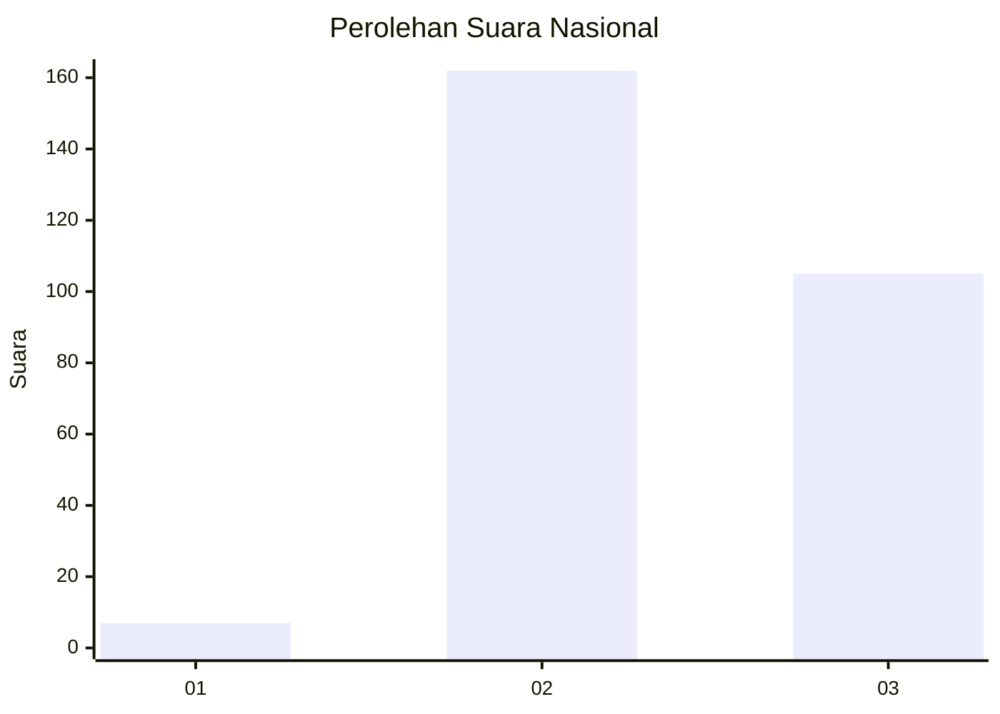
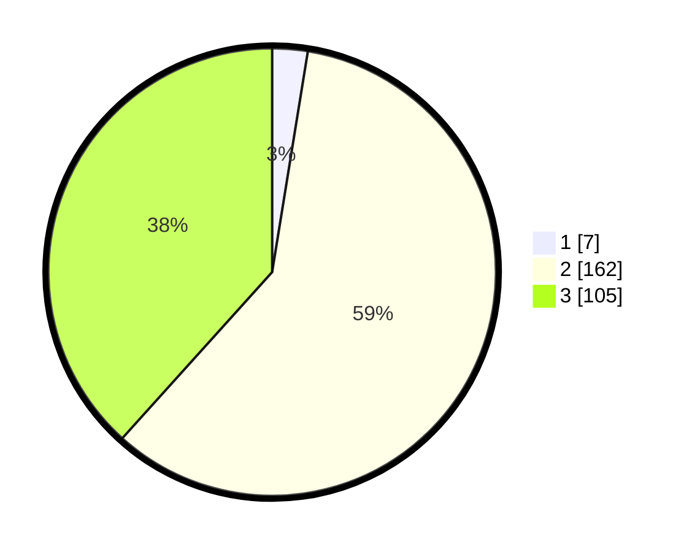

# Hasil

## Grafik

## Tabel

| No. | Nama Paslon    | Suara | Suara (raw) | Persentase |
|:--- |:-------------- | -----:| -----------:| ----------:|
| 1   | ANIES MUHAIMIN | 7     | [7][p-1]    | 2,55       |
| 2   | PRABOWO GIBRAN | 162   | [162][p-2]  | 59,12      |
| 3   | GANJAR MAHFUD  | 105   | [105][p-3]  | 38,32      |

[p-1]: https://github.com/gigit-pemilu/pemilu-2024/blob/main/pilpres/hitung-suara/sub/51-bali/sub/03-badung/sub/06-kuta-utara/sub/1003-kerobokan-kaja/sub/026-tps/sub/paslon-1.txt
[p-2]: https://github.com/gigit-pemilu/pemilu-2024/blob/main/pilpres/hitung-suara/sub/51-bali/sub/03-badung/sub/06-kuta-utara/sub/1003-kerobokan-kaja/sub/026-tps/sub/paslon-2.txt
[p-3]: https://github.com/gigit-pemilu/pemilu-2024/blob/main/pilpres/hitung-suara/sub/51-bali/sub/03-badung/sub/06-kuta-utara/sub/1003-kerobokan-kaja/sub/026-tps/sub/paslon-3.txt

## Foto C Plano

https://sirekap-obj-formc.kpu.go.id/4bbe/pemilu/ppwp/51/03/06/10/03/5103061003026-20240214-200116--cc4369c8-084b-432e-bd44-6beff1131b15.jpg

https://sirekap-obj-formc.kpu.go.id/4bbe/pemilu/ppwp/51/03/06/10/03/5103061003026-20240214-200207--fadd051c-6acc-4f36-9e7f-d3c406ad8da9.jpg

https://sirekap-obj-formc.kpu.go.id/4bbe/pemilu/ppwp/51/03/06/10/03/5103061003026-20240214-200613--9dd08ed7-d9f9-4f7d-ab76-c3a7d5a99411.jpg

## Metadata

| Key        | Value               |
| ---------- | ------------------- |
| Time Stamp | 2024-02-24 22:31:28 |

