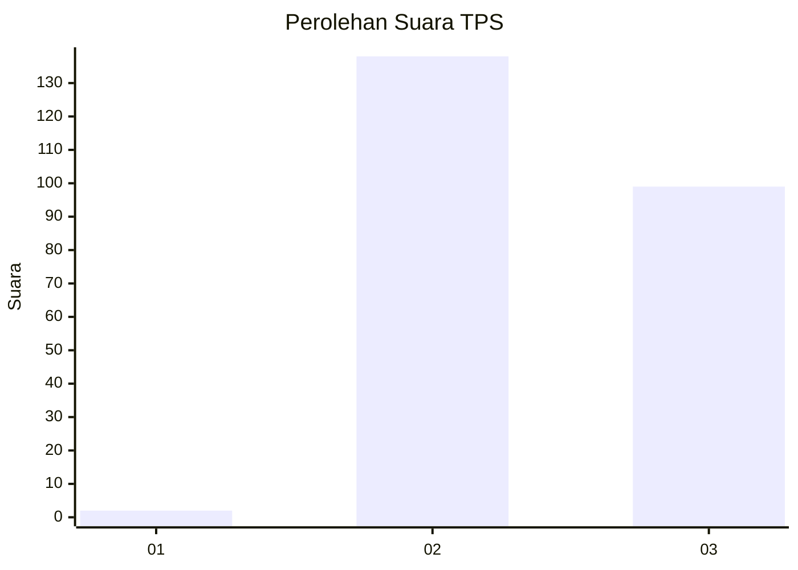
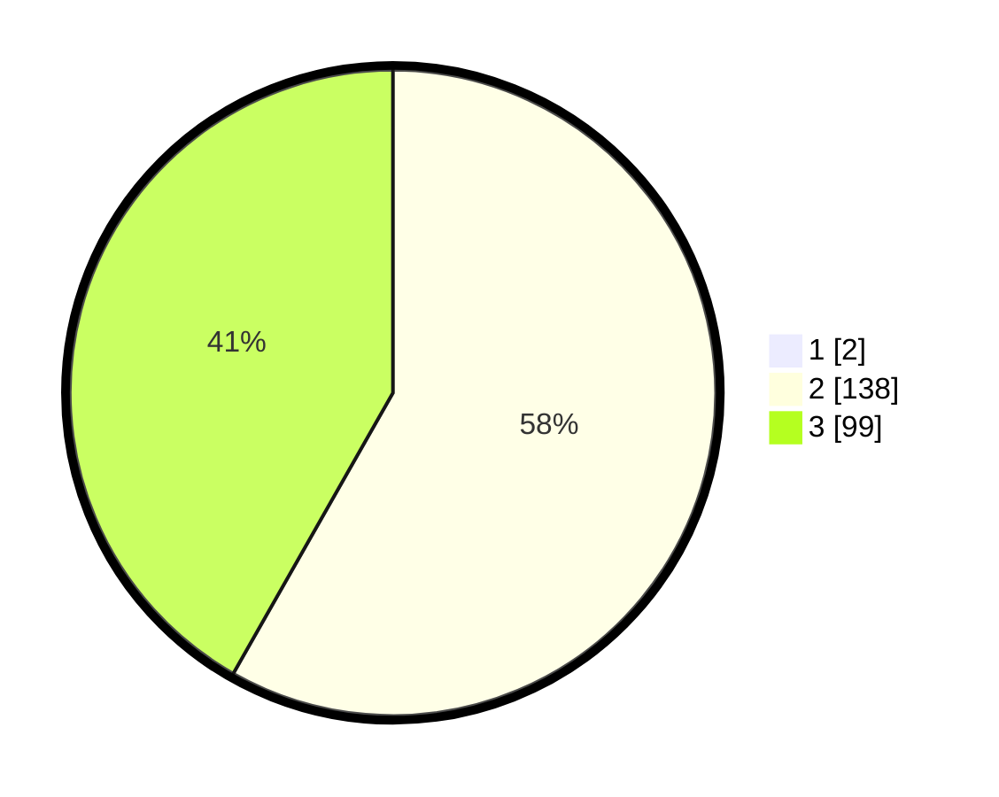

# Hasil

## Grafik

## Tabel

| No. | Nama Paslon    | Suara | Suara (raw) | Persentase |
|:--- |:-------------- | -----:| -----------:| ----------:|
| 1   | ANIES MUHAIMIN | 2     | [2][p-1]    | 0,84       |
| 2   | PRABOWO GIBRAN | 138   | [138][p-2]  | 57,74      |
| 3   | GANJAR MAHFUD  | 99    | [99][p-3]   | 41,42      |

[p-1]: https://github.com/gigit-pemilu/pemilu-2024-51-bali/blob/main/pilpres/hitung-suara/sub/51-bali/sub/03-badung/sub/06-kuta-utara/sub/1003-kerobokan-kaja/sub/030-tps/sub/paslon-1.txt
[p-2]: https://github.com/gigit-pemilu/pemilu-2024-51-bali/blob/main/pilpres/hitung-suara/sub/51-bali/sub/03-badung/sub/06-kuta-utara/sub/1003-kerobokan-kaja/sub/030-tps/sub/paslon-2.txt
[p-3]: https://github.com/gigit-pemilu/pemilu-2024-51-bali/blob/main/pilpres/hitung-suara/sub/51-bali/sub/03-badung/sub/06-kuta-utara/sub/1003-kerobokan-kaja/sub/030-tps/sub/paslon-3.txt

## Foto C Plano

https://sirekap-obj-formc.kpu.go.id/fdd9/pemilu/ppwp/51/03/06/10/03/5103061003030-20240214-141414--5de9db7a-c5ad-49ac-9f81-08966bf48403.jpg

https://sirekap-obj-formc.kpu.go.id/fdd9/pemilu/ppwp/51/03/06/10/03/5103061003030-20240214-141903--fa40a922-17cb-4bf1-8c53-ed8721cd88ab.jpg

https://sirekap-obj-formc.kpu.go.id/fdd9/pemilu/ppwp/51/03/06/10/03/5103061003030-20240216-131954--2b891b5d-3e17-4fc1-8eeb-8a31beac37f3.jpg

## Metadata

| Key        | Value               |
| ---------- | ------------------- |
| Time Stamp | 2024-02-24 22:31:28 |

## DATA PEMILIH TETAP

Jumlah pemilih dalam DPT: **274**.
 * L: **135**.
 * P: **139**.

## DATA PENGGUNA HAK PILIH

Jumlah pengguna hak pilih dalam DPT: **241**.
 * L: **115**.
 * P: **126**.

Jumlah pengguna hak pilih dalam DPTb: **7**.
 * L: **2**.
 * P: **5**.

Jumlah pengguna hak pilih dalam DPK: **1**.
 * L: **0**.
 * P: **1**.

Jumlah pengguna hak pilih: **249**.
 * L: **117**.
 * P: **132**.

## JUMLAH SUARA SAH DAN TIDAK SAH

JUMLAH SELURUH SUARA SAH: **239**.

JUMLAH SUARA TIDAK SAH: **9**.

JUMLAH SELURUH SUARA SAH DAN SUARA TIDAK SAH: **248**.

