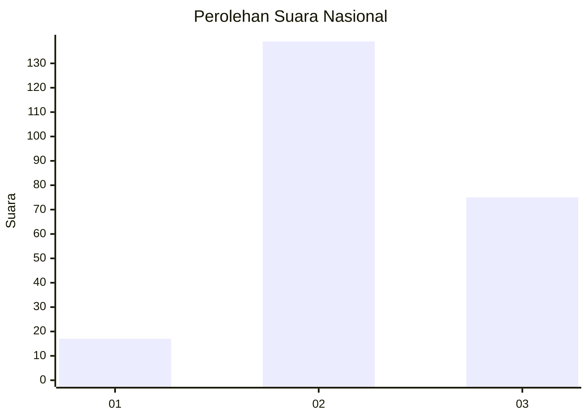
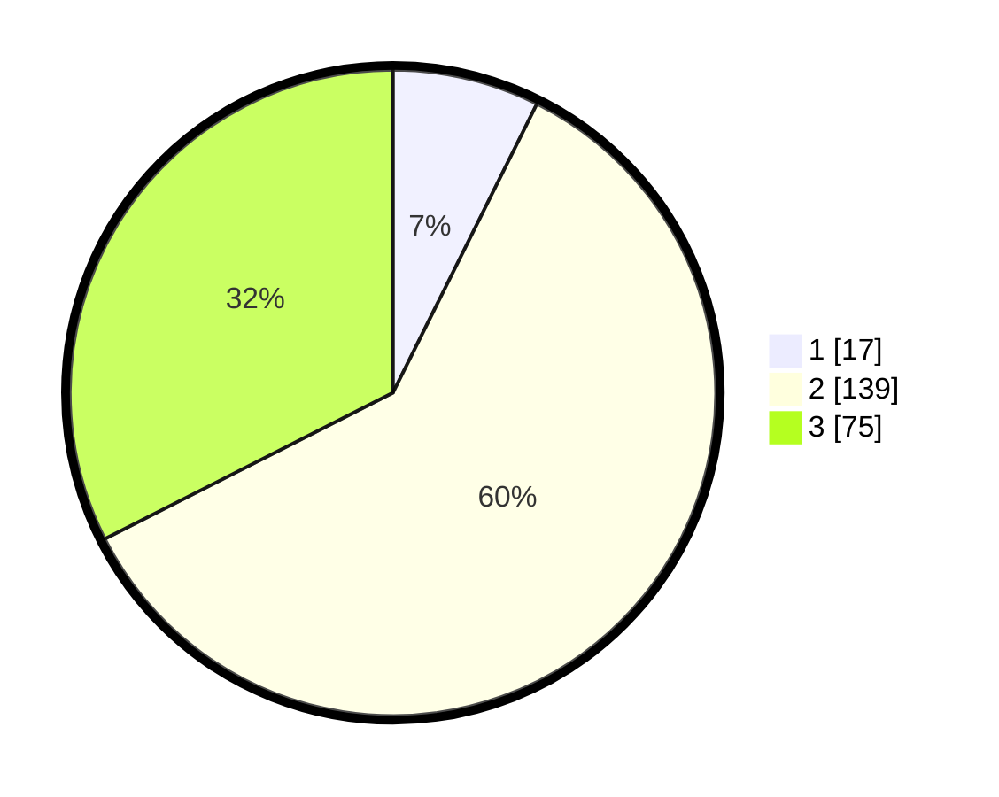

# Hasil

## Grafik

## Tabel

| No. | Nama Paslon    | Suara | Suara (raw) | Persentase |
|:--- |:-------------- | -----:| -----------:| ----------:|
| 1   | ANIES MUHAIMIN | 17    | [17][p-1]   | 7,36       |
| 2   | PRABOWO GIBRAN | 139   | [139][p-2]  | 60,17      |
| 3   | GANJAR MAHFUD  | 75    | [75][p-3]   | 32,47      |

[p-1]: https://github.com/gigit-pemilu/pemilu-2024/blob/main/pilpres/hitung-suara/sub/51-bali/sub/03-badung/sub/06-kuta-utara/sub/1003-kerobokan-kaja/sub/037-tps/sub/paslon-1.txt
[p-2]: https://github.com/gigit-pemilu/pemilu-2024/blob/main/pilpres/hitung-suara/sub/51-bali/sub/03-badung/sub/06-kuta-utara/sub/1003-kerobokan-kaja/sub/037-tps/sub/paslon-2.txt
[p-3]: https://github.com/gigit-pemilu/pemilu-2024/blob/main/pilpres/hitung-suara/sub/51-bali/sub/03-badung/sub/06-kuta-utara/sub/1003-kerobokan-kaja/sub/037-tps/sub/paslon-3.txt

## Foto C Plano

https://sirekap-obj-formc.kpu.go.id/09d1/pemilu/ppwp/51/03/06/10/03/5103061003037-20240214-195423--790517c8-fe99-4d01-8974-bb13e34ecbb5.jpg

https://sirekap-obj-formc.kpu.go.id/09d1/pemilu/ppwp/51/03/06/10/03/5103061003037-20240214-200038--c2696d35-5568-4d79-a45a-1976061a724a.jpg

https://sirekap-obj-formc.kpu.go.id/09d1/pemilu/ppwp/51/03/06/10/03/5103061003037-20240214-200139--5cf904ae-f39d-448a-8e4e-d64806dd4694.jpg

## Metadata

| Key        | Value               |
| ---------- | ------------------- |
| Time Stamp | 2024-02-21 18:00:00 |

## DATA PEMILIH TETAP

Jumlah pemilih dalam DPT: **286**.
 * L: **138**.
 * P: **148**.

## DATA PENGGUNA HAK PILIH

Jumlah pengguna hak pilih dalam DPT: **221**.
 * L: **107**.
 * P: **114**.

Jumlah pengguna hak pilih dalam DPTb: **1**.
 * L: **0**.
 * P: **1**.

Jumlah pengguna hak pilih dalam DPK: **12**.
 * L: **5**.
 * P: **7**.

Jumlah pengguna hak pilih: **234**.
 * L: **112**.
 * P: **122**.

## JUMLAH SUARA SAH DAN TIDAK SAH

JUMLAH SELURUH SUARA SAH: **231**.

JUMLAH SUARA TIDAK SAH: **3**.

JUMLAH SELURUH SUARA SAH DAN SUARA TIDAK SAH: **234**.

