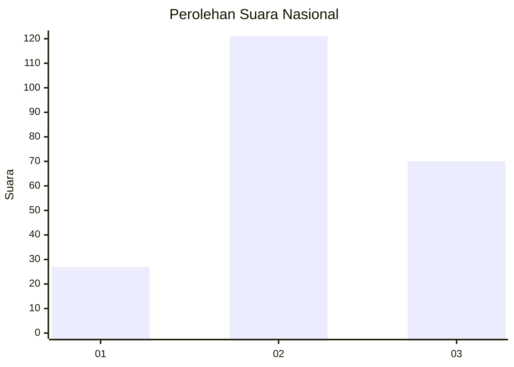
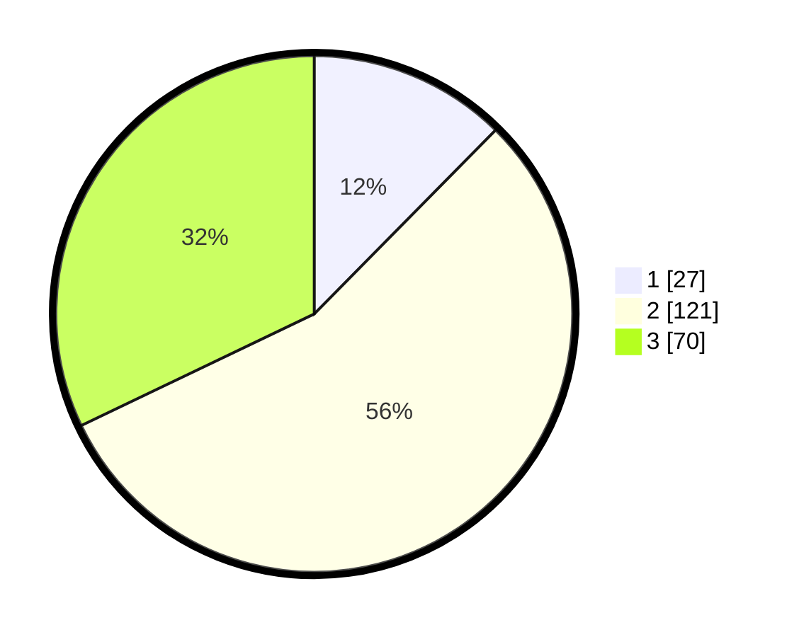

# Hasil

## Grafik

## Tabel

| No. | Nama Paslon    | Suara | Suara (raw) | Persentase |
|:--- |:-------------- | -----:| -----------:| ----------:|
| 1   | ANIES MUHAIMIN | 27    | [27][p-1]   | 12,39      |
| 2   | PRABOWO GIBRAN | 121   | [121][p-2]  | 55,50      |
| 3   | GANJAR MAHFUD  | 70    | [70][p-3]   | 32,11      |

[p-1]: https://github.com/gigit-pemilu/pemilu-2024/blob/main/pilpres/hitung-suara/sub/51-bali/sub/03-badung/sub/06-kuta-utara/sub/1003-kerobokan-kaja/sub/040-tps/sub/paslon-1.txt
[p-2]: https://github.com/gigit-pemilu/pemilu-2024/blob/main/pilpres/hitung-suara/sub/51-bali/sub/03-badung/sub/06-kuta-utara/sub/1003-kerobokan-kaja/sub/040-tps/sub/paslon-2.txt
[p-3]: https://github.com/gigit-pemilu/pemilu-2024/blob/main/pilpres/hitung-suara/sub/51-bali/sub/03-badung/sub/06-kuta-utara/sub/1003-kerobokan-kaja/sub/040-tps/sub/paslon-3.txt

## Foto C Plano

https://sirekap-obj-formc.kpu.go.id/4ef4/pemilu/ppwp/51/03/06/10/03/5103061003040-20240215-004935--0ccbb357-abdb-4b8d-99c5-fd38919c2c59.jpg

https://sirekap-obj-formc.kpu.go.id/4ef4/pemilu/ppwp/51/03/06/10/03/5103061003040-20240215-004947--e1bd87d5-0e1e-4b38-940a-d02e0867a256.jpg

https://sirekap-obj-formc.kpu.go.id/4ef4/pemilu/ppwp/51/03/06/10/03/5103061003040-20240215-004952--5004f30c-f66a-4f95-a272-9b075ec2d224.jpg

## Metadata

| Key        | Value               |
| ---------- | ------------------- |
| Time Stamp | 2024-02-16 16:25:10 |

## DATA PEMILIH TETAP

Jumlah pemilih dalam DPT: **251**.
 * L: **127**.
 * P: **124**.

## DATA PENGGUNA HAK PILIH

Jumlah pengguna hak pilih dalam DPT: **211**.
 * L: **104**.
 * P: **107**.

Jumlah pengguna hak pilih dalam DPTb: **1**.
 * L: **1**.
 * P: **0**.

Jumlah pengguna hak pilih dalam DPK: **9**.
 * L: **5**.
 * P: **4**.

Jumlah pengguna hak pilih: **221**.
 * L: **110**.
 * P: **111**.

## JUMLAH SUARA SAH DAN TIDAK SAH

JUMLAH SELURUH SUARA SAH: **218**.

JUMLAH SUARA TIDAK SAH: **3**.

JUMLAH SELURUH SUARA SAH DAN SUARA TIDAK SAH: **221**.

