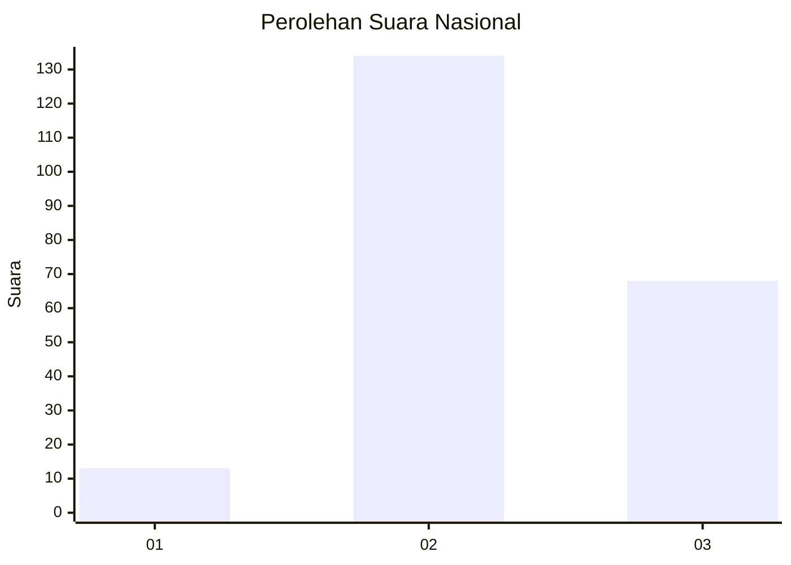
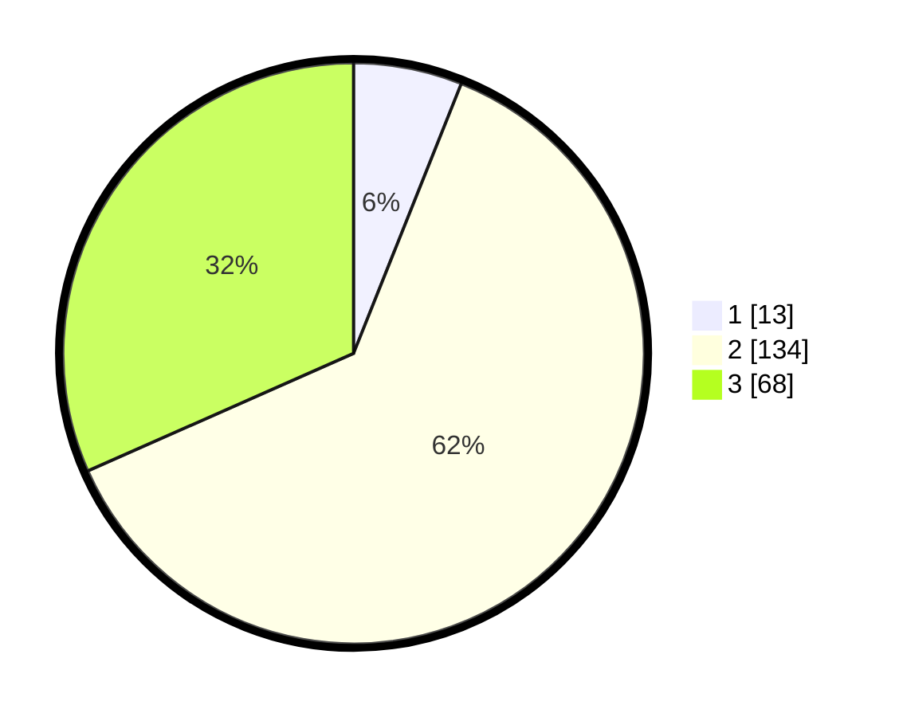

# Hasil

## Grafik

## Tabel

| No. | Nama Paslon    | Suara | Suara (raw) | Persentase |
|:--- |:-------------- | -----:| -----------:| ----------:|
| 1   | ANIES MUHAIMIN | 13    | [13][p-1]   | 6,05       |
| 2   | PRABOWO GIBRAN | 134   | [134][p-2]  | 62,33      |
| 3   | GANJAR MAHFUD  | 68    | [68][p-3]   | 31,63      |

[p-1]: https://github.com/gigit-pemilu/pemilu-2024/blob/main/pilpres/hitung-suara/sub/51-bali/sub/03-badung/sub/06-kuta-utara/sub/1003-kerobokan-kaja/sub/041-tps/sub/paslon-1.txt
[p-2]: https://github.com/gigit-pemilu/pemilu-2024/blob/main/pilpres/hitung-suara/sub/51-bali/sub/03-badung/sub/06-kuta-utara/sub/1003-kerobokan-kaja/sub/041-tps/sub/paslon-2.txt
[p-3]: https://github.com/gigit-pemilu/pemilu-2024/blob/main/pilpres/hitung-suara/sub/51-bali/sub/03-badung/sub/06-kuta-utara/sub/1003-kerobokan-kaja/sub/041-tps/sub/paslon-3.txt

## Foto C Plano

https://sirekap-obj-formc.kpu.go.id/952d/pemilu/ppwp/51/03/06/10/03/5103061003041-20240215-015626--1a5aea65-9129-4199-b3b2-8bacd4ba6e4e.jpg

https://sirekap-obj-formc.kpu.go.id/952d/pemilu/ppwp/51/03/06/10/03/5103061003041-20240215-015643--f35fff44-f527-4491-ab95-a964c0fe657f.jpg

https://sirekap-obj-formc.kpu.go.id/952d/pemilu/ppwp/51/03/06/10/03/5103061003041-20240215-015657--33ca3088-cf81-4466-8ec3-2628b9b4206e.jpg

## Metadata

| Key        | Value               |
| ---------- | ------------------- |
| Time Stamp | 2024-02-24 22:31:28 |

