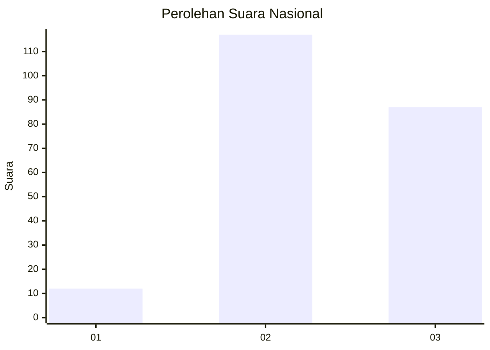
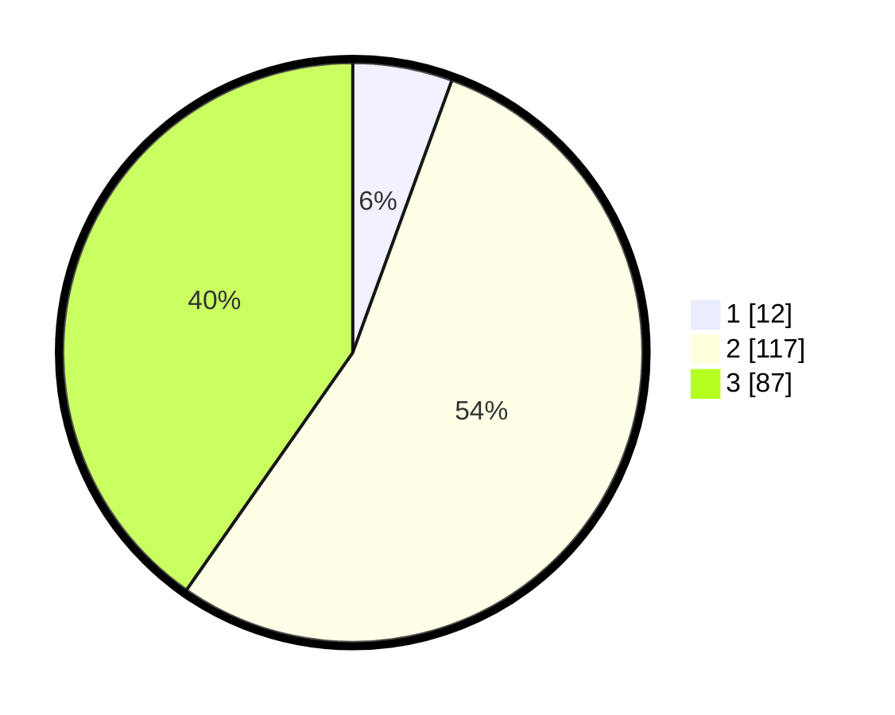

# Hasil

## Grafik

## Tabel

| No. | Nama Paslon    | Suara | Suara (raw) | Persentase |
|:--- |:-------------- | -----:| -----------:| ----------:|
| 1   | ANIES MUHAIMIN | 12    | [12][p-1]   | 5,56       |
| 2   | PRABOWO GIBRAN | 117   | [117][p-2]  | 54,17      |
| 3   | GANJAR MAHFUD  | 87    | [87][p-3]   | 40,28      |

[p-1]: https://github.com/gigit-pemilu/pemilu-2024/blob/main/pilpres/hitung-suara/sub/51-bali/sub/03-badung/sub/06-kuta-utara/sub/1003-kerobokan-kaja/sub/042-tps/sub/paslon-1.txt
[p-2]: https://github.com/gigit-pemilu/pemilu-2024/blob/main/pilpres/hitung-suara/sub/51-bali/sub/03-badung/sub/06-kuta-utara/sub/1003-kerobokan-kaja/sub/042-tps/sub/paslon-2.txt
[p-3]: https://github.com/gigit-pemilu/pemilu-2024/blob/main/pilpres/hitung-suara/sub/51-bali/sub/03-badung/sub/06-kuta-utara/sub/1003-kerobokan-kaja/sub/042-tps/sub/paslon-3.txt

## Foto C Plano

https://sirekap-obj-formc.kpu.go.id/f76a/pemilu/ppwp/51/03/06/10/03/5103061003042-20240215-001600--792c5194-feca-4de0-a75e-e1c517689f72.jpg

https://sirekap-obj-formc.kpu.go.id/f76a/pemilu/ppwp/51/03/06/10/03/5103061003042-20240215-001554--39d4c12f-4e6f-4c98-964a-04bb8dbca603.jpg

https://sirekap-obj-formc.kpu.go.id/f76a/pemilu/ppwp/51/03/06/10/03/5103061003042-20240215-001559--612d6e60-cd03-4852-9180-741ef31ccf78.jpg

## Metadata

| Key        | Value               |
| ---------- | ------------------- |
| Time Stamp | 2024-02-24 22:31:28 |

