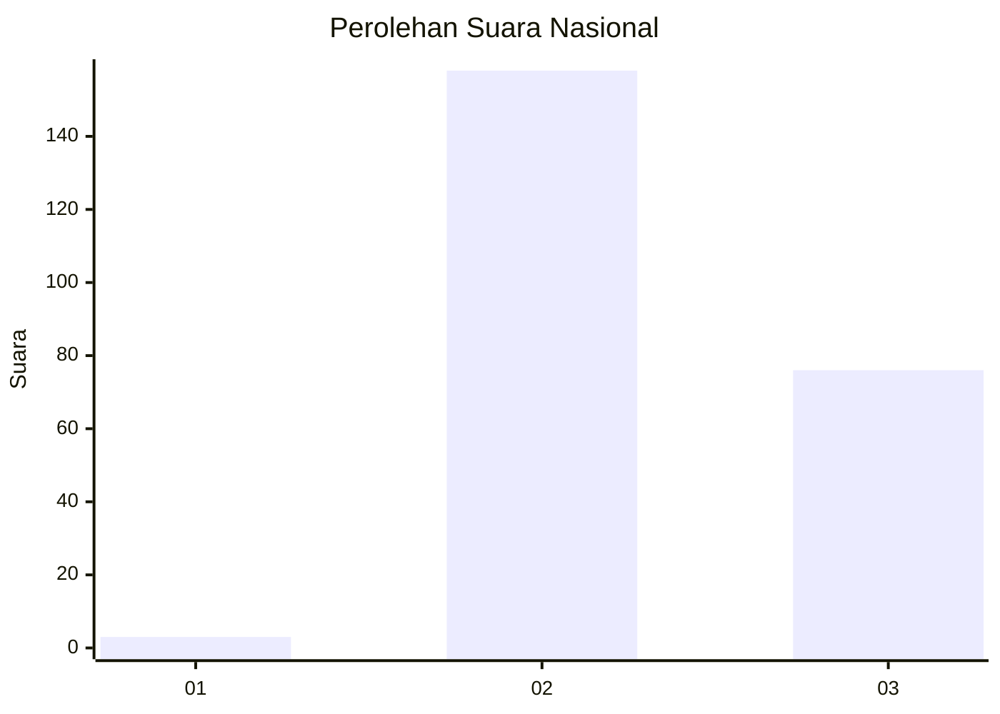
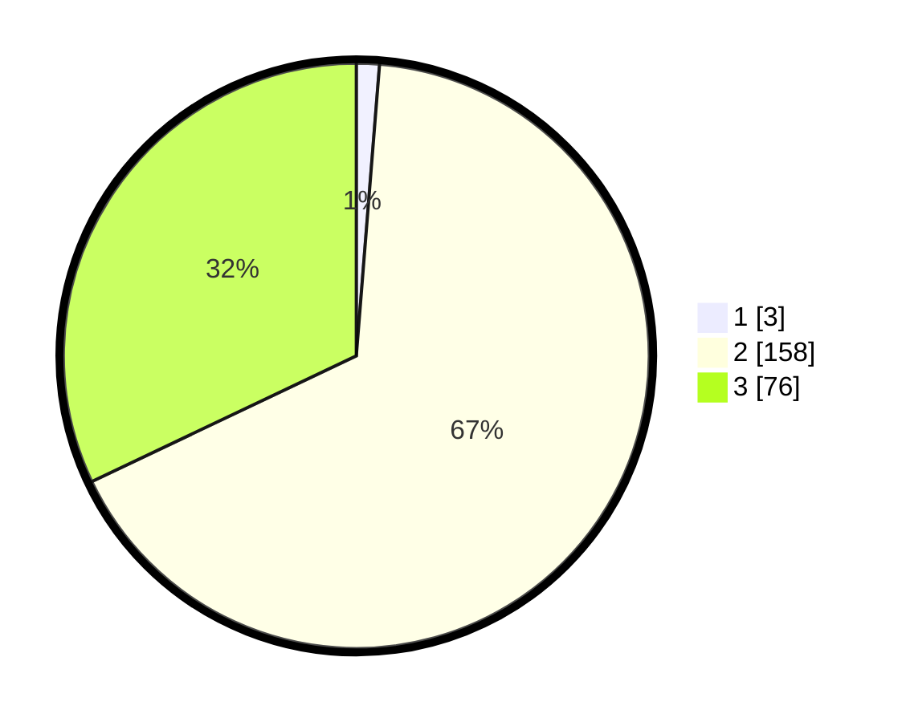

# Hasil

## Grafik

## Tabel

| No. | Nama Paslon    | Suara | Suara (raw) | Persentase |
|:--- |:-------------- | -----:| -----------:| ----------:|
| 1   | ANIES MUHAIMIN | 3     | [3][p-1]    | 1,27       |
| 2   | PRABOWO GIBRAN | 158   | [158][p-2]  | 66,67      |
| 3   | GANJAR MAHFUD  | 76    | [76][p-3]   | 32,07      |

[p-1]: https://github.com/gigit-pemilu/pemilu-2024/blob/main/pilpres/hitung-suara/sub/51-bali/sub/03-badung/sub/06-kuta-utara/sub/1003-kerobokan-kaja/sub/043-tps/sub/paslon-1.txt
[p-2]: https://github.com/gigit-pemilu/pemilu-2024/blob/main/pilpres/hitung-suara/sub/51-bali/sub/03-badung/sub/06-kuta-utara/sub/1003-kerobokan-kaja/sub/043-tps/sub/paslon-2.txt
[p-3]: https://github.com/gigit-pemilu/pemilu-2024/blob/main/pilpres/hitung-suara/sub/51-bali/sub/03-badung/sub/06-kuta-utara/sub/1003-kerobokan-kaja/sub/043-tps/sub/paslon-3.txt

## Foto C Plano

https://sirekap-obj-formc.kpu.go.id/69ee/pemilu/ppwp/51/03/06/10/03/5103061003043-20240214-234502--c46a9088-c87b-4967-9466-437b32afa20a.jpg

https://sirekap-obj-formc.kpu.go.id/69ee/pemilu/ppwp/51/03/06/10/03/5103061003043-20240214-234849--18d83b44-7182-4c02-8ace-1a8abc9936a2.jpg

https://sirekap-obj-formc.kpu.go.id/69ee/pemilu/ppwp/51/03/06/10/03/5103061003043-20240214-235109--90c77ae0-097c-4840-9da8-3b8a362c1eb5.jpg

## Metadata

| Key        | Value               |
| ---------- | ------------------- |
| Time Stamp | 2024-02-24 22:31:28 |

