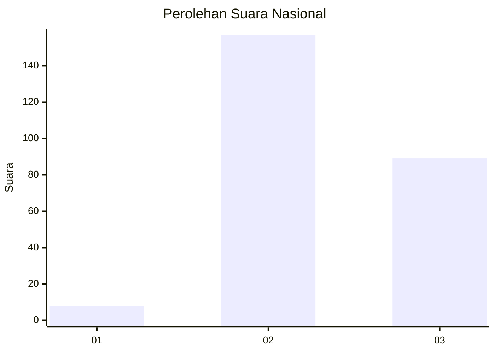
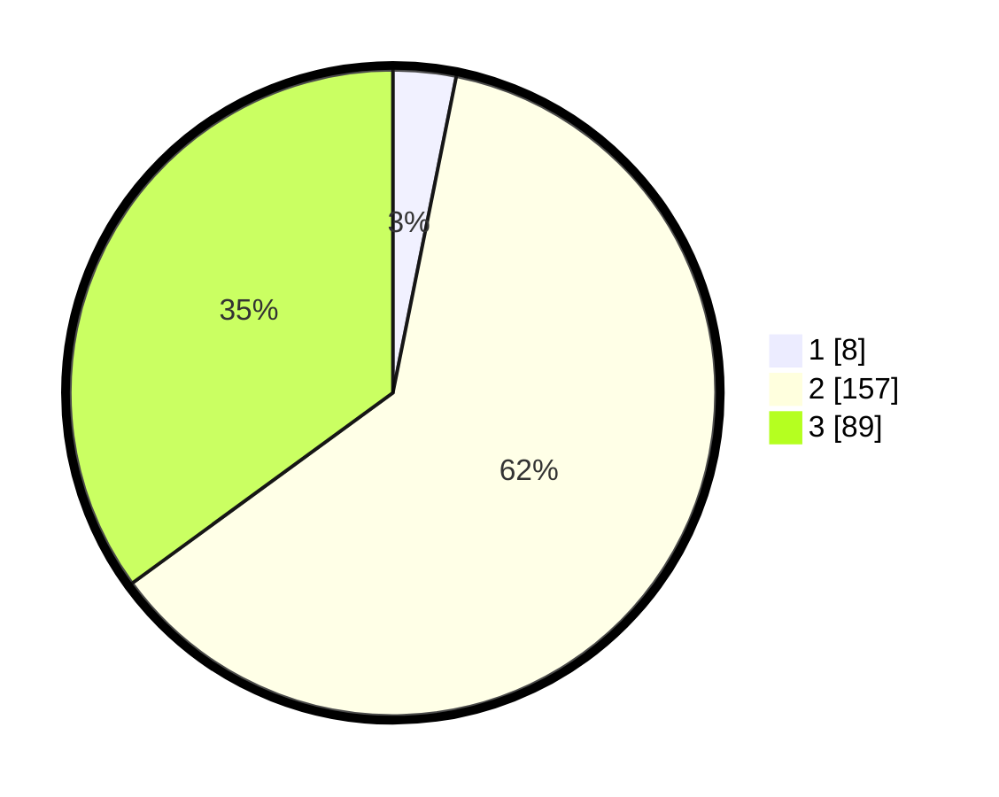

# Hasil

## Grafik

## Tabel

| No. | Nama Paslon    | Suara | Suara (raw) | Persentase |
|:--- |:-------------- | -----:| -----------:| ----------:|
| 1   | ANIES MUHAIMIN | 8     | [8][p-1]    | 3,15       |
| 2   | PRABOWO GIBRAN | 157   | [157][p-2]  | 61,81      |
| 3   | GANJAR MAHFUD  | 89    | [89][p-3]   | 35,04      |

[p-1]: https://github.com/gigit-pemilu/pemilu-2024/blob/main/pilpres/hitung-suara/sub/51-bali/sub/03-badung/sub/06-kuta-utara/sub/1003-kerobokan-kaja/sub/044-tps/sub/paslon-1.txt
[p-2]: https://github.com/gigit-pemilu/pemilu-2024/blob/main/pilpres/hitung-suara/sub/51-bali/sub/03-badung/sub/06-kuta-utara/sub/1003-kerobokan-kaja/sub/044-tps/sub/paslon-2.txt
[p-3]: https://github.com/gigit-pemilu/pemilu-2024/blob/main/pilpres/hitung-suara/sub/51-bali/sub/03-badung/sub/06-kuta-utara/sub/1003-kerobokan-kaja/sub/044-tps/sub/paslon-3.txt

## Foto C Plano

https://sirekap-obj-formc.kpu.go.id/e879/pemilu/ppwp/51/03/06/10/03/5103061003044-20240214-231458--4502f368-2d24-433a-9c5d-d4c2aee2d5b2.jpg

https://sirekap-obj-formc.kpu.go.id/e879/pemilu/ppwp/51/03/06/10/03/5103061003044-20240214-231628--3349bc3f-bc27-4a48-a7a6-44fcabbd16b7.jpg

https://sirekap-obj-formc.kpu.go.id/e879/pemilu/ppwp/51/03/06/10/03/5103061003044-20240214-231832--39a3086e-5fff-4854-8880-08e8a8387f41.jpg

## Metadata

| Key        | Value               |
| ---------- | ------------------- |
| Time Stamp | 2024-02-15 23:29:50 |

