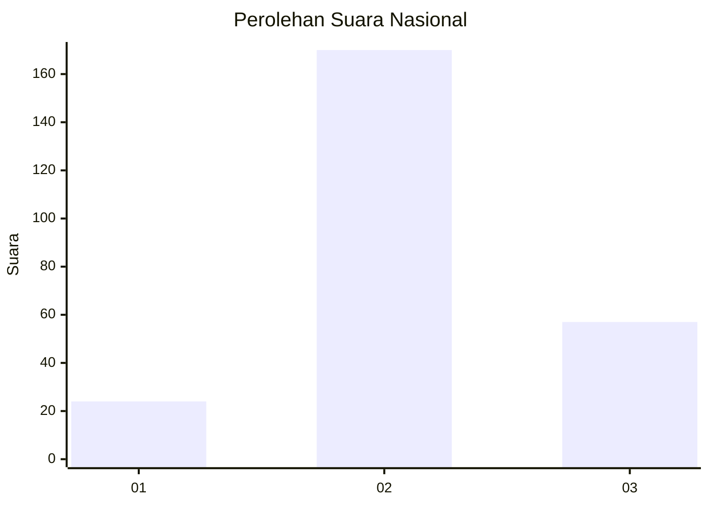
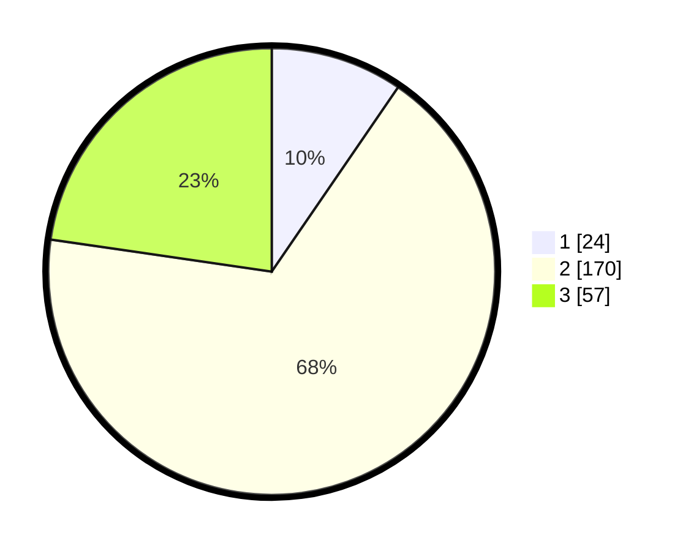

# Hasil

## Grafik

## Tabel

| No. | Nama Paslon    | Suara | Suara (raw) | Persentase |
|:--- |:-------------- | -----:| -----------:| ----------:|
| 1   | ANIES MUHAIMIN | 24    | [24][p-1]   | 9,56       |
| 2   | PRABOWO GIBRAN | 170   | [170][p-2]  | 67,73      |
| 3   | GANJAR MAHFUD  | 57    | [57][p-3]   | 22,71      |

[p-1]: https://github.com/gigit-pemilu/pemilu-2024/blob/main/pilpres/hitung-suara/sub/51-bali/sub/03-badung/sub/06-kuta-utara/sub/1003-kerobokan-kaja/sub/045-tps/sub/paslon-1.txt
[p-2]: https://github.com/gigit-pemilu/pemilu-2024/blob/main/pilpres/hitung-suara/sub/51-bali/sub/03-badung/sub/06-kuta-utara/sub/1003-kerobokan-kaja/sub/045-tps/sub/paslon-2.txt
[p-3]: https://github.com/gigit-pemilu/pemilu-2024/blob/main/pilpres/hitung-suara/sub/51-bali/sub/03-badung/sub/06-kuta-utara/sub/1003-kerobokan-kaja/sub/045-tps/sub/paslon-3.txt

## Foto C Plano

https://sirekap-obj-formc.kpu.go.id/475c/pemilu/ppwp/51/03/06/10/03/5103061003045-20240214-141447--ba3768c1-6797-413a-b034-e0889fcffdd7.jpg

https://sirekap-obj-formc.kpu.go.id/475c/pemilu/ppwp/51/03/06/10/03/5103061003045-20240214-141322--57d8b386-2741-4c41-b846-26a3dc83dd94.jpg

https://sirekap-obj-formc.kpu.go.id/475c/pemilu/ppwp/51/03/06/10/03/5103061003045-20240215-124414--626dbbe7-5c19-442d-bac6-cc6b3f09926e.jpg

## Metadata

| Key        | Value               |
| ---------- | ------------------- |
| Time Stamp | 2024-02-16 08:00:28 |

## DATA PEMILIH TETAP

Jumlah pemilih dalam DPT: **284**.
 * L: **146**.
 * P: **138**.

## DATA PENGGUNA HAK PILIH

Jumlah pengguna hak pilih dalam DPT: **243**.
 * L: **118**.
 * P: **125**.

Jumlah pengguna hak pilih dalam DPTb: **1**.
 * L: **0**.
 * P: **1**.

Jumlah pengguna hak pilih dalam DPK: **8**.
 * L: **0**.
 * P: **8**.

Jumlah pengguna hak pilih: **252**.
 * L: **118**.
 * P: **134**.

## JUMLAH SUARA SAH DAN TIDAK SAH

JUMLAH SELURUH SUARA SAH: **251**.

JUMLAH SUARA TIDAK SAH: **1**.

JUMLAH SELURUH SUARA SAH DAN SUARA TIDAK SAH: **252**.

