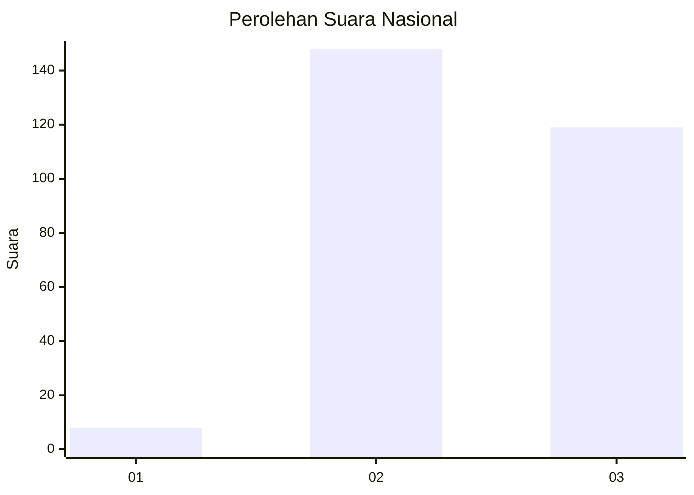
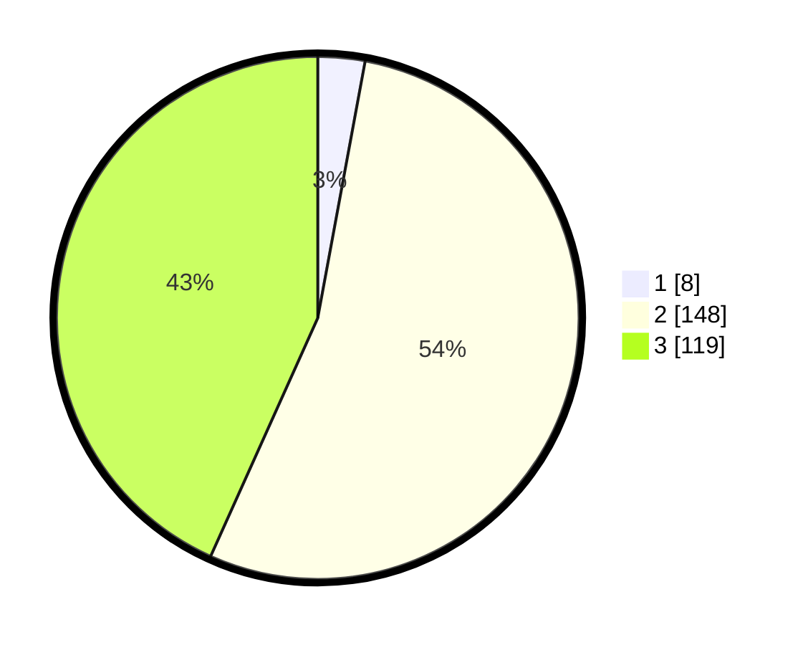

# Hasil

## Grafik

## Tabel

| No. | Nama Paslon    | Suara | Suara (raw) | Persentase |
|:--- |:-------------- | -----:| -----------:| ----------:|
| 1   | ANIES MUHAIMIN | 8     | [8][p-1]    | 2,91       |
| 2   | PRABOWO GIBRAN | 148   | [148][p-2]  | 53,82      |
| 3   | GANJAR MAHFUD  | 119   | [119][p-3]  | 43,27      |

[p-1]: https://github.com/gigit-pemilu/pemilu-2024/blob/main/pilpres/hitung-suara/sub/51-bali/sub/03-badung/sub/06-kuta-utara/sub/2004-tibubeneng/sub/003-tps/sub/paslon-1.txt
[p-2]: https://github.com/gigit-pemilu/pemilu-2024/blob/main/pilpres/hitung-suara/sub/51-bali/sub/03-badung/sub/06-kuta-utara/sub/2004-tibubeneng/sub/003-tps/sub/paslon-2.txt
[p-3]: https://github.com/gigit-pemilu/pemilu-2024/blob/main/pilpres/hitung-suara/sub/51-bali/sub/03-badung/sub/06-kuta-utara/sub/2004-tibubeneng/sub/003-tps/sub/paslon-3.txt

## Foto C Plano

https://sirekap-obj-formc.kpu.go.id/7274/pemilu/ppwp/51/03/06/20/04/5103062004003-20240214-214406--c26b7495-ba2f-4a3e-abb5-b50002266f7c.jpg

https://sirekap-obj-formc.kpu.go.id/7274/pemilu/ppwp/51/03/06/20/04/5103062004003-20240214-214459--b28a9800-06a8-4a17-88f8-9a4e8da098de.jpg

https://sirekap-obj-formc.kpu.go.id/7274/pemilu/ppwp/51/03/06/20/04/5103062004003-20240214-214546--1cfcee4f-3b26-4bb5-8a28-62895c716622.jpg

## Metadata

| Key        | Value               |
| ---------- | ------------------- |
| Time Stamp | 2024-02-24 22:31:28 |

