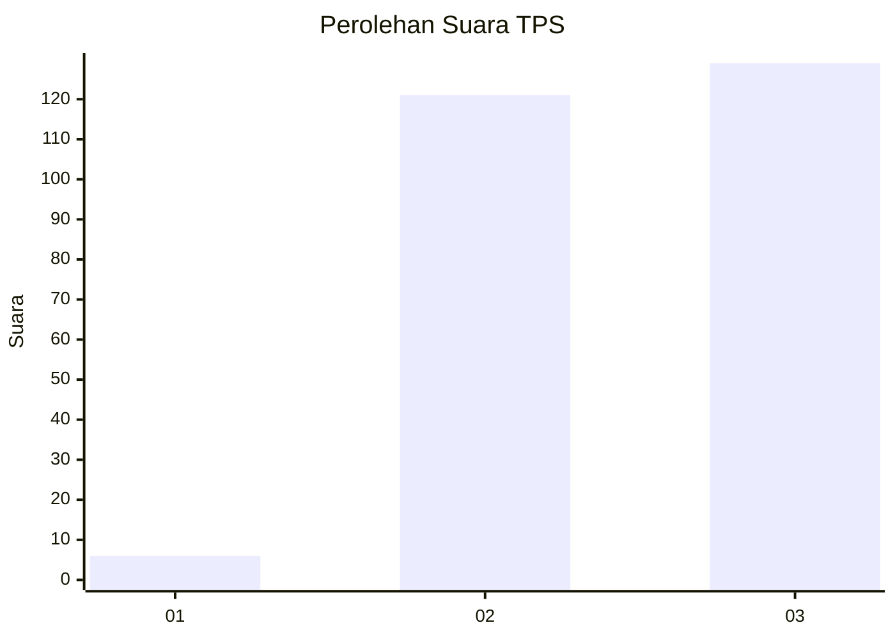
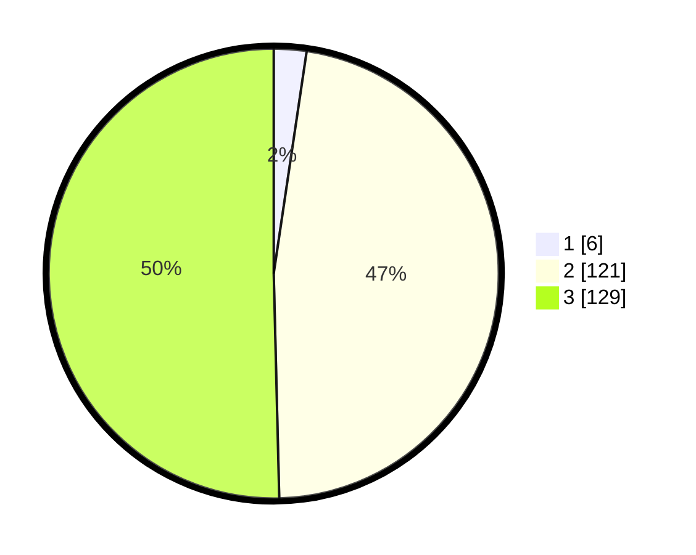

# Hasil

## Grafik

## Tabel

| No. | Nama Paslon    | Suara | Suara (raw) | Persentase |
|:--- |:-------------- | -----:| -----------:| ----------:|
| 1   | ANIES MUHAIMIN | 6     | [6][p-1]    | 2,34       |
| 2   | PRABOWO GIBRAN | 121   | [121][p-2]  | 47,27      |
| 3   | GANJAR MAHFUD  | 129   | [129][p-3]  | 50,39      |

[p-1]: https://github.com/gigit-pemilu/pemilu-2024-51-bali/blob/main/pilpres/hitung-suara/sub/51-bali/sub/03-badung/sub/06-kuta-utara/sub/2004-tibubeneng/sub/004-tps/sub/paslon-1.txt
[p-2]: https://github.com/gigit-pemilu/pemilu-2024-51-bali/blob/main/pilpres/hitung-suara/sub/51-bali/sub/03-badung/sub/06-kuta-utara/sub/2004-tibubeneng/sub/004-tps/sub/paslon-2.txt
[p-3]: https://github.com/gigit-pemilu/pemilu-2024-51-bali/blob/main/pilpres/hitung-suara/sub/51-bali/sub/03-badung/sub/06-kuta-utara/sub/2004-tibubeneng/sub/004-tps/sub/paslon-3.txt

## Foto C Plano

https://sirekap-obj-formc.kpu.go.id/8475/pemilu/ppwp/51/03/06/20/04/5103062004004-20240214-223440--20f56893-5170-465f-ab75-600f2eaf5b29.jpg

https://sirekap-obj-formc.kpu.go.id/8475/pemilu/ppwp/51/03/06/20/04/5103062004004-20240214-223509--322d74a7-3096-4a1f-8a97-3f54c01544df.jpg

https://sirekap-obj-formc.kpu.go.id/8475/pemilu/ppwp/51/03/06/20/04/5103062004004-20240214-223520--fff66904-a9cb-44fd-a88a-6b8eb74a5fd5.jpg

## Metadata

| Key        | Value               |
| ---------- | ------------------- |
| Time Stamp | 2024-02-16 09:00:28 |

## DATA PEMILIH TETAP

Jumlah pemilih dalam DPT: **290**.
 * L: **140**.
 * P: **150**.

## DATA PENGGUNA HAK PILIH

Jumlah pengguna hak pilih dalam DPT: **258**.
 * L: **119**.
 * P: **139**.

Jumlah pengguna hak pilih dalam DPTb: **0**.
 * L: **0**.
 * P: **0**.

Jumlah pengguna hak pilih dalam DPK: **0**.
 * L: **0**.
 * P: **0**.

Jumlah pengguna hak pilih: **258**.
 * L: **119**.
 * P: **139**.

## JUMLAH SUARA SAH DAN TIDAK SAH

JUMLAH SELURUH SUARA SAH: **256**.

JUMLAH SUARA TIDAK SAH: **2**.

JUMLAH SELURUH SUARA SAH DAN SUARA TIDAK SAH: **258**.

