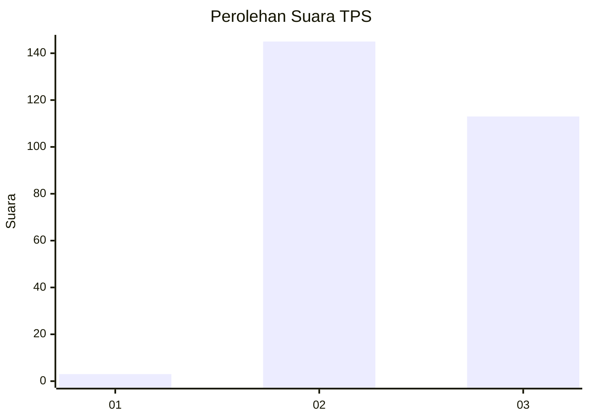
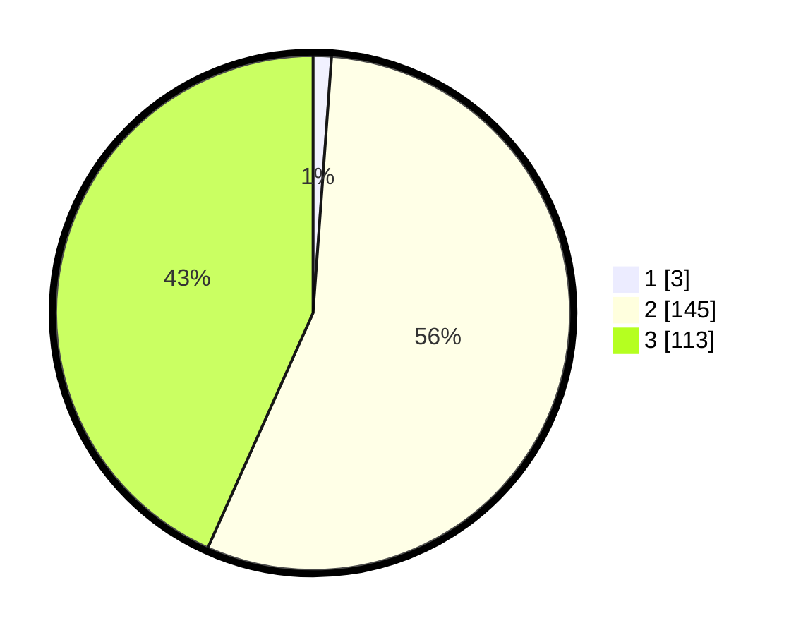

# Hasil

## Grafik

## Tabel

| No. | Nama Paslon    | Suara | Suara (raw) | Persentase |
|:--- |:-------------- | -----:| -----------:| ----------:|
| 1   | ANIES MUHAIMIN | 3     | [3][p-1]    | 1,15       |
| 2   | PRABOWO GIBRAN | 145   | [145][p-2]  | 55,56      |
| 3   | GANJAR MAHFUD  | 113   | [113][p-3]  | 43,30      |

[p-1]: https://github.com/gigit-pemilu/pemilu-2024-51-bali/blob/main/pilpres/hitung-suara/sub/51-bali/sub/03-badung/sub/06-kuta-utara/sub/2004-tibubeneng/sub/005-tps/sub/paslon-1.txt
[p-2]: https://github.com/gigit-pemilu/pemilu-2024-51-bali/blob/main/pilpres/hitung-suara/sub/51-bali/sub/03-badung/sub/06-kuta-utara/sub/2004-tibubeneng/sub/005-tps/sub/paslon-2.txt
[p-3]: https://github.com/gigit-pemilu/pemilu-2024-51-bali/blob/main/pilpres/hitung-suara/sub/51-bali/sub/03-badung/sub/06-kuta-utara/sub/2004-tibubeneng/sub/005-tps/sub/paslon-3.txt

## Foto C Plano

https://sirekap-obj-formc.kpu.go.id/ba9b/pemilu/ppwp/51/03/06/20/04/5103062004005-20240216-101034--d5a293f2-c253-44a4-a4fe-e0fc35d2815e.jpg

https://sirekap-obj-formc.kpu.go.id/ba9b/pemilu/ppwp/51/03/06/20/04/5103062004005-20240216-101058--90085587-bb99-4a7b-9fab-8638ccfe0410.jpg

https://sirekap-obj-formc.kpu.go.id/ba9b/pemilu/ppwp/51/03/06/20/04/5103062004005-20240216-101114--dff446ac-b7c5-4ada-b4b8-59d6019aa0dc.jpg

## Metadata

| Key        | Value               |
| ---------- | ------------------- |
| Time Stamp | 2024-02-21 16:00:00 |

## DATA PEMILIH TETAP

Jumlah pemilih dalam DPT: **289**.
 * L: **147**.
 * P: **142**.

## DATA PENGGUNA HAK PILIH

Jumlah pengguna hak pilih dalam DPT: **256**.
 * L: **129**.
 * P: **127**.

Jumlah pengguna hak pilih dalam DPTb: **3**.
 * L: **1**.
 * P: **2**.

Jumlah pengguna hak pilih dalam DPK: **8**.
 * L: **4**.
 * P: **4**.

Jumlah pengguna hak pilih: **267**.
 * L: **134**.
 * P: **133**.

## JUMLAH SUARA SAH DAN TIDAK SAH

JUMLAH SELURUH SUARA SAH: **261**.

JUMLAH SUARA TIDAK SAH: **6**.

JUMLAH SELURUH SUARA SAH DAN SUARA TIDAK SAH: **267**.

