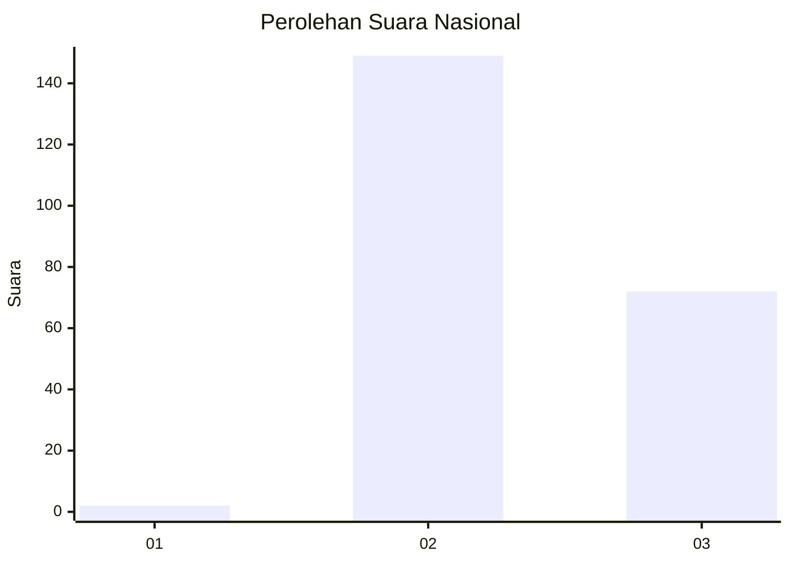
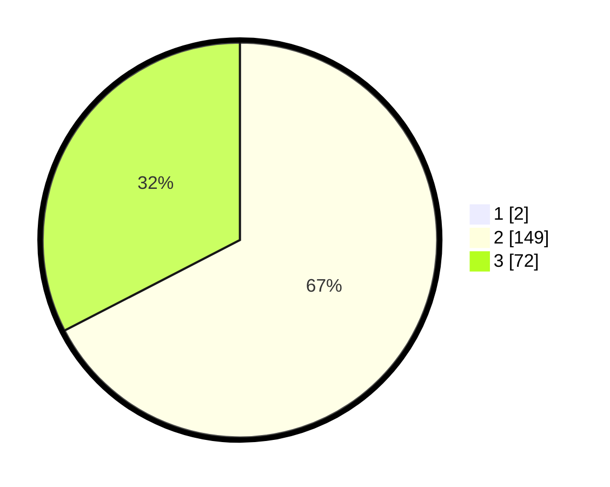

# Hasil

## Grafik

## Tabel

| No. | Nama Paslon    | Suara | Suara (raw) | Persentase |
|:--- |:-------------- | -----:| -----------:| ----------:|
| 1   | ANIES MUHAIMIN | 2     | [2][p-1]    | 0,90       |
| 2   | PRABOWO GIBRAN | 149   | [149][p-2]  | 66,82      |
| 3   | GANJAR MAHFUD  | 72    | [72][p-3]   | 32,29      |

[p-1]: https://github.com/gigit-pemilu/pemilu-2024/blob/main/pilpres/hitung-suara/sub/51-bali/sub/03-badung/sub/06-kuta-utara/sub/2004-tibubeneng/sub/008-tps/sub/paslon-1.txt
[p-2]: https://github.com/gigit-pemilu/pemilu-2024/blob/main/pilpres/hitung-suara/sub/51-bali/sub/03-badung/sub/06-kuta-utara/sub/2004-tibubeneng/sub/008-tps/sub/paslon-2.txt
[p-3]: https://github.com/gigit-pemilu/pemilu-2024/blob/main/pilpres/hitung-suara/sub/51-bali/sub/03-badung/sub/06-kuta-utara/sub/2004-tibubeneng/sub/008-tps/sub/paslon-3.txt

## Foto C Plano

https://sirekap-obj-formc.kpu.go.id/8209/pemilu/ppwp/51/03/06/20/04/5103062004008-20240214-221509--d59b5dcf-002d-4437-9ac6-3828fdddf759.jpg

https://sirekap-obj-formc.kpu.go.id/8209/pemilu/ppwp/51/03/06/20/04/5103062004008-20240214-221647--13cea00f-aeaf-47d8-86fa-be6ed4dbbd53.jpg

https://sirekap-obj-formc.kpu.go.id/8209/pemilu/ppwp/51/03/06/20/04/5103062004008-20240214-221744--f72f3cf7-b4c3-4a25-bb10-76fbfe4a18e0.jpg

## Metadata

| Key        | Value               |
| ---------- | ------------------- |
| Time Stamp | 2024-02-21 19:00:00 |

## DATA PEMILIH TETAP

Jumlah pemilih dalam DPT: **219**.
 * L: **103**.
 * P: **116**.

## DATA PENGGUNA HAK PILIH

Jumlah pengguna hak pilih dalam DPT: **204**.
 * L: **96**.
 * P: **108**.

Jumlah pengguna hak pilih dalam DPTb: **12**.
 * L: **9**.
 * P: **3**.

Jumlah pengguna hak pilih dalam DPK: **8**.
 * L: **1**.
 * P: **7**.

Jumlah pengguna hak pilih: **224**.
 * L: **106**.
 * P: **118**.

## JUMLAH SUARA SAH DAN TIDAK SAH

JUMLAH SELURUH SUARA SAH: **223**.

JUMLAH SUARA TIDAK SAH: **1**.

JUMLAH SELURUH SUARA SAH DAN SUARA TIDAK SAH: **224**.

