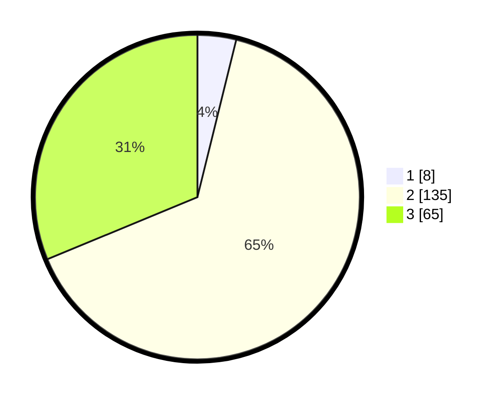

# Hasil

## Grafik

## Tabel

| No. | Nama Paslon    | Suara | Suara (raw) | Persentase |
|:--- |:-------------- | -----:| -----------:| ----------:|
| 1   | ANIES MUHAIMIN | 8     | [8][p-1]    | 3,85       |
| 2   | PRABOWO GIBRAN | 135   | [135][p-2]  | 64,90      |
| 3   | GANJAR MAHFUD  | 65    | [65][p-3]   | 31,25      |

[p-1]: https://github.com/gigit-pemilu/pemilu-2024-51-bali/blob/main/pilpres/hitung-suara/sub/51-bali/sub/03-badung/sub/06-kuta-utara/sub/2004-tibubeneng/sub/009-tps/sub/paslon-1.txt
[p-2]: https://github.com/gigit-pemilu/pemilu-2024-51-bali/blob/main/pilpres/hitung-suara/sub/51-bali/sub/03-badung/sub/06-kuta-utara/sub/2004-tibubeneng/sub/009-tps/sub/paslon-2.txt
[p-3]: https://github.com/gigit-pemilu/pemilu-2024-51-bali/blob/main/pilpres/hitung-suara/sub/51-bali/sub/03-badung/sub/06-kuta-utara/sub/2004-tibubeneng/sub/009-tps/sub/paslon-3.txt

## Foto C Plano

https://sirekap-obj-formc.kpu.go.id/bf3c/pemilu/ppwp/51/03/06/20/04/5103062004009-20240214-141803--6b1458fc-37cb-4a96-9939-e73077758527.jpg

https://sirekap-obj-formc.kpu.go.id/bf3c/pemilu/ppwp/51/03/06/20/04/5103062004009-20240214-141613--e8058aa6-1572-4f9d-bbd2-9a825ba90a57.jpg

https://sirekap-obj-formc.kpu.go.id/bf3c/pemilu/ppwp/51/03/06/20/04/5103062004009-20240214-141714--60755690-9878-4aa7-9f8d-49fcab1f41f3.jpg

## Metadata

| Key        | Value               |
| ---------- | ------------------- |
| Time Stamp | 2024-02-24 22:31:28 |

