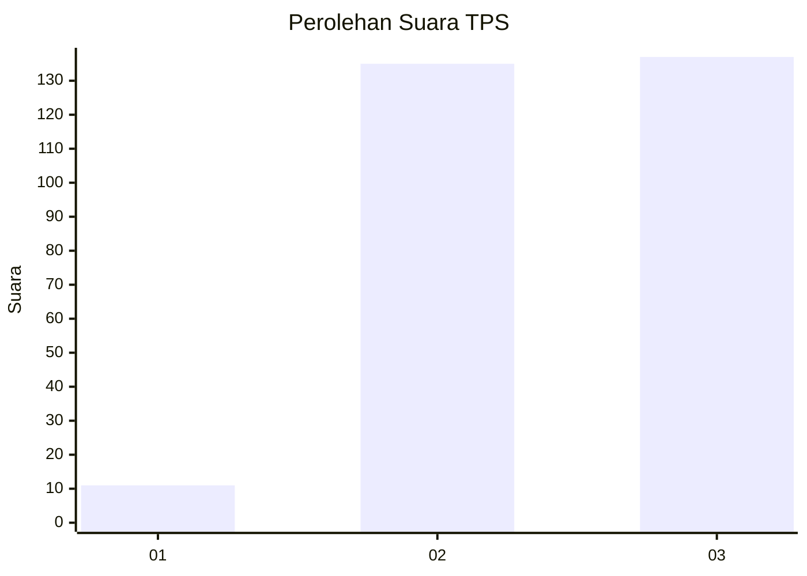
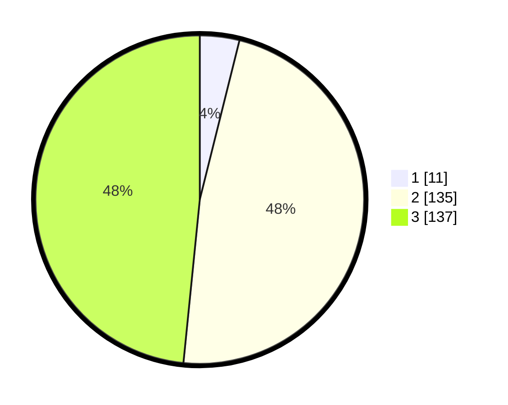

# Hasil

## Grafik

## Tabel

| No. | Nama Paslon    | Suara | Suara (raw) | Persentase |
|:--- |:-------------- | -----:| -----------:| ----------:|
| 1   | ANIES MUHAIMIN | 11    | [11][p-1]   | 3,89       |
| 2   | PRABOWO GIBRAN | 135   | [135][p-2]  | 47,70      |
| 3   | GANJAR MAHFUD  | 137   | [137][p-3]  | 48,41      |

[p-1]: https://github.com/gigit-pemilu/pemilu-2024-51-bali/blob/main/pilpres/hitung-suara/sub/51-bali/sub/03-badung/sub/06-kuta-utara/sub/2004-tibubeneng/sub/012-tps/sub/paslon-1.txt
[p-2]: https://github.com/gigit-pemilu/pemilu-2024-51-bali/blob/main/pilpres/hitung-suara/sub/51-bali/sub/03-badung/sub/06-kuta-utara/sub/2004-tibubeneng/sub/012-tps/sub/paslon-2.txt
[p-3]: https://github.com/gigit-pemilu/pemilu-2024-51-bali/blob/main/pilpres/hitung-suara/sub/51-bali/sub/03-badung/sub/06-kuta-utara/sub/2004-tibubeneng/sub/012-tps/sub/paslon-3.txt

## Foto C Plano

https://sirekap-obj-formc.kpu.go.id/13e2/pemilu/ppwp/51/03/06/20/04/5103062004012-20240216-134735--781daccb-94a3-4a88-bcf0-8ecb39806b29.jpg

https://sirekap-obj-formc.kpu.go.id/13e2/pemilu/ppwp/51/03/06/20/04/5103062004012-20240216-134736--2b0fb828-2eaf-42a7-b10b-ef39c0cfc6bd.jpg

https://sirekap-obj-formc.kpu.go.id/13e2/pemilu/ppwp/51/03/06/20/04/5103062004012-20240216-134735--904ecd1b-b793-4f6c-9061-432f488b63a0.jpg

## Metadata

| Key        | Value               |
| ---------- | ------------------- |
| Time Stamp | 2024-02-21 21:00:04 |

## DATA PEMILIH TETAP

Jumlah pemilih dalam DPT: **292**.
 * L: **143**.
 * P: **149**.

## DATA PENGGUNA HAK PILIH

Jumlah pengguna hak pilih dalam DPT: **272**.
 * L: **132**.
 * P: **140**.

Jumlah pengguna hak pilih dalam DPTb: **3**.
 * L: **1**.
 * P: **2**.

Jumlah pengguna hak pilih dalam DPK: **8**.
 * L: **2**.
 * P: **6**.

Jumlah pengguna hak pilih: **283**.
 * L: **135**.
 * P: **148**.

## JUMLAH SUARA SAH DAN TIDAK SAH

JUMLAH SELURUH SUARA SAH: **283**.

JUMLAH SUARA TIDAK SAH: **0**.

JUMLAH SELURUH SUARA SAH DAN SUARA TIDAK SAH: **283**.

