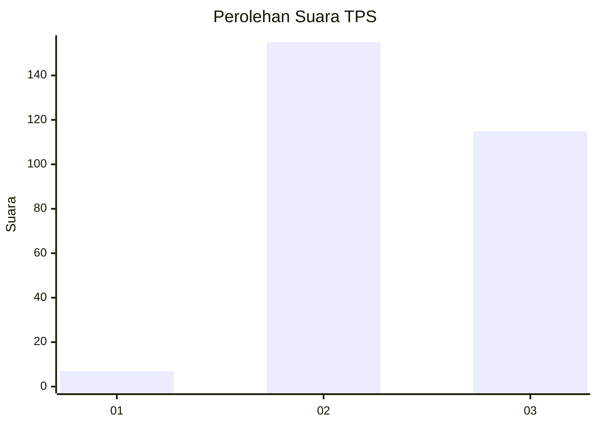
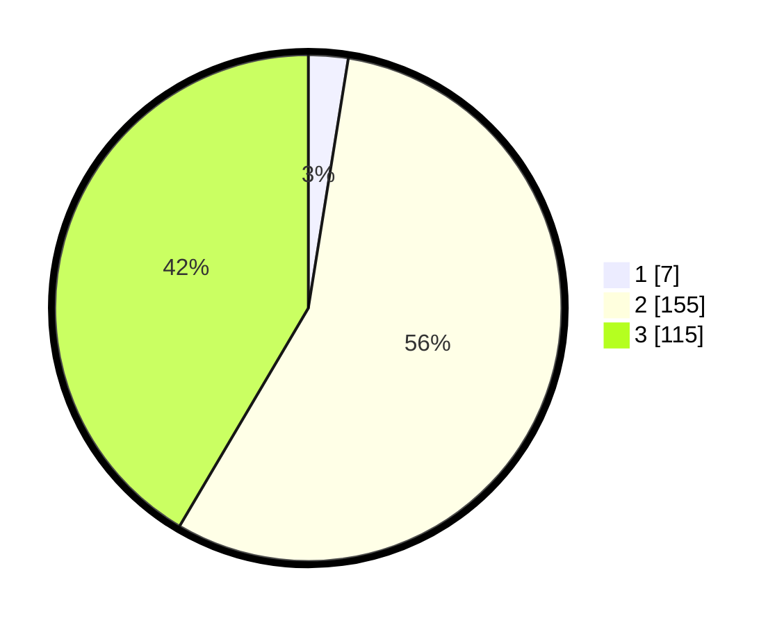

# Hasil

## Grafik

## Tabel

| No. | Nama Paslon    | Suara | Suara (raw) | Persentase |
|:--- |:-------------- | -----:| -----------:| ----------:|
| 1   | ANIES MUHAIMIN | 7     | [7][p-1]    | 2,53       |
| 2   | PRABOWO GIBRAN | 155   | [155][p-2]  | 55,96      |
| 3   | GANJAR MAHFUD  | 115   | [115][p-3]  | 41,52      |

[p-1]: https://github.com/gigit-pemilu/pemilu-2024-51-bali/blob/main/pilpres/hitung-suara/sub/51-bali/sub/03-badung/sub/06-kuta-utara/sub/2004-tibubeneng/sub/014-tps/sub/paslon-1.txt
[p-2]: https://github.com/gigit-pemilu/pemilu-2024-51-bali/blob/main/pilpres/hitung-suara/sub/51-bali/sub/03-badung/sub/06-kuta-utara/sub/2004-tibubeneng/sub/014-tps/sub/paslon-2.txt
[p-3]: https://github.com/gigit-pemilu/pemilu-2024-51-bali/blob/main/pilpres/hitung-suara/sub/51-bali/sub/03-badung/sub/06-kuta-utara/sub/2004-tibubeneng/sub/014-tps/sub/paslon-3.txt

## Foto C Plano

https://sirekap-obj-formc.kpu.go.id/1766/pemilu/ppwp/51/03/06/20/04/5103062004014-20240214-175314--27e4e91d-9f62-4c34-8186-368afff1efce.jpg

https://sirekap-obj-formc.kpu.go.id/1766/pemilu/ppwp/51/03/06/20/04/5103062004014-20240214-175446--0e2f03b4-0e01-4b67-bd56-373a3e3db28a.jpg

https://sirekap-obj-formc.kpu.go.id/1766/pemilu/ppwp/51/03/06/20/04/5103062004014-20240216-074456--64115f07-74a4-436c-94ae-e7a6f0597acd.jpg

## Metadata

| Key        | Value               |
| ---------- | ------------------- |
| Time Stamp | 2024-02-21 22:00:00 |

## DATA PEMILIH TETAP

Jumlah pemilih dalam DPT: **289**.
 * L: **152**.
 * P: **137**.

## DATA PENGGUNA HAK PILIH

Jumlah pengguna hak pilih dalam DPT: **267**.
 * L: **143**.
 * P: **124**.

Jumlah pengguna hak pilih dalam DPTb: **10**.
 * L: **3**.
 * P: **7**.

Jumlah pengguna hak pilih dalam DPK: **3**.
 * L: **2**.
 * P: **1**.

Jumlah pengguna hak pilih: **280**.
 * L: **148**.
 * P: **132**.

## JUMLAH SUARA SAH DAN TIDAK SAH

JUMLAH SELURUH SUARA SAH: **277**.

JUMLAH SUARA TIDAK SAH: **3**.

JUMLAH SELURUH SUARA SAH DAN SUARA TIDAK SAH: **280**.

