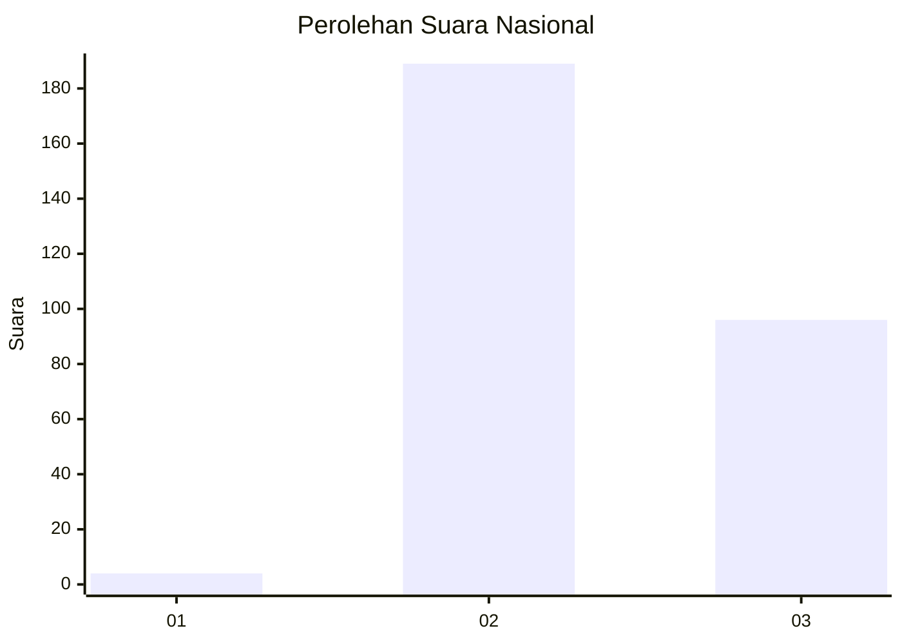
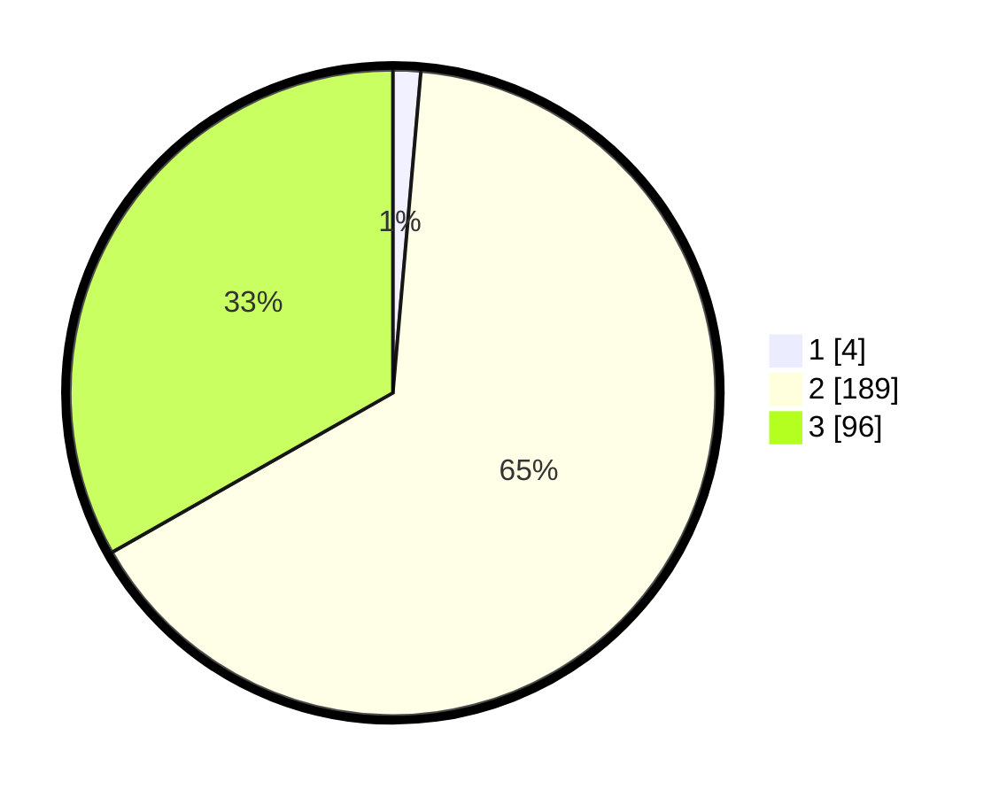

# Hasil

## Grafik

## Tabel

| No. | Nama Paslon    | Suara | Suara (raw) | Persentase |
|:--- |:-------------- | -----:| -----------:| ----------:|
| 1   | ANIES MUHAIMIN | 4     | [4][p-1]    | 1,38       |
| 2   | PRABOWO GIBRAN | 189   | [189][p-2]  | 65,40      |
| 3   | GANJAR MAHFUD  | 96    | [96][p-3]   | 33,22      |

[p-1]: https://github.com/gigit-pemilu/pemilu-2024/blob/main/pilpres/hitung-suara/sub/51-bali/sub/03-badung/sub/06-kuta-utara/sub/2004-tibubeneng/sub/016-tps/sub/paslon-1.txt
[p-2]: https://github.com/gigit-pemilu/pemilu-2024/blob/main/pilpres/hitung-suara/sub/51-bali/sub/03-badung/sub/06-kuta-utara/sub/2004-tibubeneng/sub/016-tps/sub/paslon-2.txt
[p-3]: https://github.com/gigit-pemilu/pemilu-2024/blob/main/pilpres/hitung-suara/sub/51-bali/sub/03-badung/sub/06-kuta-utara/sub/2004-tibubeneng/sub/016-tps/sub/paslon-3.txt

## Foto C Plano

https://sirekap-obj-formc.kpu.go.id/6bca/pemilu/ppwp/51/03/06/20/04/5103062004016-20240214-205410--3202322d-6e0e-4082-834f-0bdceb2228f4.jpg

https://sirekap-obj-formc.kpu.go.id/6bca/pemilu/ppwp/51/03/06/20/04/5103062004016-20240214-205527--b95e4d8c-ecde-4e01-b591-619ff8ef20a1.jpg

https://sirekap-obj-formc.kpu.go.id/6bca/pemilu/ppwp/51/03/06/20/04/5103062004016-20240214-205619--4ba9add8-da4a-4c4f-b168-5acd2a2345a2.jpg

## Metadata

| Key        | Value               |
| ---------- | ------------------- |
| Time Stamp | 2024-02-21 21:00:04 |

## DATA PEMILIH TETAP

Jumlah pemilih dalam DPT: **297**.
 * L: **141**.
 * P: **156**.

## DATA PENGGUNA HAK PILIH

Jumlah pengguna hak pilih dalam DPT: **291**.
 * L: **138**.
 * P: **153**.

Jumlah pengguna hak pilih dalam DPTb: **0**.
 * L: **0**.
 * P: **0**.

Jumlah pengguna hak pilih dalam DPK: **1**.
 * L: **0**.
 * P: **1**.

Jumlah pengguna hak pilih: **292**.
 * L: **138**.
 * P: **154**.

## JUMLAH SUARA SAH DAN TIDAK SAH

JUMLAH SELURUH SUARA SAH: **289**.

JUMLAH SUARA TIDAK SAH: **3**.

JUMLAH SELURUH SUARA SAH DAN SUARA TIDAK SAH: **292**.

