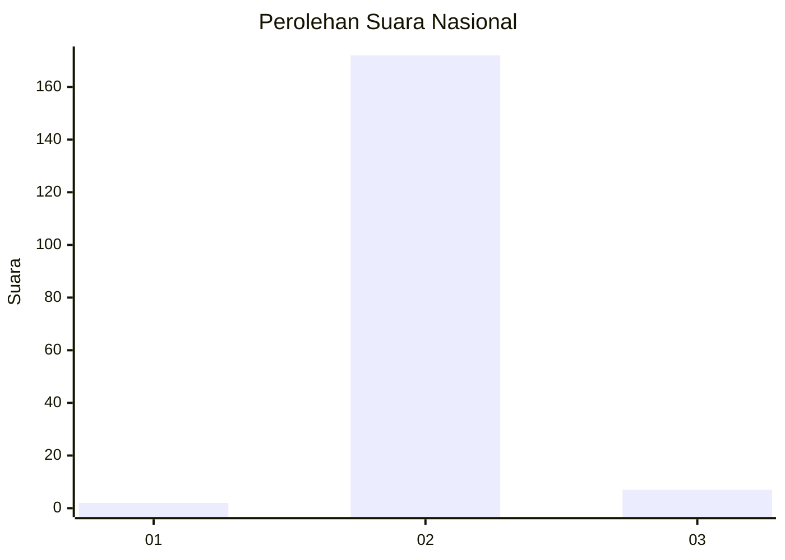
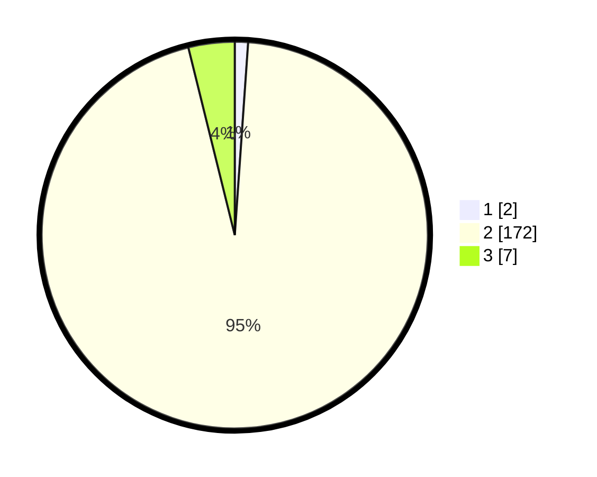

# Hasil

## Grafik

## Tabel

| No. | Nama Paslon    | Suara | Suara (raw) | Persentase |
|:--- |:-------------- | -----:| -----------:| ----------:|
| 1   | ANIES MUHAIMIN | 2     | [2][p-1]    | 1,10       |
| 2   | PRABOWO GIBRAN | 172   | [172][p-2]  | 95,03      |
| 3   | GANJAR MAHFUD  | 7     | [7][p-3]    | 3,87       |

[p-1]: https://github.com/gigit-pemilu/pemilu-2024/blob/main/pilpres/hitung-suara/sub/51-bali/sub/03-badung/sub/06-kuta-utara/sub/2004-tibubeneng/sub/021-tps/sub/paslon-1.txt
[p-2]: https://github.com/gigit-pemilu/pemilu-2024/blob/main/pilpres/hitung-suara/sub/51-bali/sub/03-badung/sub/06-kuta-utara/sub/2004-tibubeneng/sub/021-tps/sub/paslon-2.txt
[p-3]: https://github.com/gigit-pemilu/pemilu-2024/blob/main/pilpres/hitung-suara/sub/51-bali/sub/03-badung/sub/06-kuta-utara/sub/2004-tibubeneng/sub/021-tps/sub/paslon-3.txt

## Foto C Plano

https://sirekap-obj-formc.kpu.go.id/1624/pemilu/ppwp/51/03/06/20/04/5103062004021-20240214-233141--b6a6a56f-e185-41a6-ab58-a80205533bd9.jpg

https://sirekap-obj-formc.kpu.go.id/1624/pemilu/ppwp/51/03/06/20/04/5103062004021-20240214-233151--24849abf-8673-4b26-b174-8a096bed9caa.jpg

https://sirekap-obj-formc.kpu.go.id/1624/pemilu/ppwp/51/03/06/20/04/5103062004021-20240218-070828--8e487d07-17ed-4294-9466-9929c76e4878.jpg

## Metadata

| Key        | Value               |
| ---------- | ------------------- |
| Time Stamp | 2024-02-19 06:16:00 |

