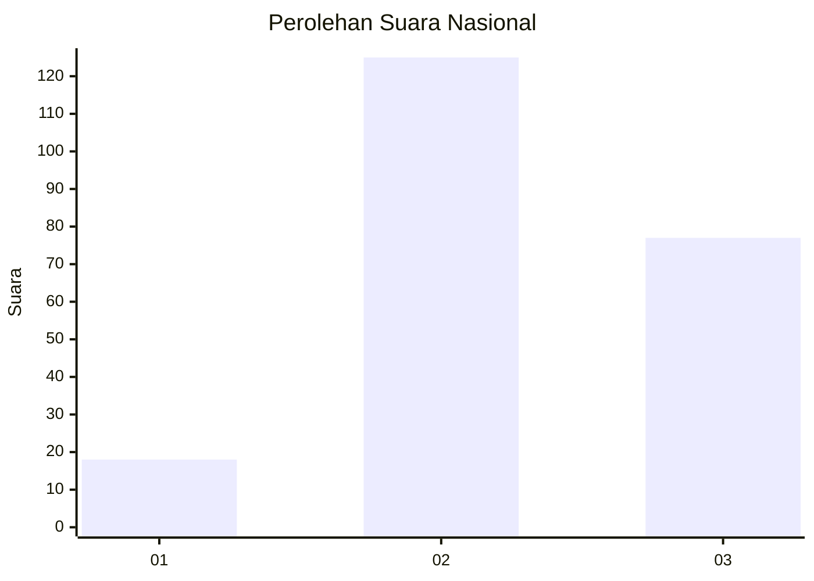
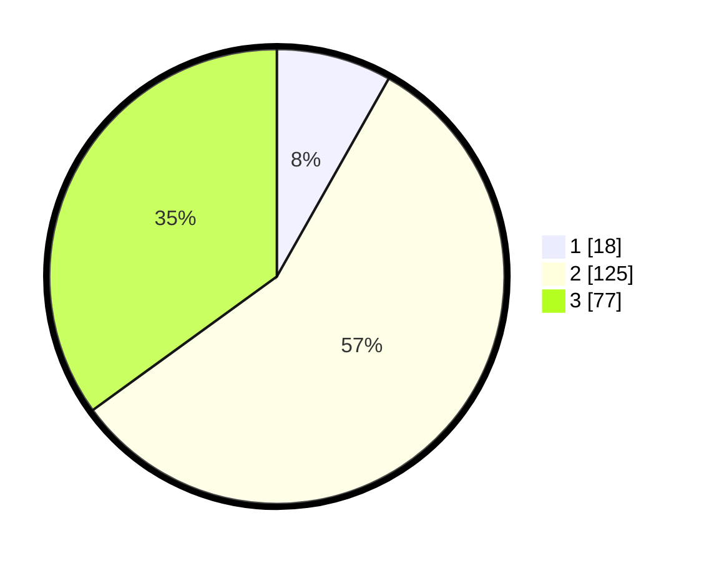

# Hasil

## Grafik

## Tabel

| No. | Nama Paslon    | Suara | Suara (raw) | Persentase |
|:--- |:-------------- | -----:| -----------:| ----------:|
| 1   | ANIES MUHAIMIN | 18    | [18][p-1]   | 8,18       |
| 2   | PRABOWO GIBRAN | 125   | [125][p-2]  | 56,82      |
| 3   | GANJAR MAHFUD  | 77    | [77][p-3]   | 35,00      |

[p-1]: https://github.com/gigit-pemilu/pemilu-2024/blob/main/pilpres/hitung-suara/sub/51-bali/sub/03-badung/sub/06-kuta-utara/sub/2004-tibubeneng/sub/023-tps/sub/paslon-1.txt
[p-2]: https://github.com/gigit-pemilu/pemilu-2024/blob/main/pilpres/hitung-suara/sub/51-bali/sub/03-badung/sub/06-kuta-utara/sub/2004-tibubeneng/sub/023-tps/sub/paslon-2.txt
[p-3]: https://github.com/gigit-pemilu/pemilu-2024/blob/main/pilpres/hitung-suara/sub/51-bali/sub/03-badung/sub/06-kuta-utara/sub/2004-tibubeneng/sub/023-tps/sub/paslon-3.txt

## Foto C Plano

https://sirekap-obj-formc.kpu.go.id/d942/pemilu/ppwp/51/03/06/20/04/5103062004023-20240216-142756--792f0417-f590-4809-85fb-8f02f1437eee.jpg

https://sirekap-obj-formc.kpu.go.id/d942/pemilu/ppwp/51/03/06/20/04/5103062004023-20240216-142758--fcb96b64-d171-4ca0-a682-5aa3d88e693b.jpg

https://sirekap-obj-formc.kpu.go.id/d942/pemilu/ppwp/51/03/06/20/04/5103062004023-20240216-142757--daf88dda-6acf-4b64-ac5a-b0d583f95f2f.jpg

## Metadata

| Key        | Value               |
| ---------- | ------------------- |
| Time Stamp | 2024-02-24 22:31:28 |

## DATA PEMILIH TETAP

Jumlah pemilih dalam DPT: **224**.
 * L: **110**.
 * P: **114**.

## DATA PENGGUNA HAK PILIH

Jumlah pengguna hak pilih dalam DPT: **216**.
 * L: **106**.
 * P: **110**.

Jumlah pengguna hak pilih dalam DPTb: **7**.
 * L: **5**.
 * P: **2**.

Jumlah pengguna hak pilih dalam DPK: **0**.
 * L: **0**.
 * P: **0**.

Jumlah pengguna hak pilih: **223**.
 * L: **111**.
 * P: **112**.

## JUMLAH SUARA SAH DAN TIDAK SAH

JUMLAH SELURUH SUARA SAH: **220**.

JUMLAH SUARA TIDAK SAH: **3**.

JUMLAH SELURUH SUARA SAH DAN SUARA TIDAK SAH: **223**.

