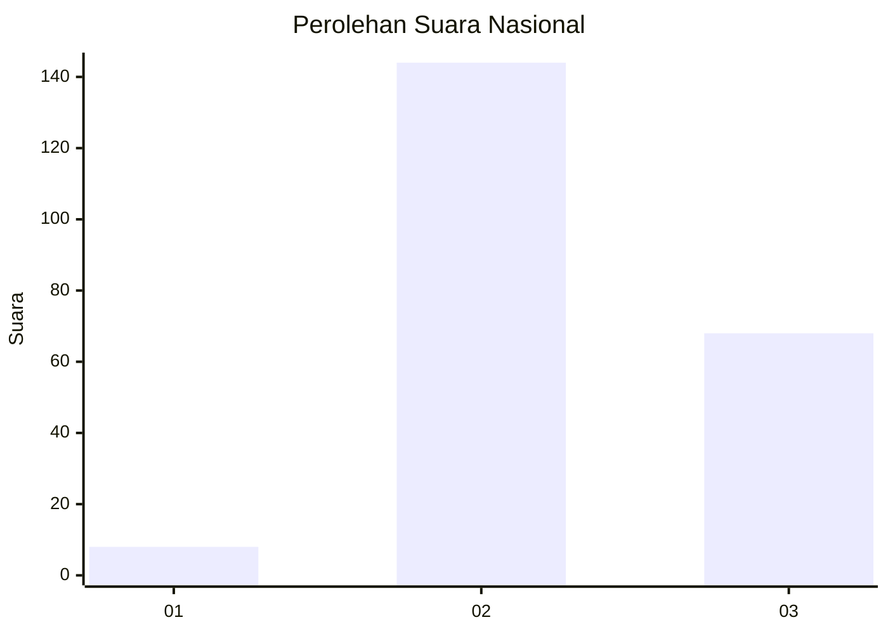
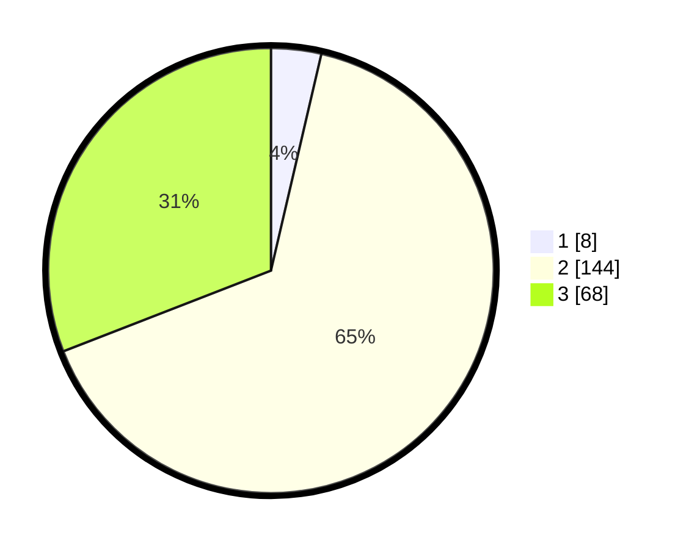

# Hasil

## Grafik

## Tabel

| No. | Nama Paslon    | Suara | Suara (raw) | Persentase |
|:--- |:-------------- | -----:| -----------:| ----------:|
| 1   | ANIES MUHAIMIN | 8     | [8][p-1]    | 3,64       |
| 2   | PRABOWO GIBRAN | 144   | [144][p-2]  | 65,45      |
| 3   | GANJAR MAHFUD  | 68    | [68][p-3]   | 30,91      |

[p-1]: https://github.com/gigit-pemilu/pemilu-2024/blob/main/pilpres/hitung-suara/sub/51-bali/sub/03-badung/sub/06-kuta-utara/sub/2004-tibubeneng/sub/026-tps/sub/paslon-1.txt
[p-2]: https://github.com/gigit-pemilu/pemilu-2024/blob/main/pilpres/hitung-suara/sub/51-bali/sub/03-badung/sub/06-kuta-utara/sub/2004-tibubeneng/sub/026-tps/sub/paslon-2.txt
[p-3]: https://github.com/gigit-pemilu/pemilu-2024/blob/main/pilpres/hitung-suara/sub/51-bali/sub/03-badung/sub/06-kuta-utara/sub/2004-tibubeneng/sub/026-tps/sub/paslon-3.txt

## Foto C Plano

https://sirekap-obj-formc.kpu.go.id/8600/pemilu/ppwp/51/03/06/20/04/5103062004026-20240214-213109--aa1eb022-b6b4-4dda-a2d1-7de41d992b44.jpg

https://sirekap-obj-formc.kpu.go.id/8600/pemilu/ppwp/51/03/06/20/04/5103062004026-20240214-213110--bec0991c-0d5a-47f7-91a1-d54be33b445a.jpg

https://sirekap-obj-formc.kpu.go.id/8600/pemilu/ppwp/51/03/06/20/04/5103062004026-20240214-213113--3ddbcc87-de68-4a27-a924-4943ff81402e.jpg

## Metadata

| Key        | Value               |
| ---------- | ------------------- |
| Time Stamp | 2024-02-24 22:31:28 |

