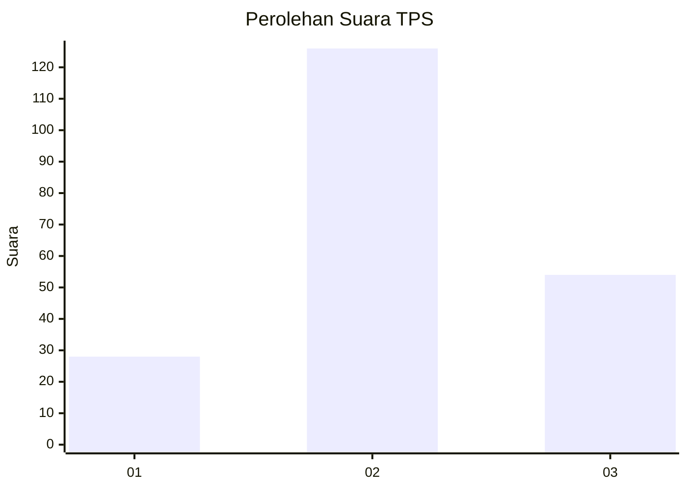
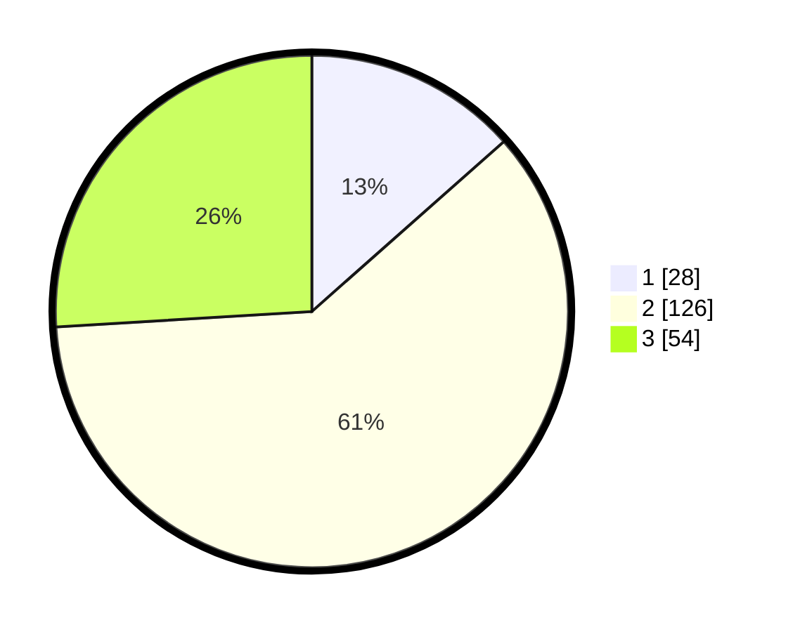

# Hasil

## Grafik

## Tabel

| No. | Nama Paslon    | Suara | Suara (raw) | Persentase |
|:--- |:-------------- | -----:| -----------:| ----------:|
| 1   | ANIES MUHAIMIN | 28    | [28][p-1]   | 13,46      |
| 2   | PRABOWO GIBRAN | 126   | [126][p-2]  | 60,58      |
| 3   | GANJAR MAHFUD  | 54    | [54][p-3]   | 25,96      |

[p-1]: https://github.com/gigit-pemilu/pemilu-2024-51-bali/blob/main/pilpres/hitung-suara/sub/51-bali/sub/03-badung/sub/06-kuta-utara/sub/2004-tibubeneng/sub/029-tps/sub/paslon-1.txt
[p-2]: https://github.com/gigit-pemilu/pemilu-2024-51-bali/blob/main/pilpres/hitung-suara/sub/51-bali/sub/03-badung/sub/06-kuta-utara/sub/2004-tibubeneng/sub/029-tps/sub/paslon-2.txt
[p-3]: https://github.com/gigit-pemilu/pemilu-2024-51-bali/blob/main/pilpres/hitung-suara/sub/51-bali/sub/03-badung/sub/06-kuta-utara/sub/2004-tibubeneng/sub/029-tps/sub/paslon-3.txt

## Foto C Plano

https://sirekap-obj-formc.kpu.go.id/b086/pemilu/ppwp/51/03/06/20/04/5103062004029-20240216-212910--f1ce4917-82ce-4968-9798-89ed9f3e5839.jpg

https://sirekap-obj-formc.kpu.go.id/b086/pemilu/ppwp/51/03/06/20/04/5103062004029-20240218-130605--203de271-c1b9-4451-8c88-25e658e5006a.jpg

https://sirekap-obj-formc.kpu.go.id/b086/pemilu/ppwp/51/03/06/20/04/5103062004029-20240216-214715--80116773-fd79-45e8-87e2-198073d53bed.jpg

## Metadata

| Key        | Value               |
| ---------- | ------------------- |
| Time Stamp | 2024-02-24 22:31:28 |

## DATA PEMILIH TETAP

Jumlah pemilih dalam DPT: **241**.
 * L: **116**.
 * P: **125**.

## DATA PENGGUNA HAK PILIH

Jumlah pengguna hak pilih dalam DPT: **200**.
 * L: **98**.
 * P: **102**.

Jumlah pengguna hak pilih dalam DPTb: **7**.
 * L: **3**.
 * P: **4**.

Jumlah pengguna hak pilih dalam DPK: **4**.
 * L: **2**.
 * P: **2**.

Jumlah pengguna hak pilih: **211**.
 * L: **103**.
 * P: **108**.

## JUMLAH SUARA SAH DAN TIDAK SAH

JUMLAH SELURUH SUARA SAH: **208**.

JUMLAH SUARA TIDAK SAH: **3**.

JUMLAH SELURUH SUARA SAH DAN SUARA TIDAK SAH: **211**.

