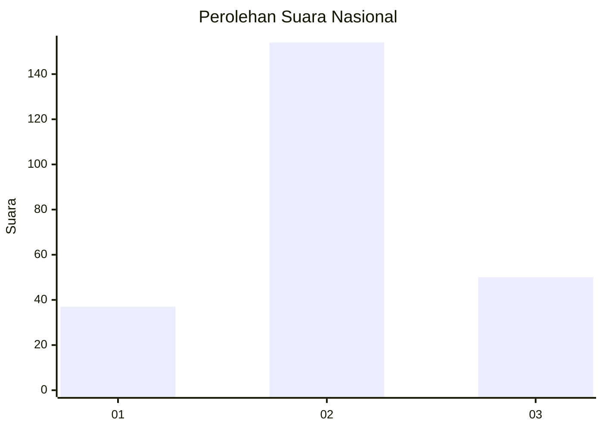
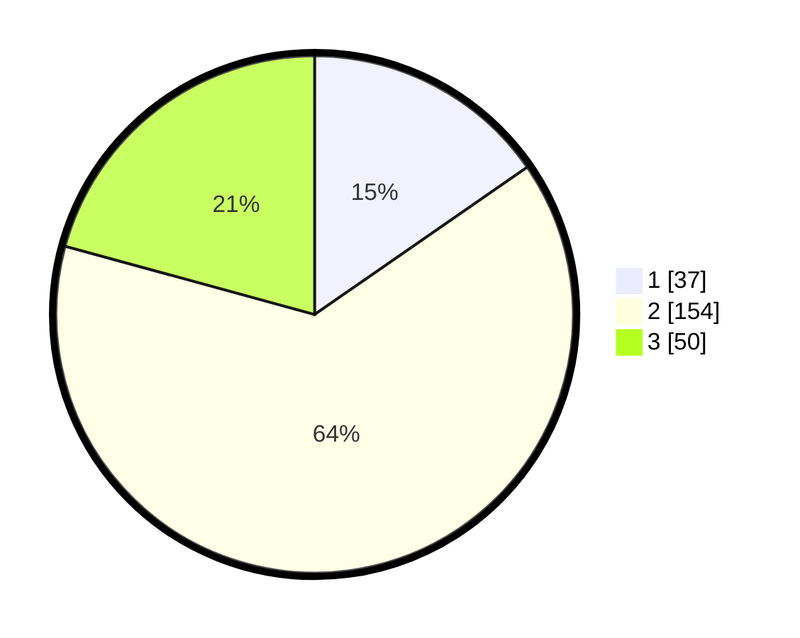

# Hasil

## Grafik

## Tabel

| No. | Nama Paslon    | Suara | Suara (raw) | Persentase |
|:--- |:-------------- | -----:| -----------:| ----------:|
| 1   | ANIES MUHAIMIN | 37    | [37][p-1]   | 15,35      |
| 2   | PRABOWO GIBRAN | 154   | [154][p-2]  | 63,90      |
| 3   | GANJAR MAHFUD  | 50    | [50][p-3]   | 20,75      |

[p-1]: https://github.com/gigit-pemilu/pemilu-2024/blob/main/pilpres/hitung-suara/sub/51-bali/sub/03-badung/sub/06-kuta-utara/sub/2004-tibubeneng/sub/030-tps/sub/paslon-1.txt
[p-2]: https://github.com/gigit-pemilu/pemilu-2024/blob/main/pilpres/hitung-suara/sub/51-bali/sub/03-badung/sub/06-kuta-utara/sub/2004-tibubeneng/sub/030-tps/sub/paslon-2.txt
[p-3]: https://github.com/gigit-pemilu/pemilu-2024/blob/main/pilpres/hitung-suara/sub/51-bali/sub/03-badung/sub/06-kuta-utara/sub/2004-tibubeneng/sub/030-tps/sub/paslon-3.txt

## Foto C Plano

https://sirekap-obj-formc.kpu.go.id/0389/pemilu/ppwp/51/03/06/20/04/5103062004030-20240214-192822--fb71d993-2f03-4eb5-9aed-bdc682c571f2.jpg

https://sirekap-obj-formc.kpu.go.id/0389/pemilu/ppwp/51/03/06/20/04/5103062004030-20240214-193904--c5af7c0e-fae0-4113-aeec-172e45e40029.jpg

https://sirekap-obj-formc.kpu.go.id/0389/pemilu/ppwp/51/03/06/20/04/5103062004030-20240214-195324--efaabcc1-4b63-4c3d-9c69-dc49784550fa.jpg

## Metadata

| Key        | Value               |
| ---------- | ------------------- |
| Time Stamp | 2024-02-14 21:46:01 |

## DATA PEMILIH TETAP

Jumlah pemilih dalam DPT: **249**.
 * L: **126**.
 * P: **123**.

## DATA PENGGUNA HAK PILIH

Jumlah pengguna hak pilih dalam DPT: **209**.
 * L: **105**.
 * P: **104**.

Jumlah pengguna hak pilih dalam DPTb: **5**.
 * L: **0**.
 * P: **5**.

Jumlah pengguna hak pilih dalam DPK: **31**.
 * L: **11**.
 * P: **20**.

Jumlah pengguna hak pilih: **245**.
 * L: **116**.
 * P: **129**.

## JUMLAH SUARA SAH DAN TIDAK SAH

JUMLAH SELURUH SUARA SAH: **241**.

JUMLAH SUARA TIDAK SAH: **4**.

JUMLAH SELURUH SUARA SAH DAN SUARA TIDAK SAH: **245**.

