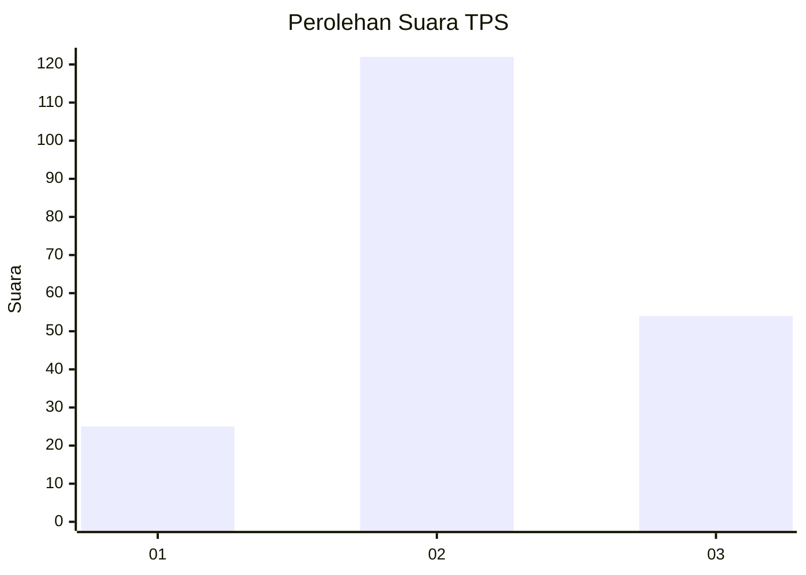
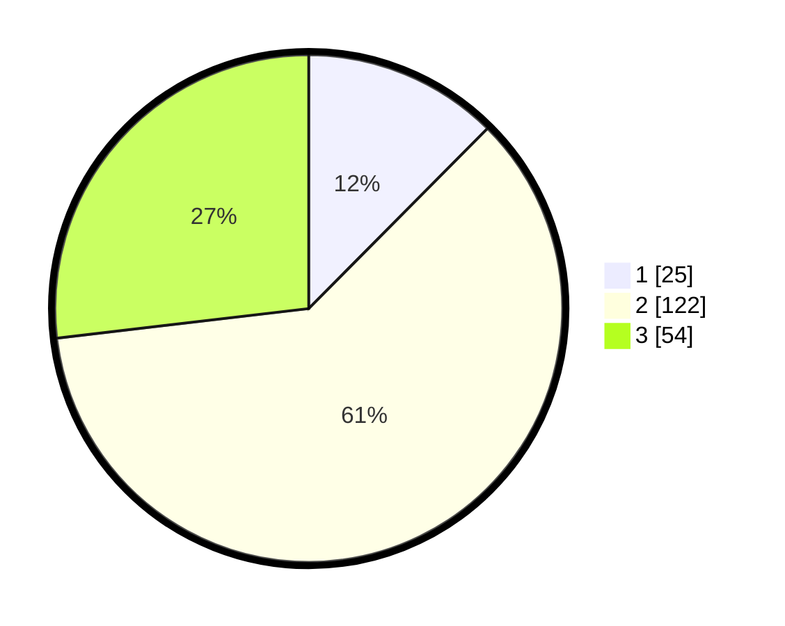

# Hasil

## Grafik

## Tabel

| No. | Nama Paslon    | Suara | Suara (raw) | Persentase |
|:--- |:-------------- | -----:| -----------:| ----------:|
| 1   | ANIES MUHAIMIN | 25    | [25][p-1]   | 12,44      |
| 2   | PRABOWO GIBRAN | 122   | [122][p-2]  | 60,70      |
| 3   | GANJAR MAHFUD  | 54    | [54][p-3]   | 26,87      |

[p-1]: https://github.com/gigit-pemilu/pemilu-2024-51-bali/blob/main/pilpres/hitung-suara/sub/51-bali/sub/03-badung/sub/06-kuta-utara/sub/2004-tibubeneng/sub/032-tps/sub/paslon-1.txt
[p-2]: https://github.com/gigit-pemilu/pemilu-2024-51-bali/blob/main/pilpres/hitung-suara/sub/51-bali/sub/03-badung/sub/06-kuta-utara/sub/2004-tibubeneng/sub/032-tps/sub/paslon-2.txt
[p-3]: https://github.com/gigit-pemilu/pemilu-2024-51-bali/blob/main/pilpres/hitung-suara/sub/51-bali/sub/03-badung/sub/06-kuta-utara/sub/2004-tibubeneng/sub/032-tps/sub/paslon-3.txt

## Foto C Plano

https://sirekap-obj-formc.kpu.go.id/e98f/pemilu/ppwp/51/03/06/20/04/5103062004032-20240214-215334--c1540ea9-ec62-4d30-ba41-fce7da4892d9.jpg

https://sirekap-obj-formc.kpu.go.id/e98f/pemilu/ppwp/51/03/06/20/04/5103062004032-20240214-215413--7de0eef3-26fd-4560-80f1-a6036151ae0c.jpg

https://sirekap-obj-formc.kpu.go.id/e98f/pemilu/ppwp/51/03/06/20/04/5103062004032-20240214-215419--b13c5010-dc90-4457-97da-dfc0b7bf7639.jpg

## Metadata

| Key        | Value               |
| ---------- | ------------------- |
| Time Stamp | 2024-02-16 13:00:29 |

## DATA PEMILIH TETAP

Jumlah pemilih dalam DPT: **247**.
 * L: **122**.
 * P: **125**.

## DATA PENGGUNA HAK PILIH

Jumlah pengguna hak pilih dalam DPT: **193**.
 * L: **94**.
 * P: **99**.

Jumlah pengguna hak pilih dalam DPTb: **4**.
 * L: **3**.
 * P: **1**.

Jumlah pengguna hak pilih dalam DPK: **7**.
 * L: **2**.
 * P: **5**.

Jumlah pengguna hak pilih: **204**.
 * L: **99**.
 * P: **105**.

## JUMLAH SUARA SAH DAN TIDAK SAH

JUMLAH SELURUH SUARA SAH: **202**.

JUMLAH SUARA TIDAK SAH: **2**.

JUMLAH SELURUH SUARA SAH DAN SUARA TIDAK SAH: **204**.

