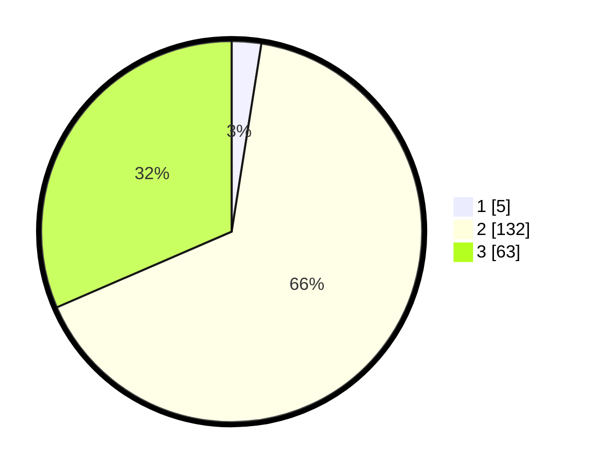

# Hasil

## Grafik

## Tabel

| No. | Nama Paslon    | Suara | Suara (raw) | Persentase |
|:--- |:-------------- | -----:| -----------:| ----------:|
| 1   | ANIES MUHAIMIN | 5     | [5][p-1]    | 2,50       |
| 2   | PRABOWO GIBRAN | 132   | [132][p-2]  | 66,00      |
| 3   | GANJAR MAHFUD  | 63    | [63][p-3]   | 31,50      |

[p-1]: https://github.com/gigit-pemilu/pemilu-2024-51-bali/blob/main/pilpres/hitung-suara/sub/51-bali/sub/03-badung/sub/06-kuta-utara/sub/2004-tibubeneng/sub/033-tps/sub/paslon-1.txt
[p-2]: https://github.com/gigit-pemilu/pemilu-2024-51-bali/blob/main/pilpres/hitung-suara/sub/51-bali/sub/03-badung/sub/06-kuta-utara/sub/2004-tibubeneng/sub/033-tps/sub/paslon-2.txt
[p-3]: https://github.com/gigit-pemilu/pemilu-2024-51-bali/blob/main/pilpres/hitung-suara/sub/51-bali/sub/03-badung/sub/06-kuta-utara/sub/2004-tibubeneng/sub/033-tps/sub/paslon-3.txt

## Foto C Plano

https://sirekap-obj-formc.kpu.go.id/77e9/pemilu/ppwp/51/03/06/20/04/5103062004033-20240214-203331--c2e39bbe-64e9-4a79-8834-1eb3fbb7498e.jpg

https://sirekap-obj-formc.kpu.go.id/77e9/pemilu/ppwp/51/03/06/20/04/5103062004033-20240214-205326--053e9668-a4c6-49a4-a635-a2dfe9d72253.jpg

https://sirekap-obj-formc.kpu.go.id/77e9/pemilu/ppwp/51/03/06/20/04/5103062004033-20240214-205759--e4fad9c3-120d-4d4b-aabe-a2781948f4d8.jpg

## Metadata

| Key        | Value               |
| ---------- | ------------------- |
| Time Stamp | 2024-02-24 22:31:28 |

