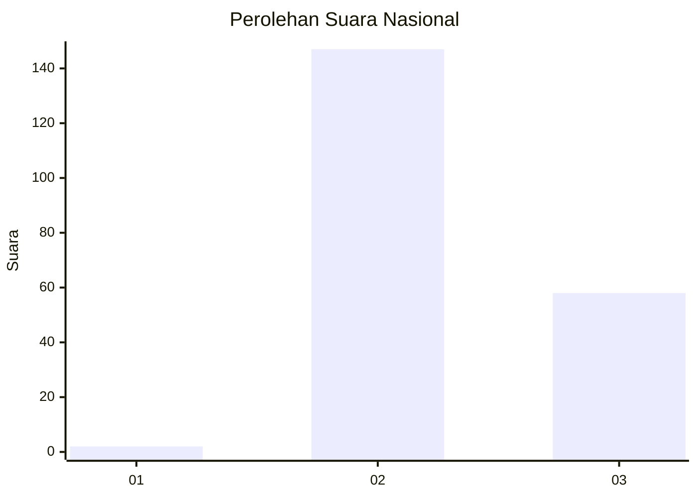
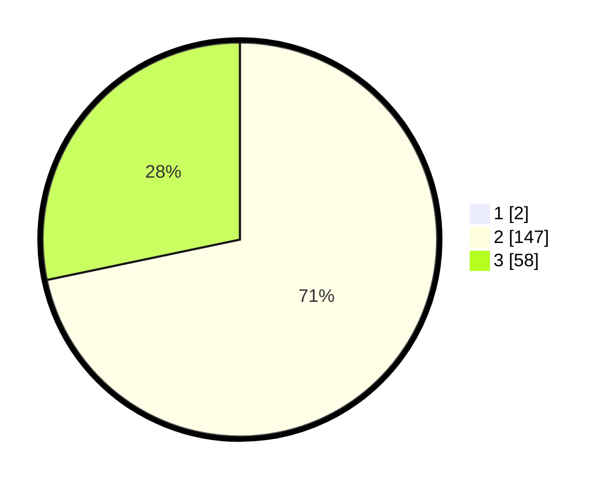

# Hasil

## Grafik

## Tabel

| No. | Nama Paslon    | Suara | Suara (raw) | Persentase |
|:--- |:-------------- | -----:| -----------:| ----------:|
| 1   | ANIES MUHAIMIN | 2     | [2][p-1]    | 0,97       |
| 2   | PRABOWO GIBRAN | 147   | [147][p-2]  | 71,01      |
| 3   | GANJAR MAHFUD  | 58    | [58][p-3]   | 28,02      |

[p-1]: https://github.com/gigit-pemilu/pemilu-2024/blob/main/pilpres/hitung-suara/sub/51-bali/sub/03-badung/sub/06-kuta-utara/sub/2004-tibubeneng/sub/034-tps/sub/paslon-1.txt
[p-2]: https://github.com/gigit-pemilu/pemilu-2024/blob/main/pilpres/hitung-suara/sub/51-bali/sub/03-badung/sub/06-kuta-utara/sub/2004-tibubeneng/sub/034-tps/sub/paslon-2.txt
[p-3]: https://github.com/gigit-pemilu/pemilu-2024/blob/main/pilpres/hitung-suara/sub/51-bali/sub/03-badung/sub/06-kuta-utara/sub/2004-tibubeneng/sub/034-tps/sub/paslon-3.txt

## Foto C Plano

https://sirekap-obj-formc.kpu.go.id/8a22/pemilu/ppwp/51/03/06/20/04/5103062004034-20240214-211934--03da6873-917d-4d37-909f-3a51afb96743.jpg

https://sirekap-obj-formc.kpu.go.id/8a22/pemilu/ppwp/51/03/06/20/04/5103062004034-20240214-222727--ee6ee961-8766-4dd1-901c-ee09ca078d9b.jpg

https://sirekap-obj-formc.kpu.go.id/8a22/pemilu/ppwp/51/03/06/20/04/5103062004034-20240214-222805--64266942-7459-40c9-a806-ee8712765fd3.jpg

## Metadata

| Key        | Value               |
| ---------- | ------------------- |
| Time Stamp | 2024-02-24 22:31:28 |

