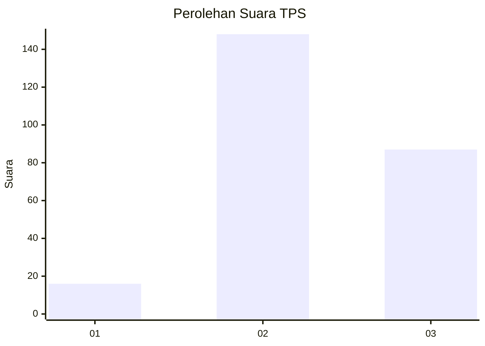
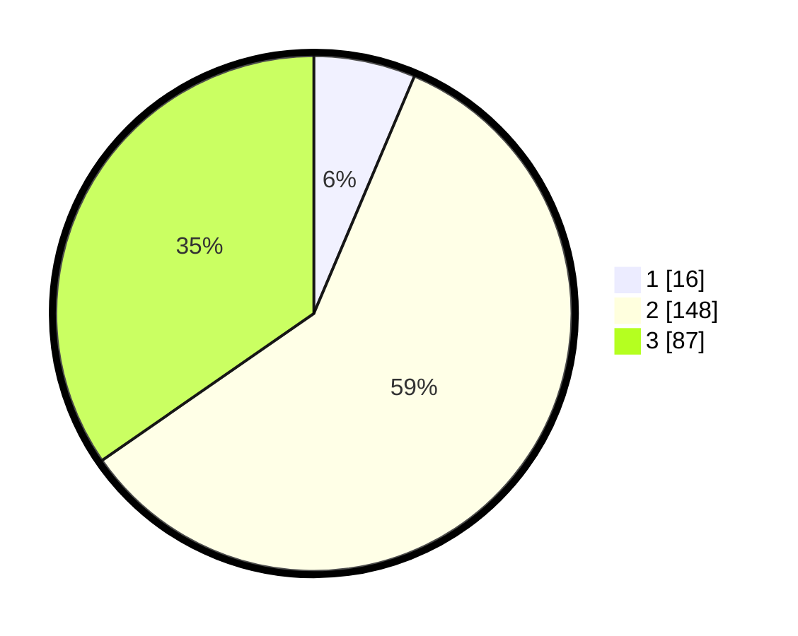

# Hasil

## Grafik

## Tabel

| No. | Nama Paslon    | Suara | Suara (raw) | Persentase |
|:--- |:-------------- | -----:| -----------:| ----------:|
| 1   | ANIES MUHAIMIN | 16    | [16][p-1]   | 6,37       |
| 2   | PRABOWO GIBRAN | 148   | [148][p-2]  | 58,96      |
| 3   | GANJAR MAHFUD  | 87    | [87][p-3]   | 34,66      |

[p-1]: https://github.com/gigit-pemilu/pemilu-2024-51-bali/blob/main/pilpres/hitung-suara/sub/51-bali/sub/03-badung/sub/06-kuta-utara/sub/2005-canggu/sub/009-tps/sub/paslon-1.txt
[p-2]: https://github.com/gigit-pemilu/pemilu-2024-51-bali/blob/main/pilpres/hitung-suara/sub/51-bali/sub/03-badung/sub/06-kuta-utara/sub/2005-canggu/sub/009-tps/sub/paslon-2.txt
[p-3]: https://github.com/gigit-pemilu/pemilu-2024-51-bali/blob/main/pilpres/hitung-suara/sub/51-bali/sub/03-badung/sub/06-kuta-utara/sub/2005-canggu/sub/009-tps/sub/paslon-3.txt

## Foto C Plano

https://sirekap-obj-formc.kpu.go.id/5afd/pemilu/ppwp/51/03/06/20/05/5103062005009-20240215-162408--5973bbb9-f8fb-482f-bc8c-1452f2d87bf4.jpg

https://sirekap-obj-formc.kpu.go.id/5afd/pemilu/ppwp/51/03/06/20/05/5103062005009-20240215-162544--16218164-c666-4e7e-a758-3db5bba01675.jpg

## Metadata

| Key        | Value               |
| ---------- | ------------------- |
| Time Stamp | 2024-02-21 01:00:00 |

