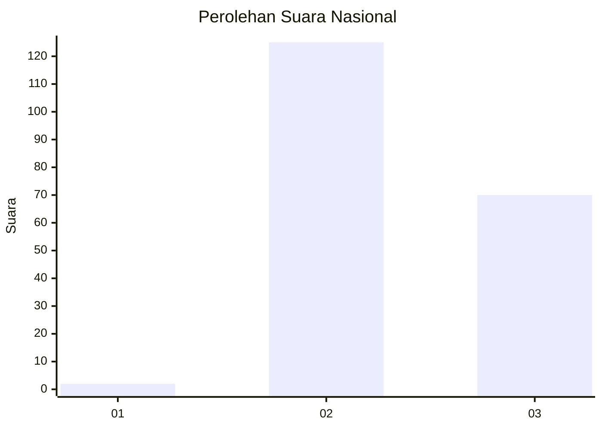
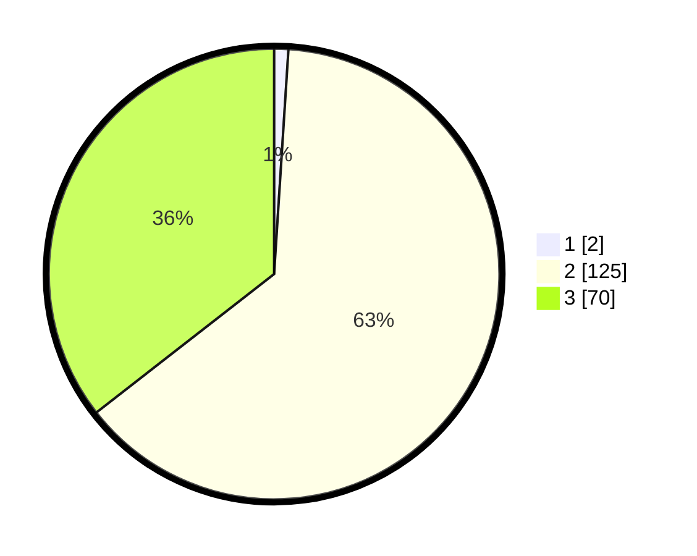

# Hasil

## Grafik

## Tabel

| No. | Nama Paslon    | Suara | Suara (raw) | Persentase |
|:--- |:-------------- | -----:| -----------:| ----------:|
| 1   | ANIES MUHAIMIN | 2     | [2][p-1]    | 1,02       |
| 2   | PRABOWO GIBRAN | 125   | [125][p-2]  | 63,45      |
| 3   | GANJAR MAHFUD  | 70    | [70][p-3]   | 35,53      |

[p-1]: https://github.com/gigit-pemilu/pemilu-2024/blob/main/pilpres/hitung-suara/sub/51-bali/sub/03-badung/sub/06-kuta-utara/sub/2005-canggu/sub/010-tps/sub/paslon-1.txt
[p-2]: https://github.com/gigit-pemilu/pemilu-2024/blob/main/pilpres/hitung-suara/sub/51-bali/sub/03-badung/sub/06-kuta-utara/sub/2005-canggu/sub/010-tps/sub/paslon-2.txt
[p-3]: https://github.com/gigit-pemilu/pemilu-2024/blob/main/pilpres/hitung-suara/sub/51-bali/sub/03-badung/sub/06-kuta-utara/sub/2005-canggu/sub/010-tps/sub/paslon-3.txt

## Foto C Plano

https://sirekap-obj-formc.kpu.go.id/05a5/pemilu/ppwp/51/03/06/20/05/5103062005010-20240215-065242--7f3d7061-d831-4e4b-9369-cff714db706e.jpg

https://sirekap-obj-formc.kpu.go.id/05a5/pemilu/ppwp/51/03/06/20/05/5103062005010-20240215-065414--646f08a3-5074-466b-8aeb-dc362b715b2d.jpg

https://sirekap-obj-formc.kpu.go.id/05a5/pemilu/ppwp/51/03/06/20/05/5103062005010-20240215-065532--827d3cf7-c264-42c9-8900-2d738c336808.jpg

## Metadata

| Key        | Value               |
| ---------- | ------------------- |
| Time Stamp | 2024-02-21 01:00:00 |

