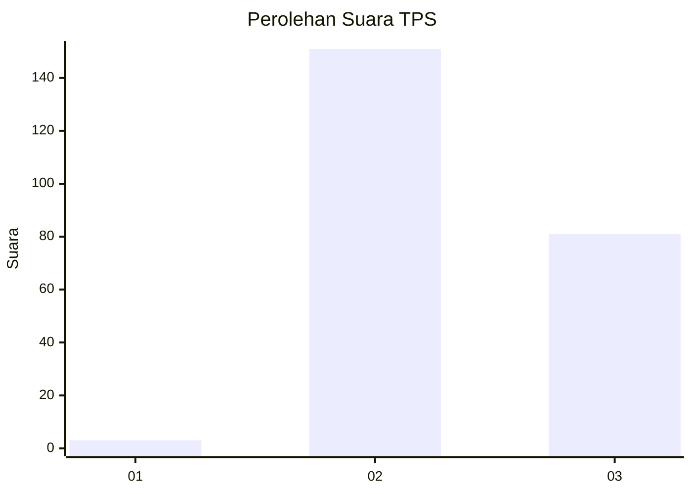
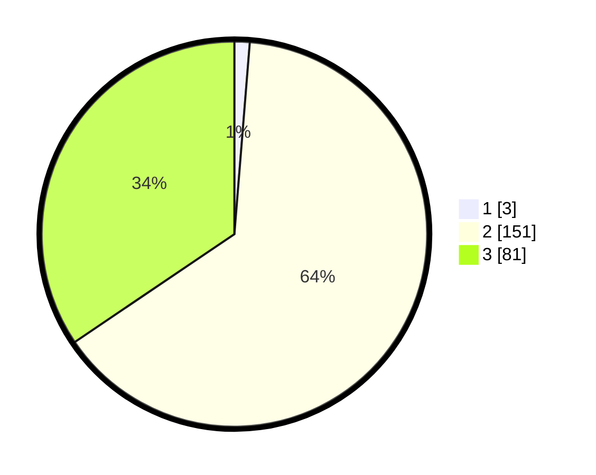

# Hasil

## Grafik

## Tabel

| No. | Nama Paslon    | Suara | Suara (raw) | Persentase |
|:--- |:-------------- | -----:| -----------:| ----------:|
| 1   | ANIES MUHAIMIN | 3     | [3][p-1]    | 1,28       |
| 2   | PRABOWO GIBRAN | 151   | [151][p-2]  | 64,26      |
| 3   | GANJAR MAHFUD  | 81    | [81][p-3]   | 34,47      |

[p-1]: https://github.com/gigit-pemilu/pemilu-2024-51-bali/blob/main/pilpres/hitung-suara/sub/51-bali/sub/03-badung/sub/06-kuta-utara/sub/2005-canggu/sub/012-tps/sub/paslon-1.txt
[p-2]: https://github.com/gigit-pemilu/pemilu-2024-51-bali/blob/main/pilpres/hitung-suara/sub/51-bali/sub/03-badung/sub/06-kuta-utara/sub/2005-canggu/sub/012-tps/sub/paslon-2.txt
[p-3]: https://github.com/gigit-pemilu/pemilu-2024-51-bali/blob/main/pilpres/hitung-suara/sub/51-bali/sub/03-badung/sub/06-kuta-utara/sub/2005-canggu/sub/012-tps/sub/paslon-3.txt

## Foto C Plano

https://sirekap-obj-formc.kpu.go.id/714a/pemilu/ppwp/51/03/06/20/05/5103062005012-20240214-204643--f334f1f4-d46e-4ee9-b2d8-e1e09c0cc6f0.jpg

https://sirekap-obj-formc.kpu.go.id/714a/pemilu/ppwp/51/03/06/20/05/5103062005012-20240216-144331--23be9cd3-496c-4023-b756-c7e82812154c.jpg

https://sirekap-obj-formc.kpu.go.id/714a/pemilu/ppwp/51/03/06/20/05/5103062005012-20240214-221802--bfde0130-c6f6-4a89-a0cf-18bb0501eaa2.jpg

## Metadata

| Key        | Value               |
| ---------- | ------------------- |
| Time Stamp | 2024-02-21 01:00:00 |

## DATA PEMILIH TETAP

Jumlah pemilih dalam DPT: **249**.
 * L: **117**.
 * P: **132**.

## DATA PENGGUNA HAK PILIH

Jumlah pengguna hak pilih dalam DPT: **233**.
 * L: **108**.
 * P: **125**.

Jumlah pengguna hak pilih dalam DPTb: **4**.
 * L: **2**.
 * P: **2**.

Jumlah pengguna hak pilih dalam DPK: **5**.
 * L: **2**.
 * P: **3**.

Jumlah pengguna hak pilih: **242**.
 * L: **112**.
 * P: **130**.

## JUMLAH SUARA SAH DAN TIDAK SAH

JUMLAH SELURUH SUARA SAH: **235**.

JUMLAH SUARA TIDAK SAH: **7**.

JUMLAH SELURUH SUARA SAH DAN SUARA TIDAK SAH: **242**.

