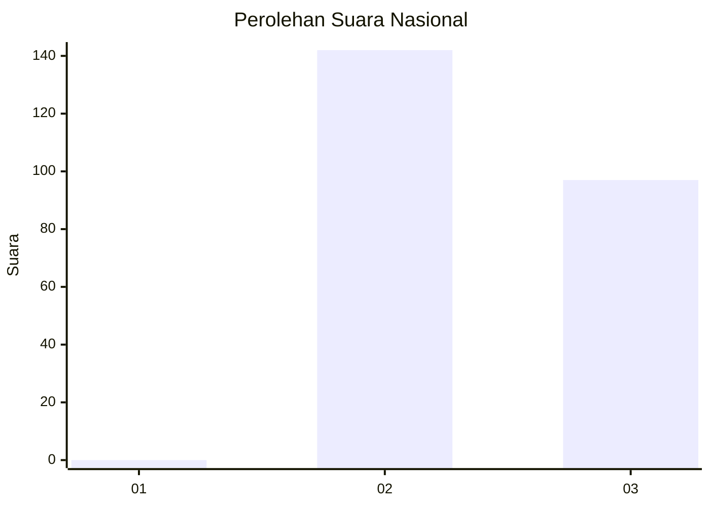
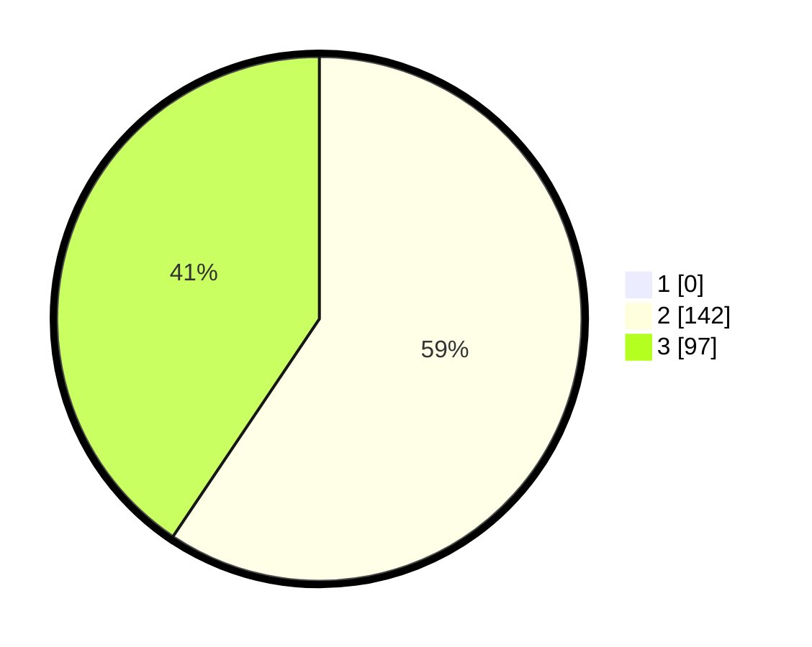

# Hasil

## Grafik

## Tabel

| No. | Nama Paslon    | Suara | Suara (raw) | Persentase |
|:--- |:-------------- | -----:| -----------:| ----------:|
| 1   | ANIES MUHAIMIN | 0     | [0][p-1]    | 0,00       |
| 2   | PRABOWO GIBRAN | 142   | [142][p-2]  | 59,41      |
| 3   | GANJAR MAHFUD  | 97    | [97][p-3]   | 40,59      |

[p-1]: https://github.com/gigit-pemilu/pemilu-2024/blob/main/pilpres/hitung-suara/sub/51-bali/sub/03-badung/sub/06-kuta-utara/sub/2005-canggu/sub/013-tps/sub/paslon-1.txt
[p-2]: https://github.com/gigit-pemilu/pemilu-2024/blob/main/pilpres/hitung-suara/sub/51-bali/sub/03-badung/sub/06-kuta-utara/sub/2005-canggu/sub/013-tps/sub/paslon-2.txt
[p-3]: https://github.com/gigit-pemilu/pemilu-2024/blob/main/pilpres/hitung-suara/sub/51-bali/sub/03-badung/sub/06-kuta-utara/sub/2005-canggu/sub/013-tps/sub/paslon-3.txt

## Foto C Plano

https://sirekap-obj-formc.kpu.go.id/83aa/pemilu/ppwp/51/03/06/20/05/5103062005013-20240216-090953--8a6f9338-36df-40fc-b026-ec008290a7b4.jpg

https://sirekap-obj-formc.kpu.go.id/83aa/pemilu/ppwp/51/03/06/20/05/5103062005013-20240216-082803--87b29536-5d9a-40a0-9ae8-d8fdb3871341.jpg

https://sirekap-obj-formc.kpu.go.id/83aa/pemilu/ppwp/51/03/06/20/05/5103062005013-20240214-233609--91ccbeab-2fbf-496e-859b-d2d1b0b1f131.jpg

## Metadata

| Key        | Value               |
| ---------- | ------------------- |
| Time Stamp | 2024-02-21 01:00:00 |

## DATA PEMILIH TETAP

Jumlah pemilih dalam DPT: **246**.
 * L: **122**.
 * P: **124**.

## DATA PENGGUNA HAK PILIH

Jumlah pengguna hak pilih dalam DPT: **241**.
 * L: **120**.
 * P: **121**.

Jumlah pengguna hak pilih dalam DPTb: **6**.
 * L: **5**.
 * P: **1**.

Jumlah pengguna hak pilih dalam DPK: **0**.
 * L: **0**.
 * P: **0**.

Jumlah pengguna hak pilih: **247**.
 * L: **125**.
 * P: **122**.

## JUMLAH SUARA SAH DAN TIDAK SAH

JUMLAH SELURUH SUARA SAH: **240**.

JUMLAH SUARA TIDAK SAH: **7**.

JUMLAH SELURUH SUARA SAH DAN SUARA TIDAK SAH: **247**.

