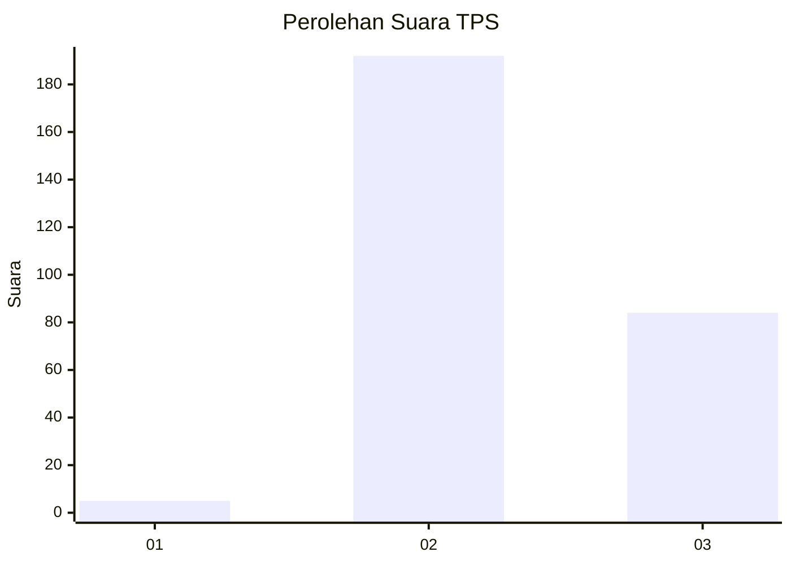

# Hasil

## Grafik

## Tabel

| No. | Nama Paslon    | Suara | Suara (raw) | Persentase |
|:--- |:-------------- | -----:| -----------:| ----------:|
| 1   | ANIES MUHAIMIN | 5     | [5][p-1]    | 1,78       |
| 2   | PRABOWO GIBRAN | 192   | [192][p-2]  | 68,33      |
| 3   | GANJAR MAHFUD  | 84    | [84][p-3]   | 29,89      |

[p-1]: https://github.com/gigit-pemilu/pemilu-2024-51-bali/blob/main/pilpres/hitung-suara/sub/51-bali/sub/03-badung/sub/06-kuta-utara/sub/2005-canggu/sub/014-tps/sub/paslon-1.txt
[p-2]: https://github.com/gigit-pemilu/pemilu-2024-51-bali/blob/main/pilpres/hitung-suara/sub/51-bali/sub/03-badung/sub/06-kuta-utara/sub/2005-canggu/sub/014-tps/sub/paslon-2.txt
[p-3]: https://github.com/gigit-pemilu/pemilu-2024-51-bali/blob/main/pilpres/hitung-suara/sub/51-bali/sub/03-badung/sub/06-kuta-utara/sub/2005-canggu/sub/014-tps/sub/paslon-3.txt

## Foto C Plano

https://sirekap-obj-formc.kpu.go.id/a0e6/pemilu/ppwp/51/03/06/20/05/5103062005014-20240216-223832--45bfc5c4-6ff1-477c-8535-0b2d5fca531f.jpg

https://sirekap-obj-formc.kpu.go.id/a0e6/pemilu/ppwp/51/03/06/20/05/5103062005014-20240216-224550--cb9f6979-6eb3-4109-9ebc-3a8f057b257a.jpg

https://sirekap-obj-formc.kpu.go.id/a0e6/pemilu/ppwp/51/03/06/20/05/5103062005014-20240216-225336--6e81c664-6769-4bf9-abc8-05cead07441d.jpg

## Metadata

| Key        | Value               |
| ---------- | ------------------- |
| Time Stamp | 2024-02-21 01:00:00 |

## DATA PEMILIH TETAP

Jumlah pemilih dalam DPT: **294**.
 * L: **141**.
 * P: **153**.

## DATA PENGGUNA HAK PILIH

Jumlah pengguna hak pilih dalam DPT: **282**.
 * L: **135**.
 * P: **147**.

Jumlah pengguna hak pilih dalam DPTb: **3**.
 * L: **0**.
 * P: **3**.

Jumlah pengguna hak pilih dalam DPK: **0**.
 * L: **0**.
 * P: **0**.

Jumlah pengguna hak pilih: **285**.
 * L: **135**.
 * P: **150**.

## JUMLAH SUARA SAH DAN TIDAK SAH

JUMLAH SELURUH SUARA SAH: **281**.

JUMLAH SUARA TIDAK SAH: **4**.

JUMLAH SELURUH SUARA SAH DAN SUARA TIDAK SAH: **285**.

