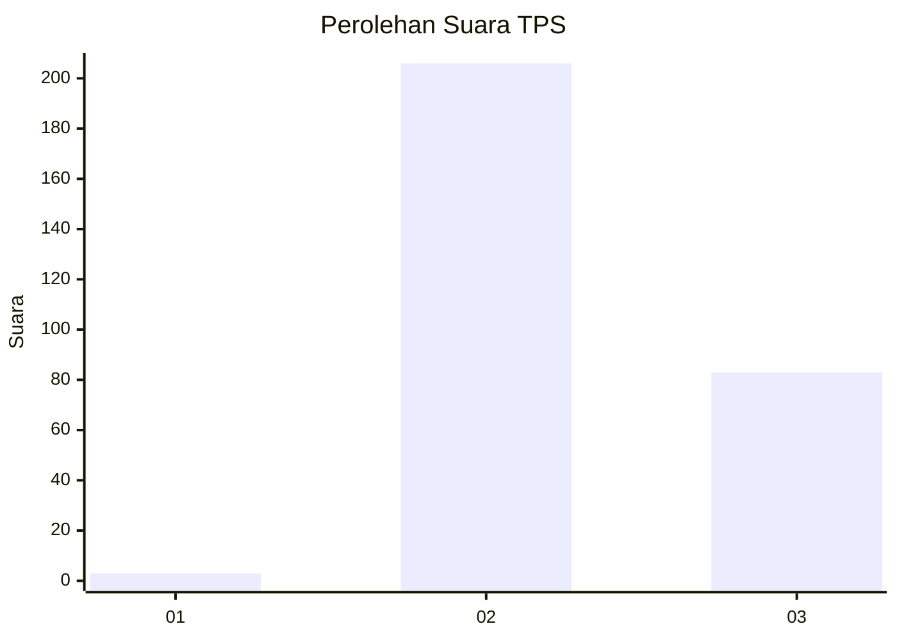
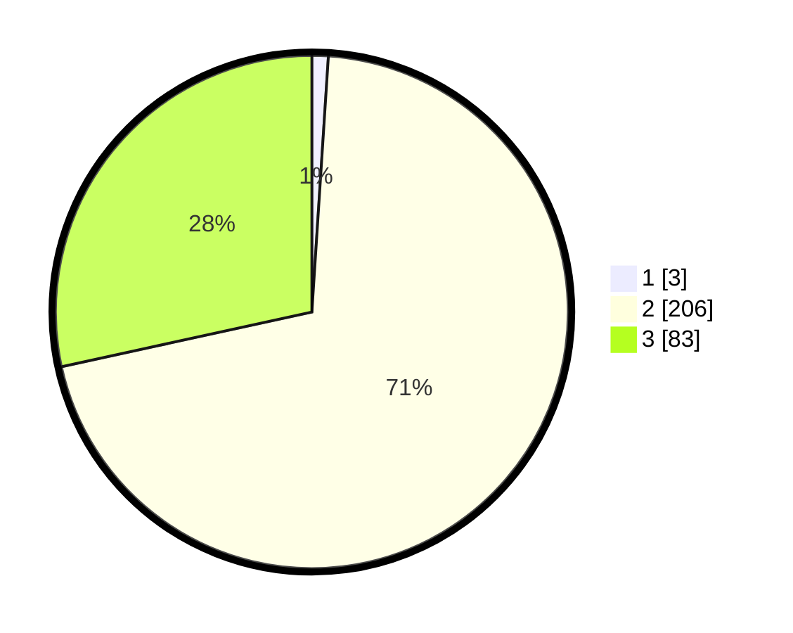

# Hasil

## Grafik

## Tabel

| No. | Nama Paslon    | Suara | Suara (raw) | Persentase |
|:--- |:-------------- | -----:| -----------:| ----------:|
| 1   | ANIES MUHAIMIN | 3     | [3][p-1]    | 1,03       |
| 2   | PRABOWO GIBRAN | 206   | [206][p-2]  | 70,55      |
| 3   | GANJAR MAHFUD  | 83    | [83][p-3]   | 28,42      |

[p-1]: https://github.com/gigit-pemilu/pemilu-2024-51-bali/blob/main/pilpres/hitung-suara/sub/51-bali/sub/03-badung/sub/06-kuta-utara/sub/2005-canggu/sub/015-tps/sub/paslon-1.txt
[p-2]: https://github.com/gigit-pemilu/pemilu-2024-51-bali/blob/main/pilpres/hitung-suara/sub/51-bali/sub/03-badung/sub/06-kuta-utara/sub/2005-canggu/sub/015-tps/sub/paslon-2.txt
[p-3]: https://github.com/gigit-pemilu/pemilu-2024-51-bali/blob/main/pilpres/hitung-suara/sub/51-bali/sub/03-badung/sub/06-kuta-utara/sub/2005-canggu/sub/015-tps/sub/paslon-3.txt

## Foto C Plano

https://sirekap-obj-formc.kpu.go.id/58bf/pemilu/ppwp/51/03/06/20/05/5103062005015-20240214-213344--939dbf0b-ba4f-4943-8775-aaf1ed4ca24e.jpg

https://sirekap-obj-formc.kpu.go.id/58bf/pemilu/ppwp/51/03/06/20/05/5103062005015-20240214-201219--71271fe6-59f5-40df-ad0b-68ff9b930cca.jpg

https://sirekap-obj-formc.kpu.go.id/58bf/pemilu/ppwp/51/03/06/20/05/5103062005015-20240214-213454--601b8aaf-2d0c-4161-be2c-779c1c5143ac.jpg

## Metadata

| Key        | Value               |
| ---------- | ------------------- |
| Time Stamp | 2024-02-21 01:00:00 |

