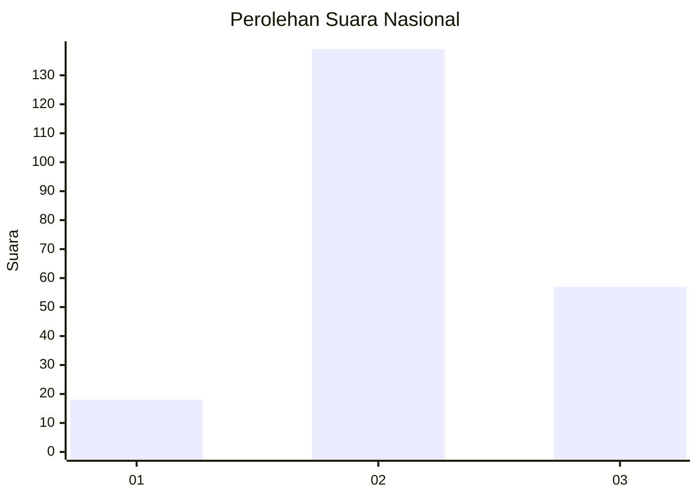
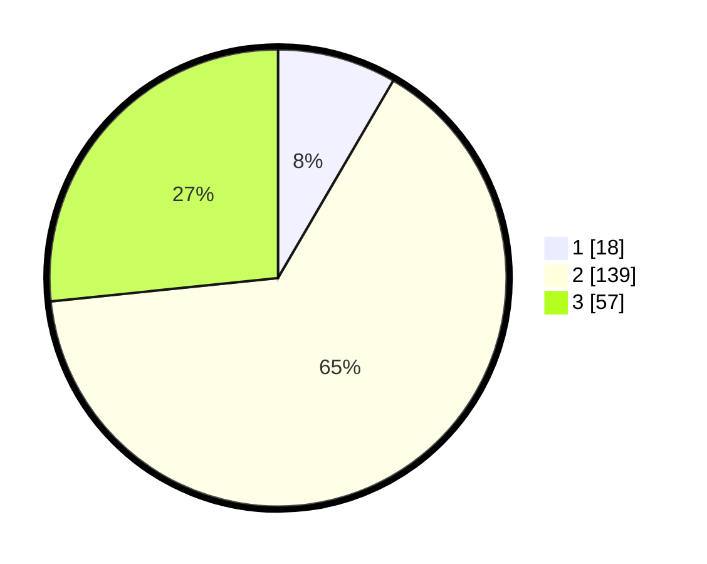

# Hasil

## Grafik

## Tabel

| No. | Nama Paslon    | Suara | Suara (raw) | Persentase |
|:--- |:-------------- | -----:| -----------:| ----------:|
| 1   | ANIES MUHAIMIN | 18    | [18][p-1]   | 8,41       |
| 2   | PRABOWO GIBRAN | 139   | [139][p-2]  | 64,95      |
| 3   | GANJAR MAHFUD  | 57    | [57][p-3]   | 26,64      |

[p-1]: https://github.com/gigit-pemilu/pemilu-2024/blob/main/pilpres/hitung-suara/sub/51-bali/sub/03-badung/sub/06-kuta-utara/sub/2006-dalung/sub/001-tps/sub/paslon-1.txt
[p-2]: https://github.com/gigit-pemilu/pemilu-2024/blob/main/pilpres/hitung-suara/sub/51-bali/sub/03-badung/sub/06-kuta-utara/sub/2006-dalung/sub/001-tps/sub/paslon-2.txt
[p-3]: https://github.com/gigit-pemilu/pemilu-2024/blob/main/pilpres/hitung-suara/sub/51-bali/sub/03-badung/sub/06-kuta-utara/sub/2006-dalung/sub/001-tps/sub/paslon-3.txt

## Foto C Plano

https://sirekap-obj-formc.kpu.go.id/4916/pemilu/ppwp/51/03/06/20/06/5103062006001-20240216-143104--39fb4f5e-2b05-4922-a075-d1f5423a7e38.jpg

https://sirekap-obj-formc.kpu.go.id/4916/pemilu/ppwp/51/03/06/20/06/5103062006001-20240216-143106--32da370c-c99e-4982-9d34-937952044c78.jpg

https://sirekap-obj-formc.kpu.go.id/4916/pemilu/ppwp/51/03/06/20/06/5103062006001-20240216-143105--a19b40a2-ea3e-4d60-9c61-dc7fda4034a8.jpg

## Metadata

| Key        | Value               |
| ---------- | ------------------- |
| Time Stamp | 2024-02-24 22:31:28 |

## DATA PEMILIH TETAP

Jumlah pemilih dalam DPT: **250**.
 * L: **122**.
 * P: **128**.

## DATA PENGGUNA HAK PILIH

Jumlah pengguna hak pilih dalam DPT: **209**.
 * L: **101**.
 * P: **108**.

Jumlah pengguna hak pilih dalam DPTb: **5**.
 * L: **1**.
 * P: **4**.

Jumlah pengguna hak pilih dalam DPK: **1**.
 * L: **0**.
 * P: **1**.

Jumlah pengguna hak pilih: **215**.
 * L: **102**.
 * P: **113**.

## JUMLAH SUARA SAH DAN TIDAK SAH

JUMLAH SELURUH SUARA SAH: **214**.

JUMLAH SUARA TIDAK SAH: **1**.

JUMLAH SELURUH SUARA SAH DAN SUARA TIDAK SAH: **215**.

