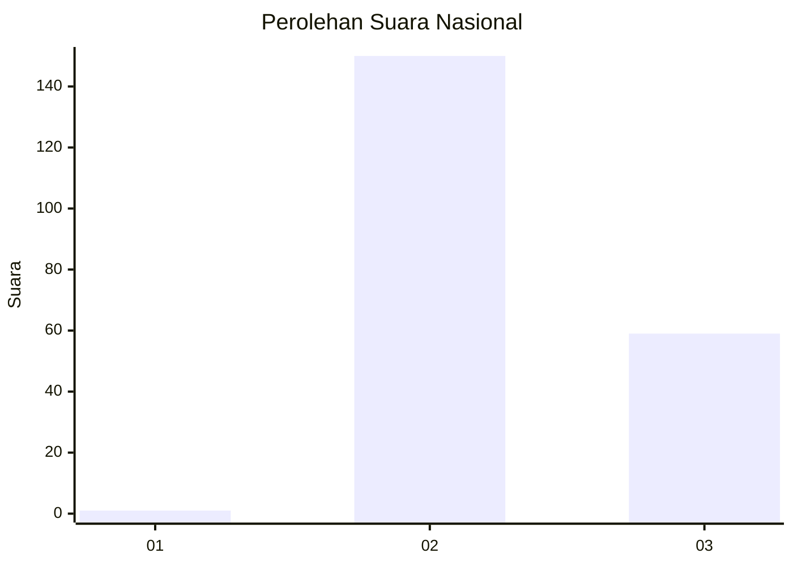
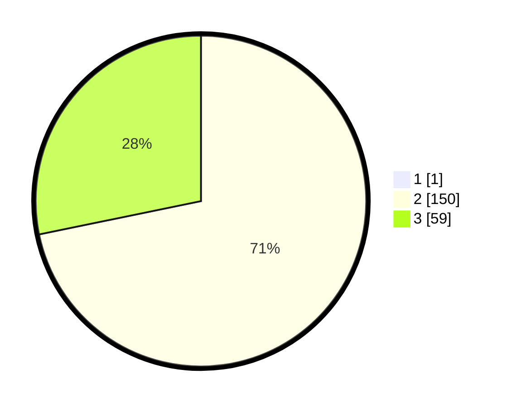

# Hasil

## Grafik

## Tabel

| No. | Nama Paslon    | Suara | Suara (raw) | Persentase |
|:--- |:-------------- | -----:| -----------:| ----------:|
| 1   | ANIES MUHAIMIN | 1     | [1][p-1]    | 0,48       |
| 2   | PRABOWO GIBRAN | 150   | [150][p-2]  | 71,43      |
| 3   | GANJAR MAHFUD  | 59    | [59][p-3]   | 28,10      |

[p-1]: https://github.com/gigit-pemilu/pemilu-2024/blob/main/pilpres/hitung-suara/sub/51-bali/sub/03-badung/sub/06-kuta-utara/sub/2006-dalung/sub/003-tps/sub/paslon-1.txt
[p-2]: https://github.com/gigit-pemilu/pemilu-2024/blob/main/pilpres/hitung-suara/sub/51-bali/sub/03-badung/sub/06-kuta-utara/sub/2006-dalung/sub/003-tps/sub/paslon-2.txt
[p-3]: https://github.com/gigit-pemilu/pemilu-2024/blob/main/pilpres/hitung-suara/sub/51-bali/sub/03-badung/sub/06-kuta-utara/sub/2006-dalung/sub/003-tps/sub/paslon-3.txt

## Foto C Plano

https://sirekap-obj-formc.kpu.go.id/864f/pemilu/ppwp/51/03/06/20/06/5103062006003-20240214-130620--0fcc6183-3e7c-44a1-8f7e-53630c031e76.jpg

https://sirekap-obj-formc.kpu.go.id/864f/pemilu/ppwp/51/03/06/20/06/5103062006003-20240214-130205--32b3cc84-c01f-4a92-ad17-f712dc48f14a.jpg

https://sirekap-obj-formc.kpu.go.id/864f/pemilu/ppwp/51/03/06/20/06/5103062006003-20240214-130325--a66124ac-cfb5-4eba-8346-2e40bb93f66e.jpg

## Metadata

| Key        | Value               |
| ---------- | ------------------- |
| Time Stamp | 2024-02-14 21:46:01 |

## DATA PEMILIH TETAP

Jumlah pemilih dalam DPT: **236**.
 * L: **121**.
 * P: **115**.

## DATA PENGGUNA HAK PILIH

Jumlah pengguna hak pilih dalam DPT: **197**.
 * L: **100**.
 * P: **97**.

Jumlah pengguna hak pilih dalam DPTb: **3**.
 * L: **2**.
 * P: **1**.

Jumlah pengguna hak pilih dalam DPK: **12**.
 * L: **4**.
 * P: **8**.

Jumlah pengguna hak pilih: **212**.
 * L: **106**.
 * P: **106**.

## JUMLAH SUARA SAH DAN TIDAK SAH

JUMLAH SELURUH SUARA SAH: **210**.

JUMLAH SUARA TIDAK SAH: **2**.

JUMLAH SELURUH SUARA SAH DAN SUARA TIDAK SAH: **212**.

