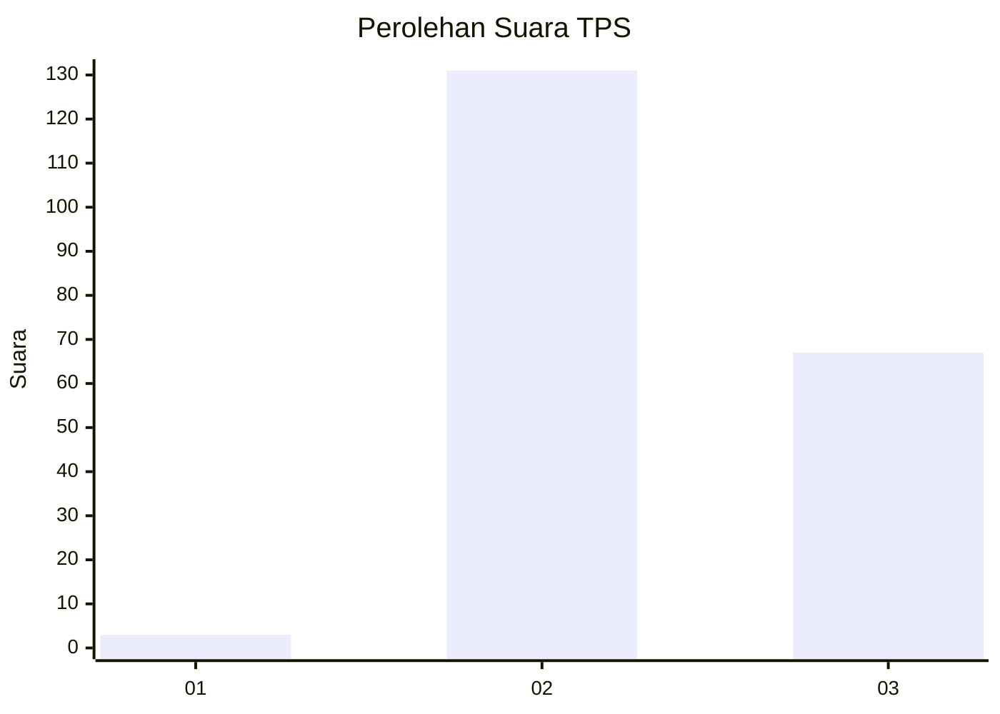
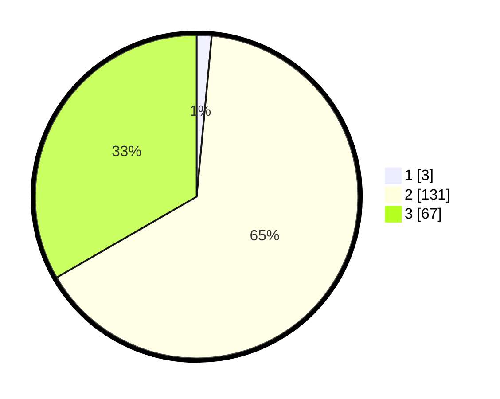

# Hasil

## Grafik

## Tabel

| No. | Nama Paslon    | Suara | Suara (raw) | Persentase |
|:--- |:-------------- | -----:| -----------:| ----------:|
| 1   | ANIES MUHAIMIN | 3     | [3][p-1]    | 1,49       |
| 2   | PRABOWO GIBRAN | 131   | [131][p-2]  | 65,17      |
| 3   | GANJAR MAHFUD  | 67    | [67][p-3]   | 33,33      |

[p-1]: https://github.com/gigit-pemilu/pemilu-2024-51-bali/blob/main/pilpres/hitung-suara/sub/51-bali/sub/03-badung/sub/06-kuta-utara/sub/2006-dalung/sub/005-tps/sub/paslon-1.txt
[p-2]: https://github.com/gigit-pemilu/pemilu-2024-51-bali/blob/main/pilpres/hitung-suara/sub/51-bali/sub/03-badung/sub/06-kuta-utara/sub/2006-dalung/sub/005-tps/sub/paslon-2.txt
[p-3]: https://github.com/gigit-pemilu/pemilu-2024-51-bali/blob/main/pilpres/hitung-suara/sub/51-bali/sub/03-badung/sub/06-kuta-utara/sub/2006-dalung/sub/005-tps/sub/paslon-3.txt

## Foto C Plano

https://sirekap-obj-formc.kpu.go.id/cb6a/pemilu/ppwp/51/03/06/20/06/5103062006005-20240215-202525--3e9cec1a-8631-4493-8382-78821ca0b6eb.jpg

https://sirekap-obj-formc.kpu.go.id/cb6a/pemilu/ppwp/51/03/06/20/06/5103062006005-20240215-202529--fac11753-feeb-40c7-9c5c-19da57ec64e0.jpg

https://sirekap-obj-formc.kpu.go.id/cb6a/pemilu/ppwp/51/03/06/20/06/5103062006005-20240215-202525--be975518-0b5d-48d0-bde5-a3d0ce9eea76.jpg

## Metadata

| Key        | Value               |
| ---------- | ------------------- |
| Time Stamp | 2024-02-24 22:31:28 |

## DATA PEMILIH TETAP

Jumlah pemilih dalam DPT: **199**.
 * L: **95**.
 * P: **104**.

## DATA PENGGUNA HAK PILIH

Jumlah pengguna hak pilih dalam DPT: **199**.
 * L: **95**.
 * P: **104**.

Jumlah pengguna hak pilih dalam DPTb: **1**.
 * L: **0**.
 * P: **1**.

Jumlah pengguna hak pilih dalam DPK: **3**.
 * L: **1**.
 * P: **2**.

Jumlah pengguna hak pilih: **203**.
 * L: **96**.
 * P: **107**.

## JUMLAH SUARA SAH DAN TIDAK SAH

JUMLAH SELURUH SUARA SAH: **201**.

JUMLAH SUARA TIDAK SAH: **2**.

JUMLAH SELURUH SUARA SAH DAN SUARA TIDAK SAH: **203**.

