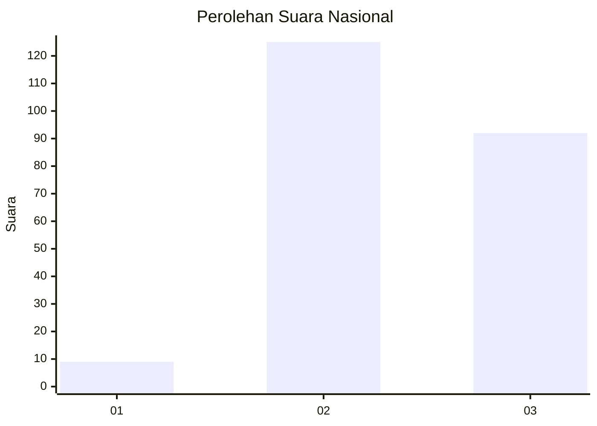
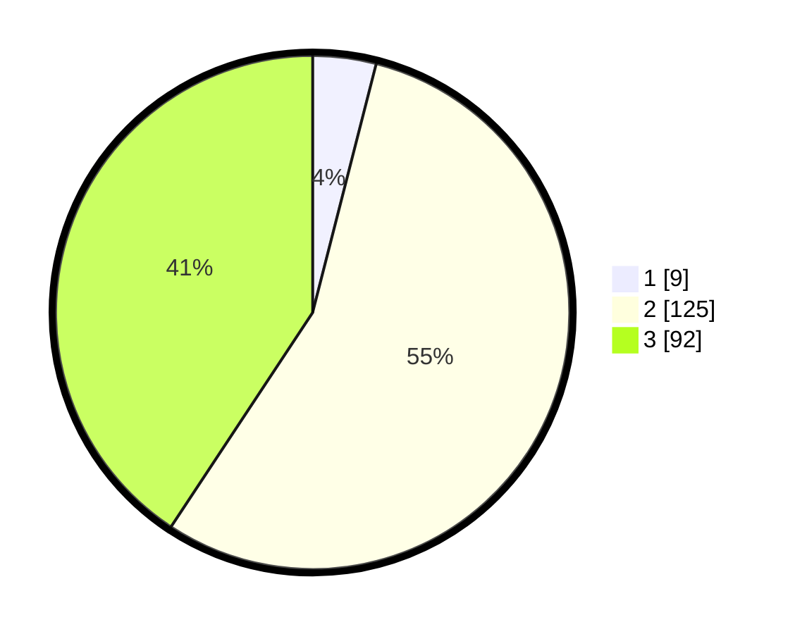

# Hasil

## Grafik

## Tabel

| No. | Nama Paslon    | Suara | Suara (raw) | Persentase |
|:--- |:-------------- | -----:| -----------:| ----------:|
| 1   | ANIES MUHAIMIN | 9     | [9][p-1]    | 3,98       |
| 2   | PRABOWO GIBRAN | 125   | [125][p-2]  | 55,31      |
| 3   | GANJAR MAHFUD  | 92    | [92][p-3]   | 40,71      |

[p-1]: https://github.com/gigit-pemilu/pemilu-2024/blob/main/pilpres/hitung-suara/sub/51-bali/sub/03-badung/sub/06-kuta-utara/sub/2006-dalung/sub/009-tps/sub/paslon-1.txt
[p-2]: https://github.com/gigit-pemilu/pemilu-2024/blob/main/pilpres/hitung-suara/sub/51-bali/sub/03-badung/sub/06-kuta-utara/sub/2006-dalung/sub/009-tps/sub/paslon-2.txt
[p-3]: https://github.com/gigit-pemilu/pemilu-2024/blob/main/pilpres/hitung-suara/sub/51-bali/sub/03-badung/sub/06-kuta-utara/sub/2006-dalung/sub/009-tps/sub/paslon-3.txt

## Foto C Plano

https://sirekap-obj-formc.kpu.go.id/edc1/pemilu/ppwp/51/03/06/20/06/5103062006009-20240216-222032--56ee9460-ae8f-4256-b921-6f7d43e8ea29.jpg

https://sirekap-obj-formc.kpu.go.id/edc1/pemilu/ppwp/51/03/06/20/06/5103062006009-20240216-221823--b01db3a2-70a6-49b7-9f1f-599254427763.jpg

https://sirekap-obj-formc.kpu.go.id/edc1/pemilu/ppwp/51/03/06/20/06/5103062006009-20240216-221735--5933bf0b-0575-4936-bd74-e57eba76e86e.jpg

## Metadata

| Key        | Value               |
| ---------- | ------------------- |
| Time Stamp | 2024-02-17 16:00:02 |

## DATA PEMILIH TETAP

Jumlah pemilih dalam DPT: **261**.
 * L: **130**.
 * P: **131**.

## DATA PENGGUNA HAK PILIH

Jumlah pengguna hak pilih dalam DPT: **228**.
 * L: **115**.
 * P: **113**.

Jumlah pengguna hak pilih dalam DPTb: **0**.
 * L: **0**.
 * P: **0**.

Jumlah pengguna hak pilih dalam DPK: **0**.
 * L: **0**.
 * P: **0**.

Jumlah pengguna hak pilih: **228**.
 * L: **115**.
 * P: **113**.

## JUMLAH SUARA SAH DAN TIDAK SAH

JUMLAH SELURUH SUARA SAH: **226**.

JUMLAH SUARA TIDAK SAH: **2**.

JUMLAH SELURUH SUARA SAH DAN SUARA TIDAK SAH: **228**.

