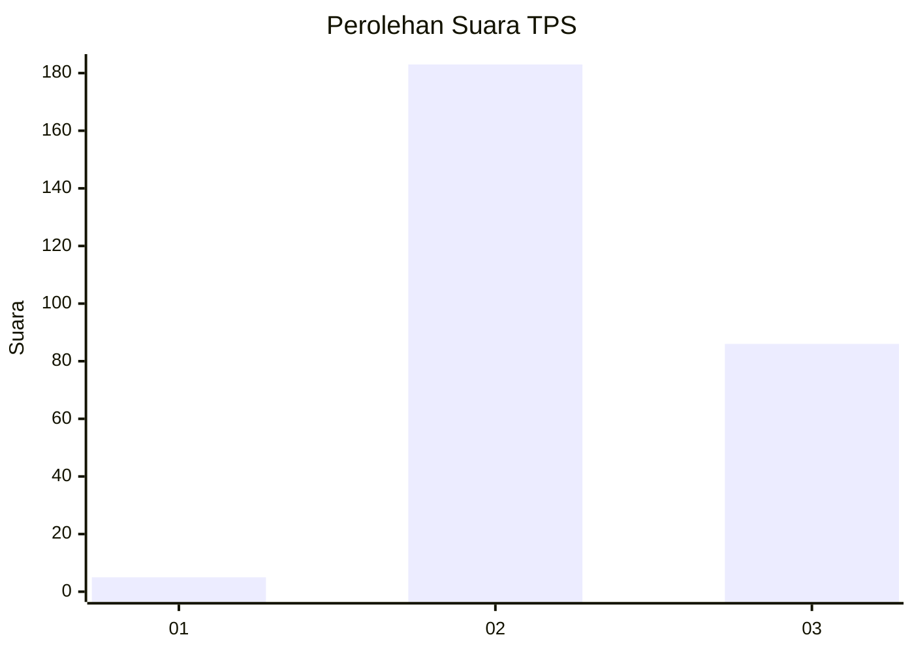
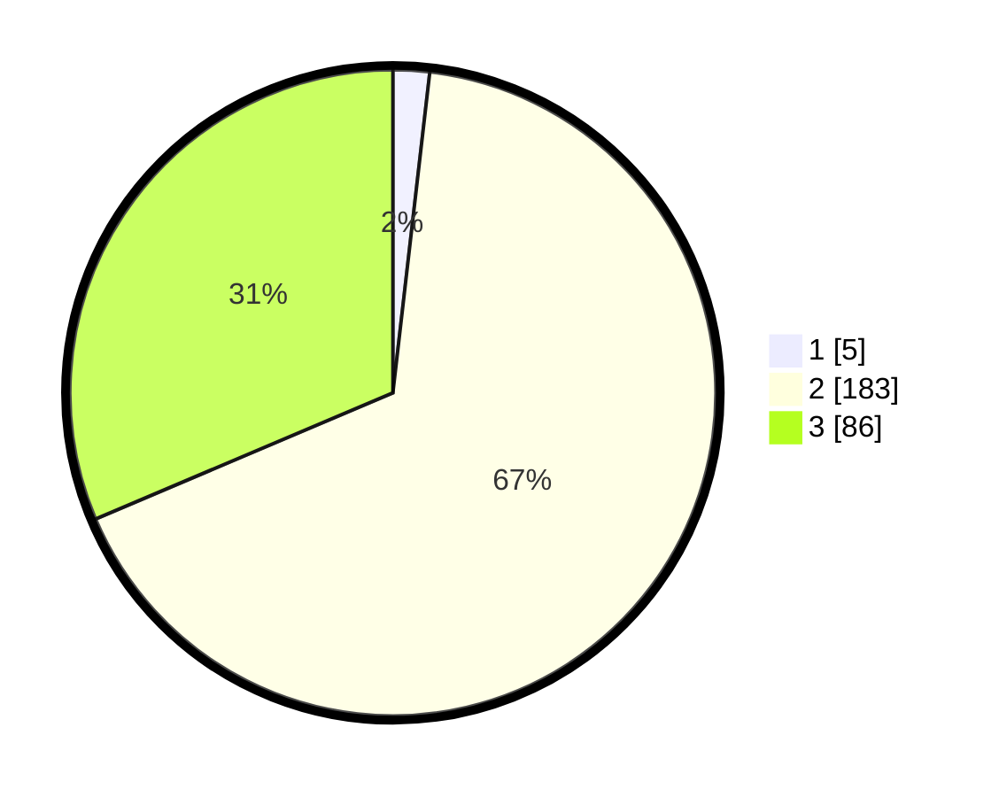

# Hasil

## Grafik

## Tabel

| No. | Nama Paslon    | Suara | Suara (raw) | Persentase |
|:--- |:-------------- | -----:| -----------:| ----------:|
| 1   | ANIES MUHAIMIN | 5     | [5][p-1]    | 1,82       |
| 2   | PRABOWO GIBRAN | 183   | [183][p-2]  | 66,79      |
| 3   | GANJAR MAHFUD  | 86    | [86][p-3]   | 31,39      |

[p-1]: https://github.com/gigit-pemilu/pemilu-2024-51-bali/blob/main/pilpres/hitung-suara/sub/51-bali/sub/03-badung/sub/06-kuta-utara/sub/2006-dalung/sub/011-tps/sub/paslon-1.txt
[p-2]: https://github.com/gigit-pemilu/pemilu-2024-51-bali/blob/main/pilpres/hitung-suara/sub/51-bali/sub/03-badung/sub/06-kuta-utara/sub/2006-dalung/sub/011-tps/sub/paslon-2.txt
[p-3]: https://github.com/gigit-pemilu/pemilu-2024-51-bali/blob/main/pilpres/hitung-suara/sub/51-bali/sub/03-badung/sub/06-kuta-utara/sub/2006-dalung/sub/011-tps/sub/paslon-3.txt

## Foto C Plano

https://sirekap-obj-formc.kpu.go.id/69ba/pemilu/ppwp/51/03/06/20/06/5103062006011-20240214-190110--5db3d501-dc40-4ae1-847a-610db87d99bd.jpg

https://sirekap-obj-formc.kpu.go.id/69ba/pemilu/ppwp/51/03/06/20/06/5103062006011-20240214-190340--b5c4289a-8994-40bc-953b-8225cf721d42.jpg

https://sirekap-obj-formc.kpu.go.id/69ba/pemilu/ppwp/51/03/06/20/06/5103062006011-20240214-190519--5139ffb3-8137-410a-9f3c-5776c4e6b7d0.jpg

## Metadata

| Key        | Value               |
| ---------- | ------------------- |
| Time Stamp | 2024-02-14 21:46:01 |

## DATA PEMILIH TETAP

Jumlah pemilih dalam DPT: **292**.
 * L: **141**.
 * P: **151**.

## DATA PENGGUNA HAK PILIH

Jumlah pengguna hak pilih dalam DPT: **253**.
 * L: **123**.
 * P: **130**.

Jumlah pengguna hak pilih dalam DPTb: **10**.
 * L: **5**.
 * P: **5**.

Jumlah pengguna hak pilih dalam DPK: **11**.
 * L: **5**.
 * P: **6**.

Jumlah pengguna hak pilih: **274**.
 * L: **133**.
 * P: **141**.

## JUMLAH SUARA SAH DAN TIDAK SAH

JUMLAH SELURUH SUARA SAH: **274**.

JUMLAH SUARA TIDAK SAH: **0**.

JUMLAH SELURUH SUARA SAH DAN SUARA TIDAK SAH: **274**.

