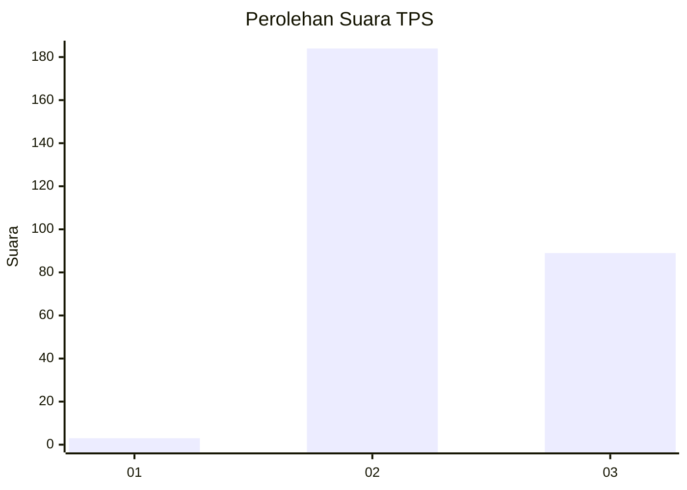
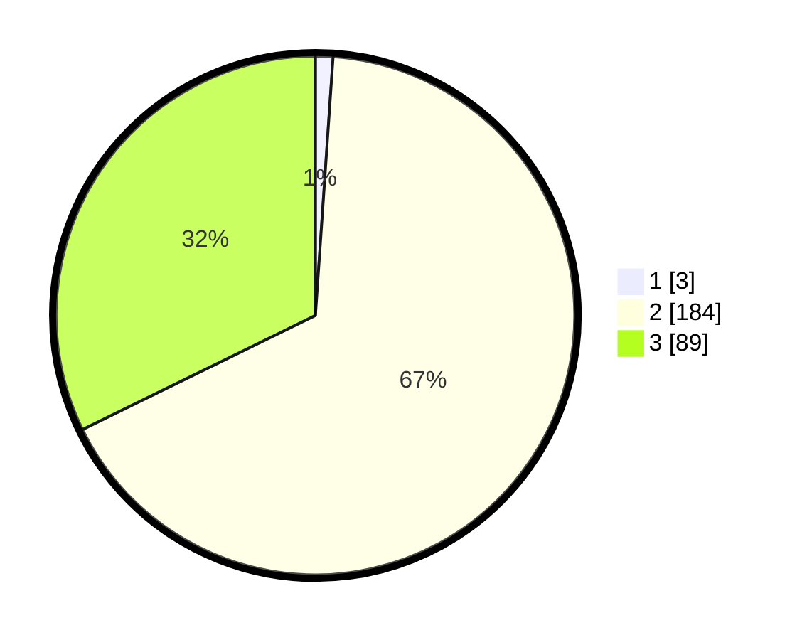

# Hasil

## Grafik

## Tabel

| No. | Nama Paslon    | Suara | Suara (raw) | Persentase |
|:--- |:-------------- | -----:| -----------:| ----------:|
| 1   | ANIES MUHAIMIN | 3     | [3][p-1]    | 1,09       |
| 2   | PRABOWO GIBRAN | 184   | [184][p-2]  | 66,67      |
| 3   | GANJAR MAHFUD  | 89    | [89][p-3]   | 32,25      |

[p-1]: https://github.com/gigit-pemilu/pemilu-2024-51-bali/blob/main/pilpres/hitung-suara/sub/51-bali/sub/03-badung/sub/06-kuta-utara/sub/2006-dalung/sub/012-tps/sub/paslon-1.txt
[p-2]: https://github.com/gigit-pemilu/pemilu-2024-51-bali/blob/main/pilpres/hitung-suara/sub/51-bali/sub/03-badung/sub/06-kuta-utara/sub/2006-dalung/sub/012-tps/sub/paslon-2.txt
[p-3]: https://github.com/gigit-pemilu/pemilu-2024-51-bali/blob/main/pilpres/hitung-suara/sub/51-bali/sub/03-badung/sub/06-kuta-utara/sub/2006-dalung/sub/012-tps/sub/paslon-3.txt

## Foto C Plano

https://sirekap-obj-formc.kpu.go.id/2835/pemilu/ppwp/51/03/06/20/06/5103062006012-20240214-190754--a03a39bf-24e7-4bc4-ae9f-f7e5894913de.jpg

https://sirekap-obj-formc.kpu.go.id/2835/pemilu/ppwp/51/03/06/20/06/5103062006012-20240214-190015--39c3974a-af2c-4f86-810c-c02cbc031a20.jpg

https://sirekap-obj-formc.kpu.go.id/2835/pemilu/ppwp/51/03/06/20/06/5103062006012-20240214-192959--ce1d8f9e-0e60-4a9d-8497-d740fe1a5441.jpg

## Metadata

| Key        | Value               |
| ---------- | ------------------- |
| Time Stamp | 2024-02-24 22:31:28 |

## DATA PEMILIH TETAP

Jumlah pemilih dalam DPT: **295**.
 * L: **143**.
 * P: **152**.

## DATA PENGGUNA HAK PILIH

Jumlah pengguna hak pilih dalam DPT: **263**.
 * L: **128**.
 * P: **135**.

Jumlah pengguna hak pilih dalam DPTb: **7**.
 * L: **1**.
 * P: **6**.

Jumlah pengguna hak pilih dalam DPK: **7**.
 * L: **2**.
 * P: **5**.

Jumlah pengguna hak pilih: **277**.
 * L: **131**.
 * P: **146**.

## JUMLAH SUARA SAH DAN TIDAK SAH

JUMLAH SELURUH SUARA SAH: **276**.

JUMLAH SUARA TIDAK SAH: **1**.

JUMLAH SELURUH SUARA SAH DAN SUARA TIDAK SAH: **277**.

