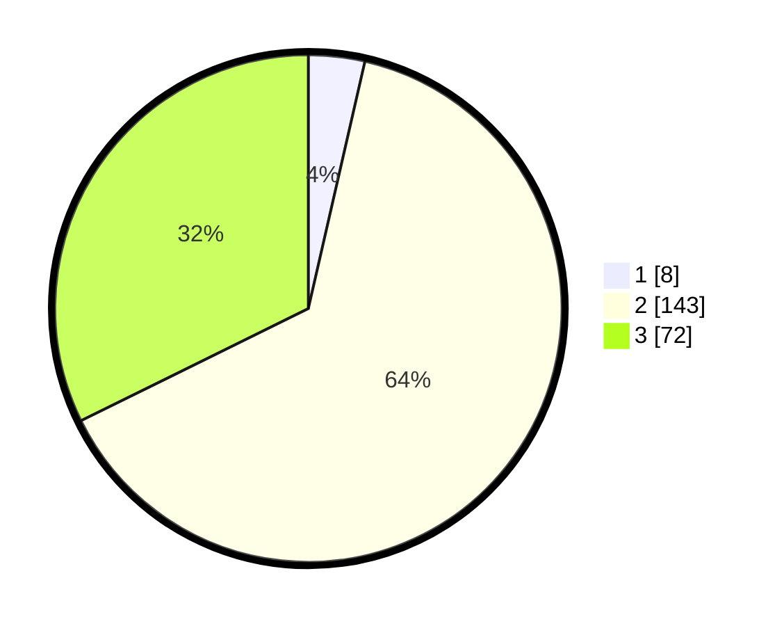

# Hasil

## Grafik

## Tabel

| No. | Nama Paslon    | Suara | Suara (raw) | Persentase |
|:--- |:-------------- | -----:| -----------:| ----------:|
| 1   | ANIES MUHAIMIN | 8     | [8][p-1]    | 3,59       |
| 2   | PRABOWO GIBRAN | 143   | [143][p-2]  | 64,13      |
| 3   | GANJAR MAHFUD  | 72    | [72][p-3]   | 32,29      |

[p-1]: https://github.com/gigit-pemilu/pemilu-2024-51-bali/blob/main/pilpres/hitung-suara/sub/51-bali/sub/03-badung/sub/06-kuta-utara/sub/2006-dalung/sub/017-tps/sub/paslon-1.txt
[p-2]: https://github.com/gigit-pemilu/pemilu-2024-51-bali/blob/main/pilpres/hitung-suara/sub/51-bali/sub/03-badung/sub/06-kuta-utara/sub/2006-dalung/sub/017-tps/sub/paslon-2.txt
[p-3]: https://github.com/gigit-pemilu/pemilu-2024-51-bali/blob/main/pilpres/hitung-suara/sub/51-bali/sub/03-badung/sub/06-kuta-utara/sub/2006-dalung/sub/017-tps/sub/paslon-3.txt

## Foto C Plano

https://sirekap-obj-formc.kpu.go.id/b384/pemilu/ppwp/51/03/06/20/06/5103062006017-20240216-222755--8961beb5-34b9-4ea6-80ba-d671ffe60026.jpg

https://sirekap-obj-formc.kpu.go.id/b384/pemilu/ppwp/51/03/06/20/06/5103062006017-20240216-223144--4366975a-0843-4d28-b03c-48bb64b902f6.jpg

https://sirekap-obj-formc.kpu.go.id/b384/pemilu/ppwp/51/03/06/20/06/5103062006017-20240216-222942--b4dfcf58-e8e3-44bb-b1ca-1f9b26f739f0.jpg

## Metadata

| Key        | Value               |
| ---------- | ------------------- |
| Time Stamp | 2024-02-21 20:00:00 |

## DATA PEMILIH TETAP

Jumlah pemilih dalam DPT: **259**.
 * L: **129**.
 * P: **130**.

## DATA PENGGUNA HAK PILIH

Jumlah pengguna hak pilih dalam DPT: **215**.
 * L: **111**.
 * P: **104**.

Jumlah pengguna hak pilih dalam DPTb: **0**.
 * L: **0**.
 * P: **0**.

Jumlah pengguna hak pilih dalam DPK: **9**.
 * L: **4**.
 * P: **5**.

Jumlah pengguna hak pilih: **224**.
 * L: **115**.
 * P: **109**.

## JUMLAH SUARA SAH DAN TIDAK SAH

JUMLAH SELURUH SUARA SAH: **223**.

JUMLAH SUARA TIDAK SAH: **1**.

JUMLAH SELURUH SUARA SAH DAN SUARA TIDAK SAH: **224**.

