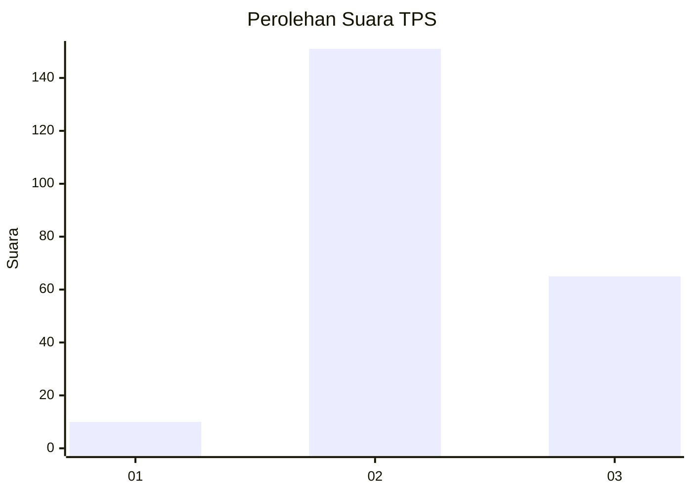
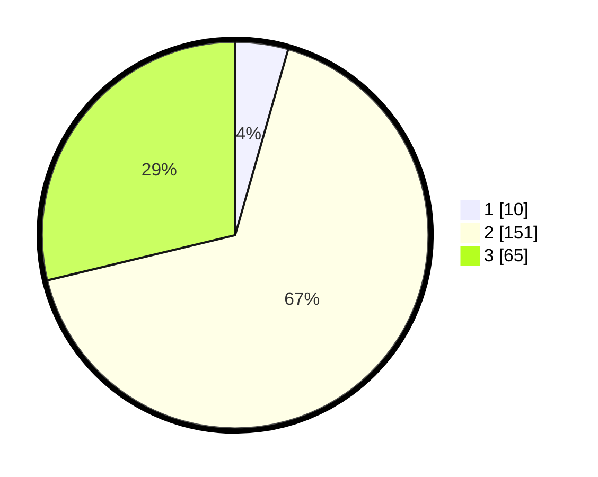

# Hasil

## Grafik

## Tabel

| No. | Nama Paslon    | Suara | Suara (raw) | Persentase |
|:--- |:-------------- | -----:| -----------:| ----------:|
| 1   | ANIES MUHAIMIN | 10    | [10][p-1]   | 4,42       |
| 2   | PRABOWO GIBRAN | 151   | [151][p-2]  | 66,81      |
| 3   | GANJAR MAHFUD  | 65    | [65][p-3]   | 28,76      |

[p-1]: https://github.com/gigit-pemilu/pemilu-2024-51-bali/blob/main/pilpres/hitung-suara/sub/51-bali/sub/03-badung/sub/06-kuta-utara/sub/2006-dalung/sub/019-tps/sub/paslon-1.txt
[p-2]: https://github.com/gigit-pemilu/pemilu-2024-51-bali/blob/main/pilpres/hitung-suara/sub/51-bali/sub/03-badung/sub/06-kuta-utara/sub/2006-dalung/sub/019-tps/sub/paslon-2.txt
[p-3]: https://github.com/gigit-pemilu/pemilu-2024-51-bali/blob/main/pilpres/hitung-suara/sub/51-bali/sub/03-badung/sub/06-kuta-utara/sub/2006-dalung/sub/019-tps/sub/paslon-3.txt

## Foto C Plano

https://sirekap-obj-formc.kpu.go.id/1915/pemilu/ppwp/51/03/06/20/06/5103062006019-20240214-193712--8a76f1f7-2927-4e9b-a359-447eaa912967.jpg

https://sirekap-obj-formc.kpu.go.id/1915/pemilu/ppwp/51/03/06/20/06/5103062006019-20240214-193950--54596500-a98f-4abc-b3ef-5596ec6511ce.jpg

https://sirekap-obj-formc.kpu.go.id/1915/pemilu/ppwp/51/03/06/20/06/5103062006019-20240214-193200--df716f30-3b52-40c2-a74a-ff109593acaf.jpg

## Metadata

| Key        | Value               |
| ---------- | ------------------- |
| Time Stamp | 2024-02-24 22:31:28 |

