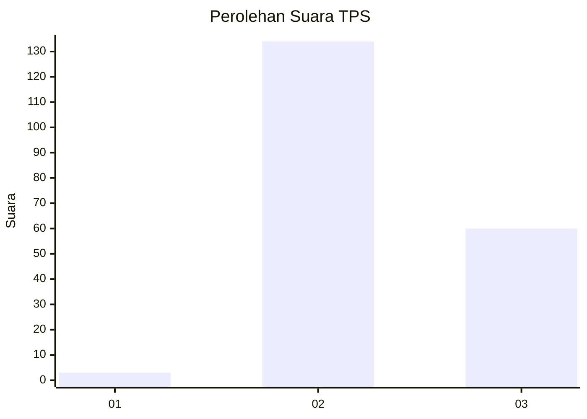

# Hasil

## Grafik

## Tabel

| No. | Nama Paslon    | Suara | Suara (raw) | Persentase |
|:--- |:-------------- | -----:| -----------:| ----------:|
| 1   | ANIES MUHAIMIN | 3     | [3][p-1]    | 1,52       |
| 2   | PRABOWO GIBRAN | 134   | [134][p-2]  | 68,02      |
| 3   | GANJAR MAHFUD  | 60    | [60][p-3]   | 30,46      |

[p-1]: https://github.com/gigit-pemilu/pemilu-2024-51-bali/blob/main/pilpres/hitung-suara/sub/51-bali/sub/03-badung/sub/06-kuta-utara/sub/2006-dalung/sub/023-tps/sub/paslon-1.txt
[p-2]: https://github.com/gigit-pemilu/pemilu-2024-51-bali/blob/main/pilpres/hitung-suara/sub/51-bali/sub/03-badung/sub/06-kuta-utara/sub/2006-dalung/sub/023-tps/sub/paslon-2.txt
[p-3]: https://github.com/gigit-pemilu/pemilu-2024-51-bali/blob/main/pilpres/hitung-suara/sub/51-bali/sub/03-badung/sub/06-kuta-utara/sub/2006-dalung/sub/023-tps/sub/paslon-3.txt

## Foto C Plano

https://sirekap-obj-formc.kpu.go.id/526f/pemilu/ppwp/51/03/06/20/06/5103062006023-20240214-220452--03a45934-902c-4960-8523-85302c898d30.jpg

https://sirekap-obj-formc.kpu.go.id/526f/pemilu/ppwp/51/03/06/20/06/5103062006023-20240214-220516--53910e0c-fb97-42e7-9aaf-75006754d999.jpg

https://sirekap-obj-formc.kpu.go.id/526f/pemilu/ppwp/51/03/06/20/06/5103062006023-20240214-220521--57fea893-eb1b-4737-987e-cd8bd12db321.jpg

## Metadata

| Key        | Value               |
| ---------- | ------------------- |
| Time Stamp | 2024-02-19 06:16:00 |

## DATA PEMILIH TETAP

Jumlah pemilih dalam DPT: **214**.
 * L: **102**.
 * P: **112**.

## DATA PENGGUNA HAK PILIH

Jumlah pengguna hak pilih dalam DPT: **187**.
 * L: **889**.
 * P: **98**.

Jumlah pengguna hak pilih dalam DPTb: **8**.
 * L: **4**.
 * P: **4**.

Jumlah pengguna hak pilih dalam DPK: **2**.
 * L: **0**.
 * P: **2**.

Jumlah pengguna hak pilih: **197**.
 * L: **0**.
 * P: **0**.

## JUMLAH SUARA SAH DAN TIDAK SAH

JUMLAH SELURUH SUARA SAH: **197**.

JUMLAH SUARA TIDAK SAH: **0**.

JUMLAH SELURUH SUARA SAH DAN SUARA TIDAK SAH: **197**.

