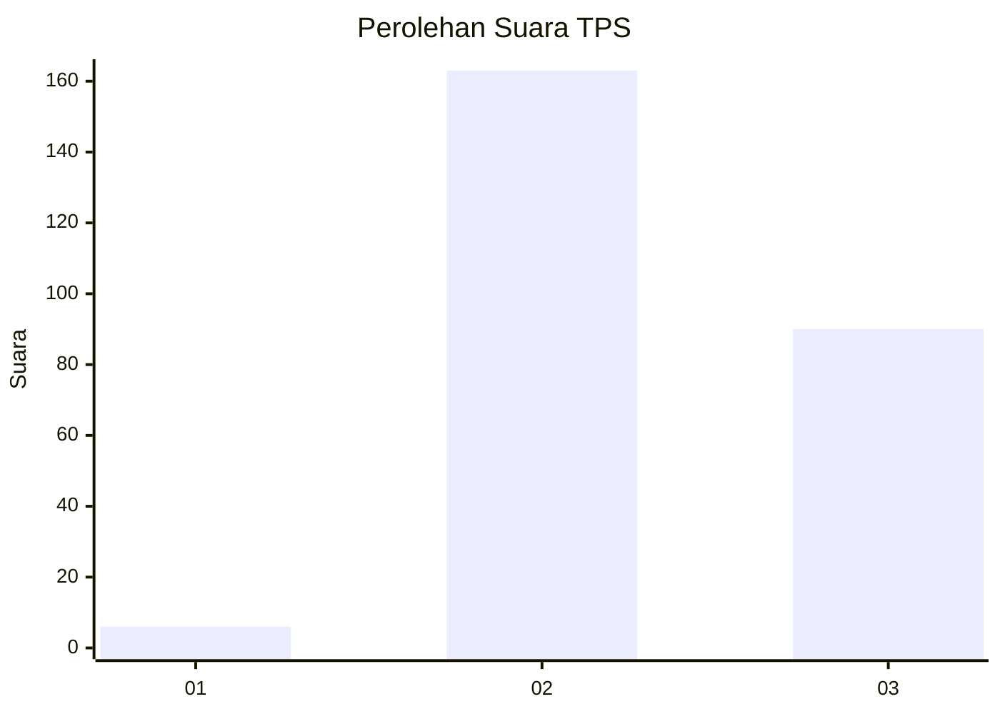
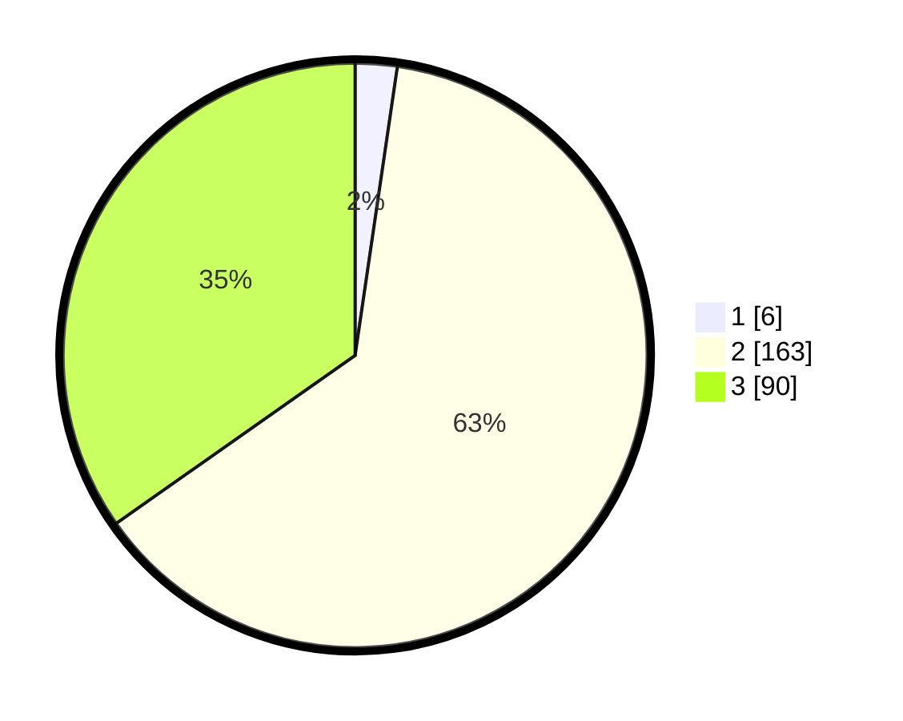

# Hasil

## Grafik

## Tabel

| No. | Nama Paslon    | Suara | Suara (raw) | Persentase |
|:--- |:-------------- | -----:| -----------:| ----------:|
| 1   | ANIES MUHAIMIN | 6     | [6][p-1]    | 2,32       |
| 2   | PRABOWO GIBRAN | 163   | [163][p-2]  | 62,93      |
| 3   | GANJAR MAHFUD  | 90    | [90][p-3]   | 34,75      |

[p-1]: https://github.com/gigit-pemilu/pemilu-2024-51-bali/blob/main/pilpres/hitung-suara/sub/51-bali/sub/03-badung/sub/06-kuta-utara/sub/2006-dalung/sub/026-tps/sub/paslon-1.txt
[p-2]: https://github.com/gigit-pemilu/pemilu-2024-51-bali/blob/main/pilpres/hitung-suara/sub/51-bali/sub/03-badung/sub/06-kuta-utara/sub/2006-dalung/sub/026-tps/sub/paslon-2.txt
[p-3]: https://github.com/gigit-pemilu/pemilu-2024-51-bali/blob/main/pilpres/hitung-suara/sub/51-bali/sub/03-badung/sub/06-kuta-utara/sub/2006-dalung/sub/026-tps/sub/paslon-3.txt

## Foto C Plano

https://sirekap-obj-formc.kpu.go.id/afd2/pemilu/ppwp/51/03/06/20/06/5103062006026-20240216-201514--c88fe0a7-e543-4e60-a770-2d51b0d0b140.jpg

https://sirekap-obj-formc.kpu.go.id/afd2/pemilu/ppwp/51/03/06/20/06/5103062006026-20240216-202245--9c2ef953-8498-4012-bd92-b6a5a3db20d0.jpg

https://sirekap-obj-formc.kpu.go.id/afd2/pemilu/ppwp/51/03/06/20/06/5103062006026-20240216-202308--39c26aa9-5488-42df-aaad-5a6ac506b11a.jpg

## Metadata

| Key        | Value               |
| ---------- | ------------------- |
| Time Stamp | 2024-02-21 16:00:00 |

## DATA PEMILIH TETAP

Jumlah pemilih dalam DPT: **281**.
 * L: **146**.
 * P: **135**.

## DATA PENGGUNA HAK PILIH

Jumlah pengguna hak pilih dalam DPT: **259**.
 * L: **127**.
 * P: **132**.

Jumlah pengguna hak pilih dalam DPTb: **7**.
 * L: **1**.
 * P: **6**.

Jumlah pengguna hak pilih dalam DPK: **1**.
 * L: **1**.
 * P: **0**.

Jumlah pengguna hak pilih: **267**.
 * L: **129**.
 * P: **138**.

## JUMLAH SUARA SAH DAN TIDAK SAH

JUMLAH SELURUH SUARA SAH: **259**.

JUMLAH SUARA TIDAK SAH: **0**.

JUMLAH SELURUH SUARA SAH DAN SUARA TIDAK SAH: **259**.

