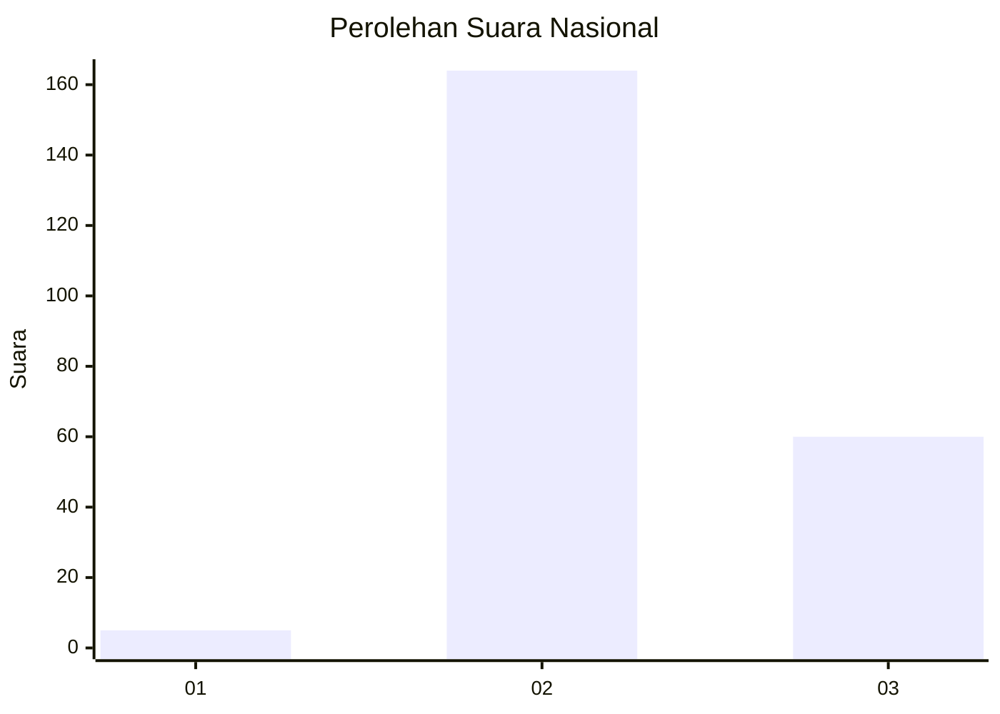
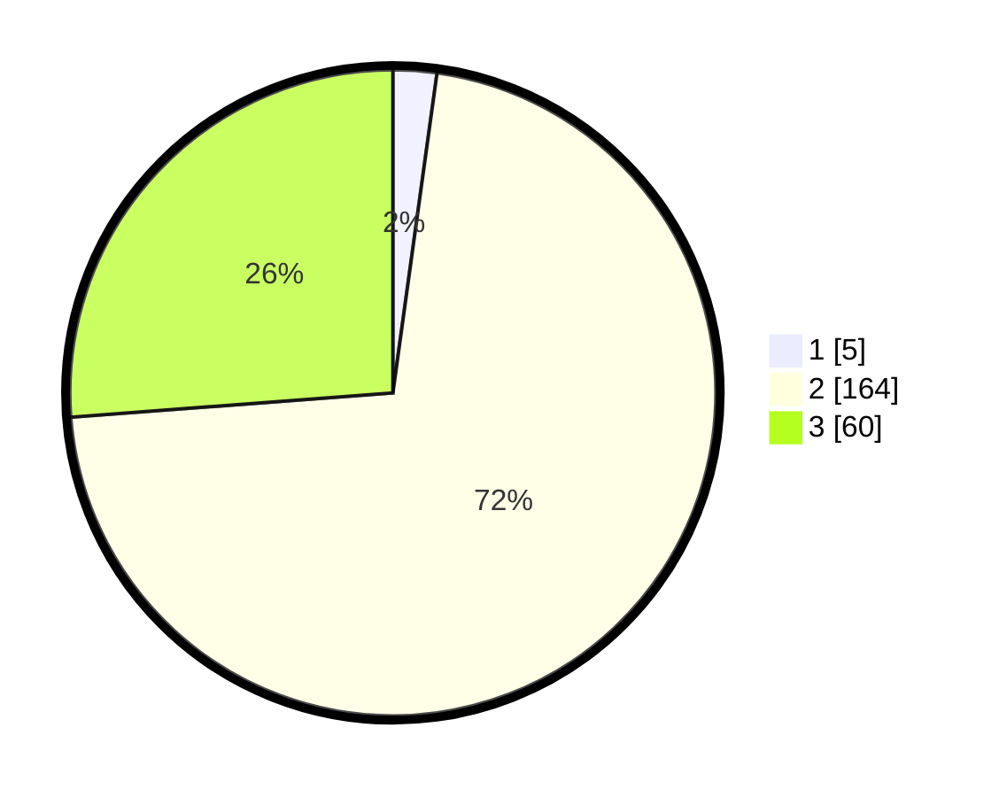

# Hasil

## Grafik

## Tabel

| No. | Nama Paslon    | Suara | Suara (raw) | Persentase |
|:--- |:-------------- | -----:| -----------:| ----------:|
| 1   | ANIES MUHAIMIN | 5     | [5][p-1]    | 2,18       |
| 2   | PRABOWO GIBRAN | 164   | [164][p-2]  | 71,62      |
| 3   | GANJAR MAHFUD  | 60    | [60][p-3]   | 26,20      |

[p-1]: https://github.com/gigit-pemilu/pemilu-2024/blob/main/pilpres/hitung-suara/sub/51-bali/sub/03-badung/sub/06-kuta-utara/sub/2006-dalung/sub/028-tps/sub/paslon-1.txt
[p-2]: https://github.com/gigit-pemilu/pemilu-2024/blob/main/pilpres/hitung-suara/sub/51-bali/sub/03-badung/sub/06-kuta-utara/sub/2006-dalung/sub/028-tps/sub/paslon-2.txt
[p-3]: https://github.com/gigit-pemilu/pemilu-2024/blob/main/pilpres/hitung-suara/sub/51-bali/sub/03-badung/sub/06-kuta-utara/sub/2006-dalung/sub/028-tps/sub/paslon-3.txt

## Foto C Plano

https://sirekap-obj-formc.kpu.go.id/92e4/pemilu/ppwp/51/03/06/20/06/5103062006028-20240218-103210--98a4b13e-2528-4663-ad6b-0b3092b3257b.jpg

https://sirekap-obj-formc.kpu.go.id/92e4/pemilu/ppwp/51/03/06/20/06/5103062006028-20240218-103323--258d9e64-f561-4e0f-a7e2-4baddfb87dbe.jpg

## Metadata

| Key        | Value               |
| ---------- | ------------------- |
| Time Stamp | 2024-02-24 22:31:28 |

