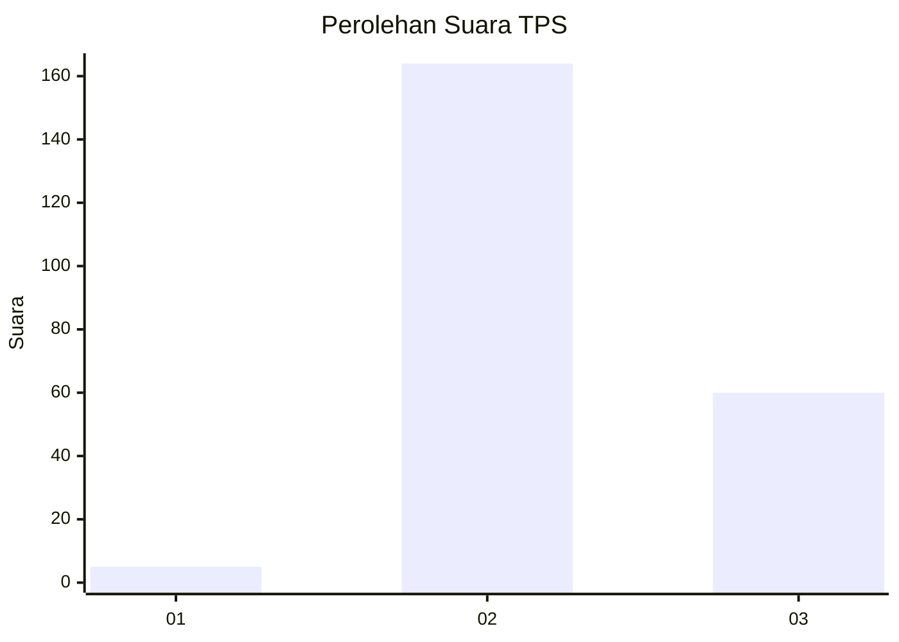
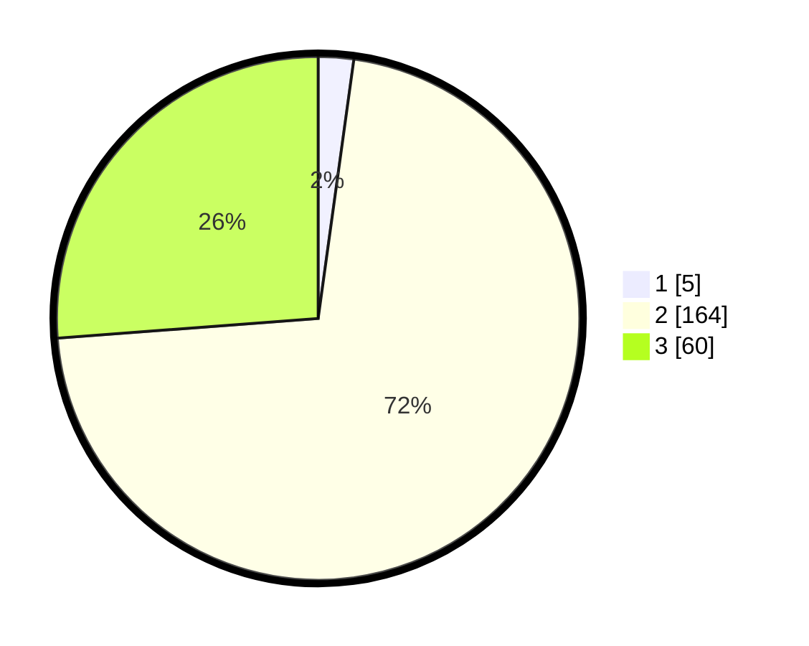

# Hasil

## Grafik

## Tabel

| No. | Nama Paslon    | Suara | Suara (raw) | Persentase |
|:--- |:-------------- | -----:| -----------:| ----------:|
| 1   | ANIES MUHAIMIN | 5     | [5][p-1]    | 2,18       |
| 2   | PRABOWO GIBRAN | 164   | [164][p-2]  | 71,62      |
| 3   | GANJAR MAHFUD  | 60    | [60][p-3]   | 26,20      |

[p-1]: https://github.com/gigit-pemilu/pemilu-2024-51-bali/blob/main/pilpres/hitung-suara/sub/51-bali/sub/03-badung/sub/06-kuta-utara/sub/2006-dalung/sub/029-tps/sub/paslon-1.txt
[p-2]: https://github.com/gigit-pemilu/pemilu-2024-51-bali/blob/main/pilpres/hitung-suara/sub/51-bali/sub/03-badung/sub/06-kuta-utara/sub/2006-dalung/sub/029-tps/sub/paslon-2.txt
[p-3]: https://github.com/gigit-pemilu/pemilu-2024-51-bali/blob/main/pilpres/hitung-suara/sub/51-bali/sub/03-badung/sub/06-kuta-utara/sub/2006-dalung/sub/029-tps/sub/paslon-3.txt

## Foto C Plano

https://sirekap-obj-formc.kpu.go.id/227c/pemilu/ppwp/51/03/06/20/06/5103062006029-20240216-223721--07ec092f-316d-4ceb-99dc-662d8153c6f7.jpg

https://sirekap-obj-formc.kpu.go.id/227c/pemilu/ppwp/51/03/06/20/06/5103062006029-20240216-223952--a913e5e2-3352-4845-b5c7-efa19ba93bc6.jpg

https://sirekap-obj-formc.kpu.go.id/227c/pemilu/ppwp/51/03/06/20/06/5103062006029-20240216-224212--0197bb20-54a5-43df-9a7e-075b2fed962c.jpg

## Metadata

| Key        | Value               |
| ---------- | ------------------- |
| Time Stamp | 2024-02-24 22:31:28 |

