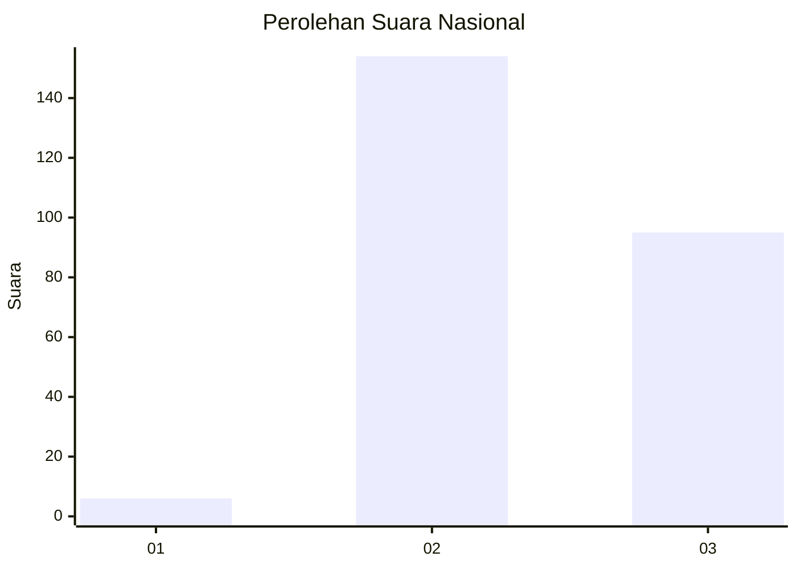
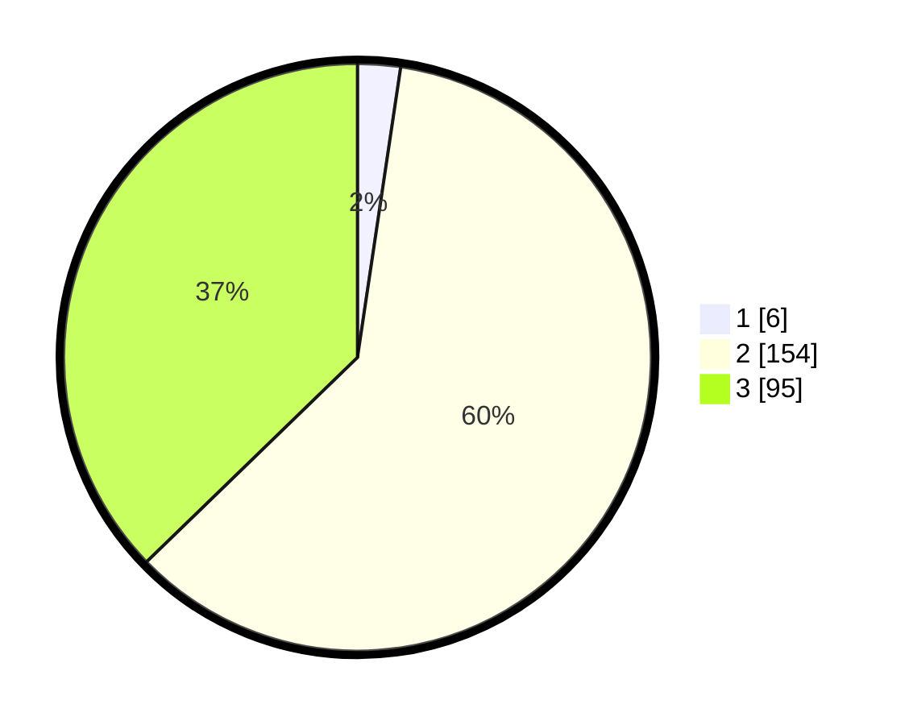

# Hasil

## Grafik

## Tabel

| No. | Nama Paslon    | Suara | Suara (raw) | Persentase |
|:--- |:-------------- | -----:| -----------:| ----------:|
| 1   | ANIES MUHAIMIN | 6     | [6][p-1]    | 2,35       |
| 2   | PRABOWO GIBRAN | 154   | [154][p-2]  | 60,39      |
| 3   | GANJAR MAHFUD  | 95    | [95][p-3]   | 37,25      |

[p-1]: https://github.com/gigit-pemilu/pemilu-2024/blob/main/pilpres/hitung-suara/sub/51-bali/sub/03-badung/sub/06-kuta-utara/sub/2006-dalung/sub/030-tps/sub/paslon-1.txt
[p-2]: https://github.com/gigit-pemilu/pemilu-2024/blob/main/pilpres/hitung-suara/sub/51-bali/sub/03-badung/sub/06-kuta-utara/sub/2006-dalung/sub/030-tps/sub/paslon-2.txt
[p-3]: https://github.com/gigit-pemilu/pemilu-2024/blob/main/pilpres/hitung-suara/sub/51-bali/sub/03-badung/sub/06-kuta-utara/sub/2006-dalung/sub/030-tps/sub/paslon-3.txt

## Foto C Plano

https://sirekap-obj-formc.kpu.go.id/94c7/pemilu/ppwp/51/03/06/20/06/5103062006030-20240217-060803--33b10909-d6e4-4fb6-a7ad-69f55011ae55.jpg

https://sirekap-obj-formc.kpu.go.id/94c7/pemilu/ppwp/51/03/06/20/06/5103062006030-20240217-061016--ac0faa7a-beec-4650-942a-8d56dc6042b6.jpg

https://sirekap-obj-formc.kpu.go.id/94c7/pemilu/ppwp/51/03/06/20/06/5103062006030-20240217-061712--e8415c36-64c0-40e3-95e6-44f0ffeb865d.jpg

## Metadata

| Key        | Value               |
| ---------- | ------------------- |
| Time Stamp | 2024-02-21 15:00:00 |

## DATA PEMILIH TETAP

Jumlah pemilih dalam DPT: **258**.
 * L: **121**.
 * P: **137**.

## DATA PENGGUNA HAK PILIH

Jumlah pengguna hak pilih dalam DPT: **240**.
 * L: **112**.
 * P: **128**.

Jumlah pengguna hak pilih dalam DPTb: **5**.
 * L: **2**.
 * P: **3**.

Jumlah pengguna hak pilih dalam DPK: **13**.
 * L: **7**.
 * P: **6**.

Jumlah pengguna hak pilih: **258**.
 * L: **121**.
 * P: **137**.

## JUMLAH SUARA SAH DAN TIDAK SAH

JUMLAH SELURUH SUARA SAH: **236**.

JUMLAH SUARA TIDAK SAH: **17**.

JUMLAH SELURUH SUARA SAH DAN SUARA TIDAK SAH: **253**.

