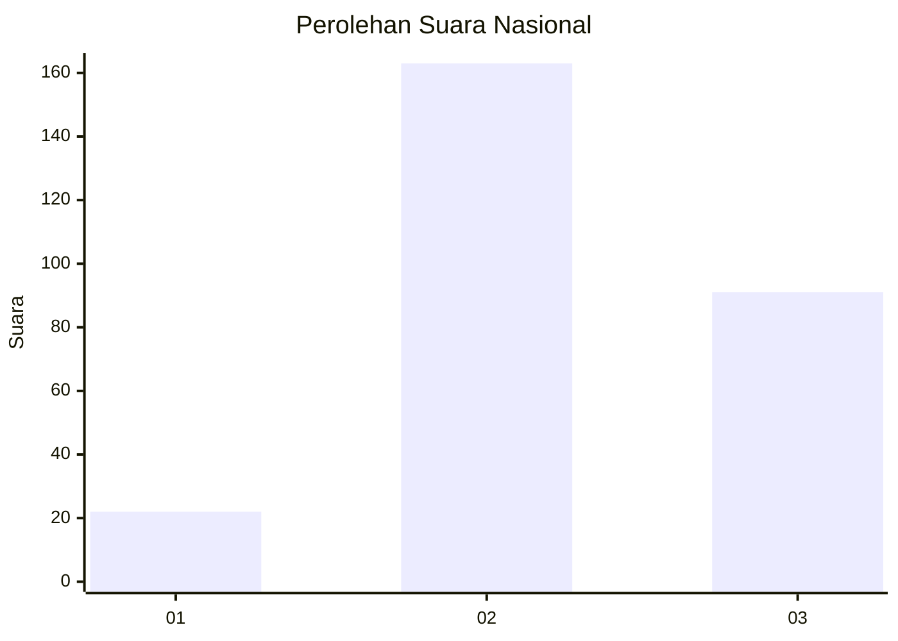
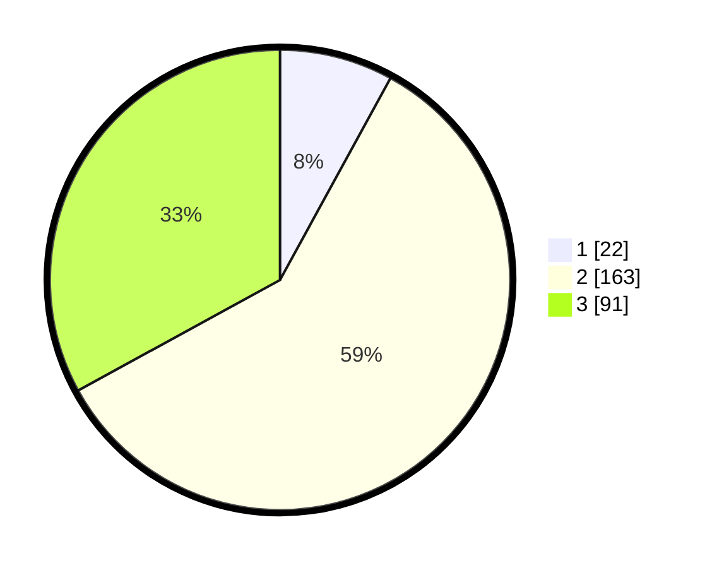

# Hasil

## Grafik

## Tabel

| No. | Nama Paslon    | Suara | Suara (raw) | Persentase |
|:--- |:-------------- | -----:| -----------:| ----------:|
| 1   | ANIES MUHAIMIN | 22    | [22][p-1]   | 7,97       |
| 2   | PRABOWO GIBRAN | 163   | [163][p-2]  | 59,06      |
| 3   | GANJAR MAHFUD  | 91    | [91][p-3]   | 32,97      |

[p-1]: https://github.com/gigit-pemilu/pemilu-2024/blob/main/pilpres/hitung-suara/sub/51-bali/sub/03-badung/sub/06-kuta-utara/sub/2006-dalung/sub/035-tps/sub/paslon-1.txt
[p-2]: https://github.com/gigit-pemilu/pemilu-2024/blob/main/pilpres/hitung-suara/sub/51-bali/sub/03-badung/sub/06-kuta-utara/sub/2006-dalung/sub/035-tps/sub/paslon-2.txt
[p-3]: https://github.com/gigit-pemilu/pemilu-2024/blob/main/pilpres/hitung-suara/sub/51-bali/sub/03-badung/sub/06-kuta-utara/sub/2006-dalung/sub/035-tps/sub/paslon-3.txt

## Foto C Plano

https://sirekap-obj-formc.kpu.go.id/6c26/pemilu/ppwp/51/03/06/20/06/5103062006035-20240215-010845--6a324c85-c35f-4e9d-a31d-ce29990bcb8a.jpg

https://sirekap-obj-formc.kpu.go.id/6c26/pemilu/ppwp/51/03/06/20/06/5103062006035-20240215-011013--1c2312b5-fa53-4f75-80ad-895d47b3e31b.jpg

https://sirekap-obj-formc.kpu.go.id/6c26/pemilu/ppwp/51/03/06/20/06/5103062006035-20240215-011104--d076f4a1-8d8b-4992-b4e6-c09b11ffe5f1.jpg

## Metadata

| Key        | Value               |
| ---------- | ------------------- |
| Time Stamp | 2024-02-21 21:00:04 |

